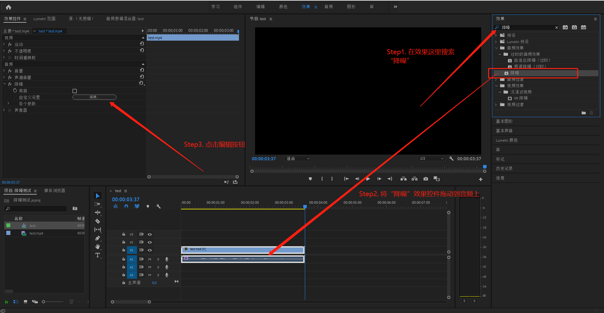
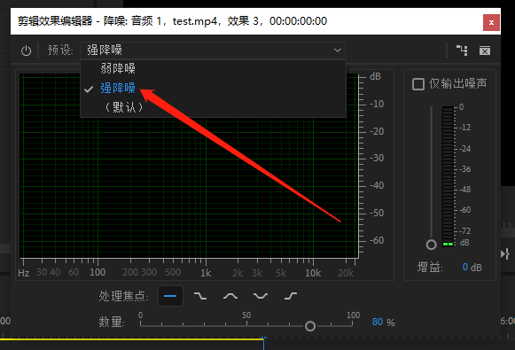
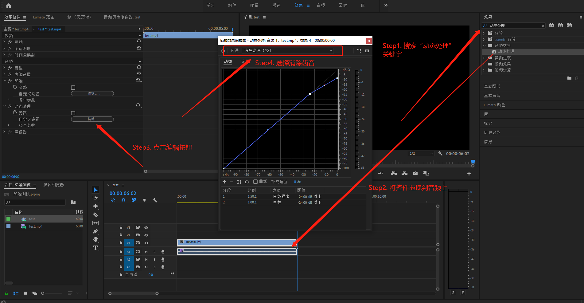

# `Premiere` 声音降噪

## 需求场景

很多时候我们直接录制的视频会掺杂着噪音，尤其是笔记本采用系统麦克风的时候，风扇的声音尤为严重。因此声音降噪处理的需求应运而生。

## 声音降噪处理方法

首先，在效果栏中搜索“**降噪**”关键字，之后将**音频效果**中的“**降噪**”控件拖动到音频上面，之后点击控件效果中降噪效果的自定义 `编辑` 按钮，操作步骤如下所示：

接下来调整预设，由于水平不够，直接选择**强降噪**。

接下来再听一遍基本上就可以忽略噪声了。

## 扩展

### 消除齿音优化

在效果栏中搜索“**动态处理**”关键字，之后将**音频效果**中的“**动态处理**”控件拖动到音频上面，之后点击控件效果中的自定义 `编辑` 按钮，将预设选择为**消除齿音(轻)**，操作步骤如下所示：

