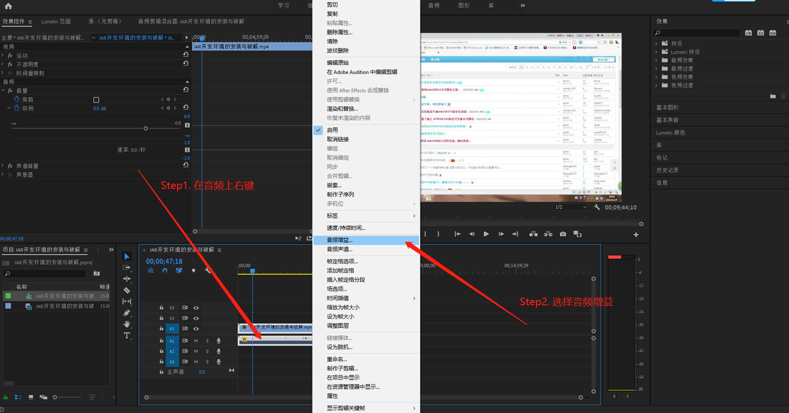
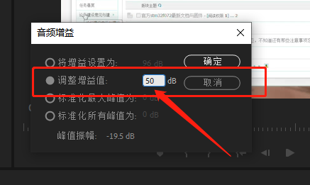

# `Premiere` 视频音量增大

## 需求场景

很多时候从网络上下载的视频会发现将声音的音量调整到最大后还是**音量过低，听不清声音**（尤其是网络教育视频），这个时候就可以通过 `Adobe Premiere` 来讲视频的声音调大了，实践下来发现，单纯的调大会造成杂音等问题，还需配合笔记[声音降噪](../声音降噪/README.md)来进行优化。

> **提示：** 很多从互联网上下载下来的视频格式可能不是 `m[p4` 格式的，需要转换成mp4格式的视频后再进行编辑，可参考[视频格式转换笔记](../../../杂项/视频格式转换/README.md)

## 解决方法

首先建立 `Premiere` 项目，之后导入需要处理的 `MP4` 视频，然后在对应**音频**上 `右键` ，选择 `音频增益` 功能，如下图所示：

接下来调整音频增益值，直到自己觉得可以即可。如下图所示

接下来就是优化音频质量了，转至笔记：[声音降噪](../声音降噪/README.md)
