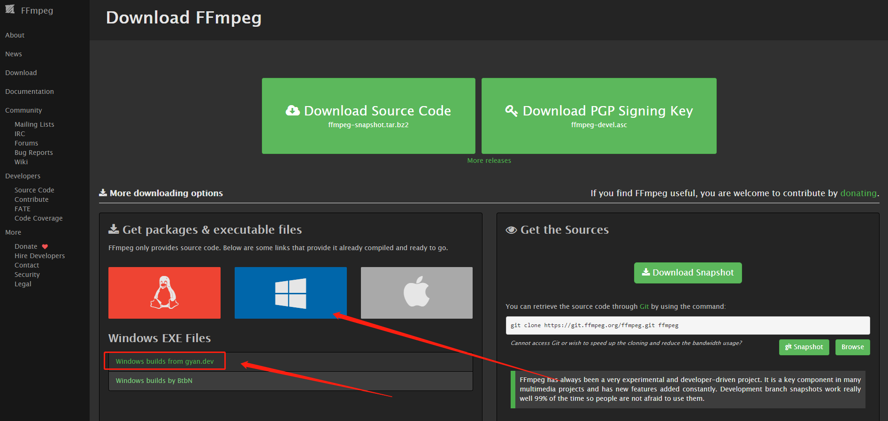
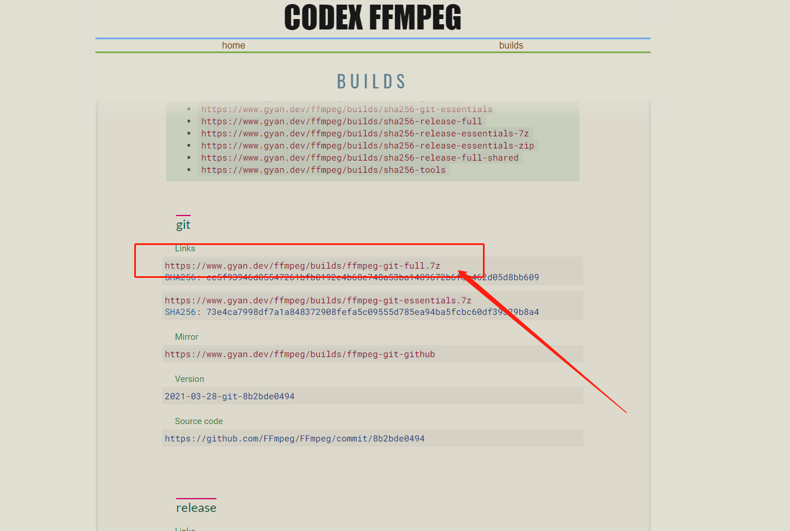
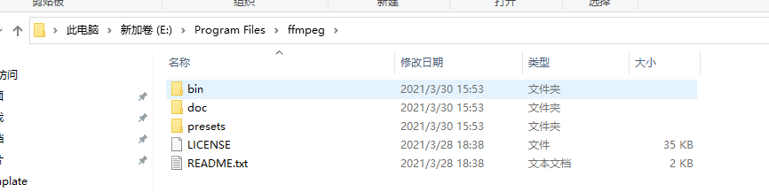
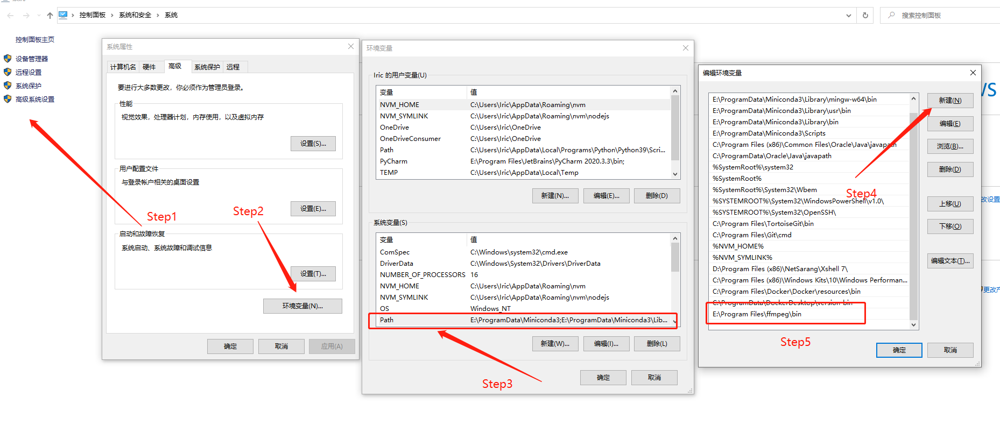

# `Windows` 安装 `FFmpeg`

## 下载并解压

首先进入 `FFmpeg` 下载页面，地址为：http://www.ffmpeg.org/download.html

选择 `Windows` 版本，如下所示：



进入Windows下载页面后往下拉，选择git下载地址，如下所示：



将下载下来的 `7z` 格式压缩包解压缩到想要放置的目录，我这里放置在了 `E:\Program Files\ffmpeg` ，如下如所示：



## 设置环境变量

将 `bin` 文件夹所在路径添加到**系统环境变量**中，如下所示：



## 安装完成验证

打开 `cmd` 命令行终端，输入 `ffmpeg` 命令，如输出内容如下即表示安装成功。

``` shell
$ ffmpeg
ffmpeg version 2021-03-28-git-8b2bde0494-full_build-www.gyan.dev Copyright (c) 2000-2021 the FFmpeg developers
  built with gcc 10.2.0 (Rev6, Built by MSYS2 project)
  configuration: --enable-gpl --enable-version3 --enable-static --disable-w32threads --disable-autodetect --enable-fontconfig --enable-iconv --enable-gnutls --enable-libxml2 --enable-gmp --enable-lzma --enable-libsnappy --enable-zlib --enable-librist --enable-libsrt --enable-libssh --enable-libzmq --enable-avisynth --enable-libbluray --enable-libcaca --enable-sdl2 --enable-libdav1d --enable-libzvbi --enable-librav1e --enable-libsvtav1 --enable-libwebp --enable-libx264 --enable-libx265 --enable-libxvid --enable-libaom --enable-libopenjpeg --enable-libvpx --enable-libass --enable-frei0r --enable-libfreetype --enable-libfribidi --enable-libvidstab --enable-libvmaf --enable-libzimg --enable-amf --enable-cuda-llvm --enable-cuvid --enable-ffnvcodec --enable-nvdec --enable-nvenc --enable-d3d11va --enable-dxva2 --enable-libmfx --enable-libglslang --enable-vulkan --enable-opencl --enable-libcdio --enable-libgme --enable-libmodplug --enable-libopenmpt --enable-libopencore-amrwb --enable-libmp3lame --enable-libshine --enable-libtheora --enable-libtwolame --enable-libvo-amrwbenc --enable-libilbc --enable-libgsm --enable-libopencore-amrnb --enable-libopus --enable-libspeex --enable-libvorbis --enable-ladspa --enable-libbs2b --enable-libflite --enable-libmysofa --enable-librubberband --enable-libsoxr --enable-chromaprint
  libavutil      56. 72.100 / 56. 72.100
  libavcodec     58.135.100 / 58.135.100
  libavformat    58. 77.100 / 58. 77.100
  libavdevice    58. 14.100 / 58. 14.100
  libavfilter     7.111.100 /  7.111.100
  libswscale      5. 10.100 /  5. 10.100
  libswresample   3. 10.100 /  3. 10.100
  libpostproc    55. 10.100 / 55. 10.100
Hyper fast Audio and Video encoder
usage: ffmpeg [options] [[infile options] -i infile]... {[outfile options] outfile}...

Use -h to get full help or, even better, run 'man ffmpeg'
```
