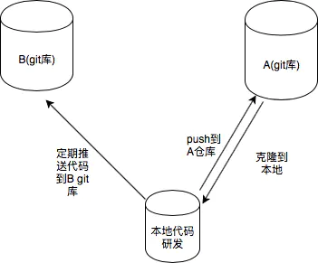

# Git 在同一项目中使用多个远端仓库

参考文章：[git同一项目使用多个远程仓库](https://www.jianshu.com/p/4cd46619b3a5)

## 需求产生原因

主要原因就是这个项目，我希望写一遍，之后同步推送到Github，自建Gitlab和Gitee上，所以在网上查找了相关资料，写出这篇笔记。

实现效果：



## 解决方法

```bash
$ git remote add virtualbing git@git.virtualbing.cn:Iric/note.git

$ git push   # 推动到GitHub上
$ git push virtualbing  # 推送到virtualbing上
```
