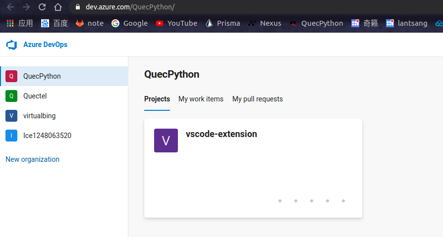

# vscode 插件开发——发布插件

## 发布准备

这个插件的发布相比于 `npm` 发包而言是非常麻烦的（ `PS` ：这是我见过的最麻烦的发包流程了）

首先我们要准备一个Microsoft账号，这个基本每个人都有，没有的话可以通过邮箱注册一个，很容易的。

但是可不是这一个账号就可以的，因为Visual Studio Code的应用市场基于微软自己的Azure DevOps，插件的身份验证、托管和管理都是在这里。

所以要发包，那就必须要注册微软的Azure DevOps，之后创建组织

## `Step1.` 登录 `Microsoft` 账号

首先访问 https://login.live.com/ 登录你的 `Microsoft` 账号即可。

## `Step2.` 配置 `Azure DevOps`

另起一个网页，访问 https://aka.ms/SignupAzureDevOps，（提示：可能会比较慢）

访问成功的话，你应该看到大致如下的内容：

提示：我这里已经建立好了**组织**和**项目**，作为新用户自己建立一个项目，之后再建立组织，如果插件没有敏感信息，建议项目选择**公开**



## `Step3.` 创建 `Token`

如下图所示，进入 `Personal Access Token` 配置页面


之后创建一个 `Token` ，如下图


> 温馨提示：建议将Organization选择All accessible organization，Scopes选择Full。官方文档上建议选择Custom defined，只开放了Marketplace的Manage权限，这样更安全嘛。实际下来发现如果只给这个权限，在发布的时候会报错，反正Azure的DevOps也不用，就给全部的权限好了。

点击创建之后， `记得要保存Token啊！`

## `Step4.` 创建发布者—— `publisher`

打开网址：https://marketplace.visualstudio.com/manage/publishers

创建一个**发布者** `publisher` ，这个名称要唯一。


> 我这里已经有一个插件了，正常刚创建的发布者是没有插件的。

接下来将项目中的 `package.json` 文件加入发布者信息

``` json
{
    "publisher": "IricBing",
}
```

## `Step5.` 安装 `vsce` 工具

`vsce` 就是 `VSCode Extension` 的缩写，专门用来打包和发布 `vscode` 扩展的。

``` shell
$ npm i vsce -g
```

## `Step6.` 源码打包

``` shell
$ yarn compile  # 编译

$ vsce package  # vsce打包
```

之后能够在根目录下看到 `packagename-version.vsix` 格式的 `vscode` 扩展包。

## `Step7.` 发布

这个发布还要分情况， `第一次发布` 的时候，将打包好的扩展包通过拖拽上传的方式来上传的应用商店，点击 `New extension` 按钮，之后选择 `Visual Studio Code` 。


第二次发布的时候就可以通过命令直接发布了。

``` shell
$ vsce publish
```

这里要输入之前创建的 `Token` ！
