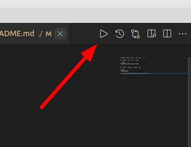

# `Ubuntu 20.04 vscode` 配置 `C/C++` 环境

## `Step1.` 安装 `C/C++` 编译器

```shell
$ sudo apt install gcc g++ gdb
```

## `Step2.` 安装相关 `vscode` 插件

* C/C++
* Code Runner

> 提示：安装完成 `Code Runner` 之后，**右上角**会有一个 `启动按钮` ，如果是 `C/C++` 项目，点击此按钮即可编译运行。如下图所示：



## `Step3.` 配置调试环境

首先在 `.vscode` 文件夹下新建 `launch.json` 和 `tasks.json` 文件，内容如下所示：

**launch.json**

```json
{
    "version": "0.2.0",
    "configurations": [
        {
            "name": "C/C++",
            "type": "cppdbg",
            "request": "launch",
            "program": "${fileDirname}/${fileBasenameNoExtension}",
            "args": [],
            "stopAtEntry": false,
            "cwd": "${workspaceFolder}",
            "environment": [],
            "externalConsole": false,
            "MIMode": "gdb",
            "preLaunchTask": "compile",
            "setupCommands": [
                {
                    "description": "Enable pretty-printing for gdb",
                    "text": "-enable-pretty-printing",
                    "ignoreFailures": true
                }
            ]
        }
    ]
}
```

**tasks.json**

```json
{
    "version": "2.0.0",
    "tasks": [{
            "label": "compile",
            "command": "g++",   // 如果是C语言项目，此处更改为gcc
            "args": [
                "-g",
                "${file}",
                "-o",
                "${fileDirname}/${fileBasenameNoExtension}"
            ],
            "problemMatcher": {
                "owner": "cpp",
                "fileLocation": [
                    "relative",
                    "${workspaceRoot}"
                ],
                "pattern": {
                    "regexp": "^(.*):(\\d+):(\\d+):\\s+(warning|error):\\s+(.*)$",
                    "file": 1,
                    "line": 2,
                    "column": 3,
                    "severity": 4,
                    "message": 5
                }
            },
            "group": {
                "kind": "build",
                "isDefault": true
            }
        }
    ]
}
```

`F9` 打断点， `F5` 调试， `OK` 啦！
