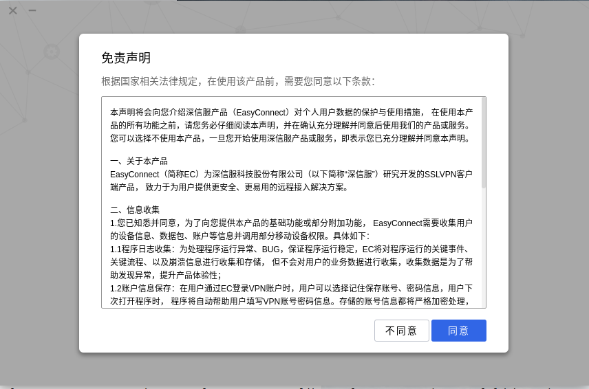

# EasyConnect 修复

## 介绍

`EasyConnect` 是一个 `VPN` 软件，常用于连接封闭的内网，一般用于学校、集团内网访问等。其基于 `Electron` 开发，所以可以运行在 `Linux` 、 `MacOS` 、 `Windows` 三大主流系统。

## bug现象

直接从图标进入没有反应，从终端启动会报错，报错信息如下：

``` shell
$ /usr/share/sangfor/EasyConnect/EasyConnect
Gtk-Message: 11:48:13.277: Failed to load module "canberra-gtk-module"

(EasyConnect:15706): Pango-ERROR **: 11:48:13.433: Harfbuzz version too old (1.3.1)

[1]    15706 trace trap (core dumped)  /usr/share/sangfor/EasyConnect/EasyConnect
```

## bug产生原因

从 `bug` 现象可以很容易的知道，这是 `Pango` 库导致的错误，错误原因是 `Harfbuzz` 版本太老。这个错误在 `Google上` 很容易找到解释，那就是—— `Electron` 的版本太老！

那没有办法。不可能让开发者去升级 `Electron` 版本，我们只能曲线救国。

根据提示，我们猜测大致有两种解决办法，一种是升级 `Harfbuzz` 的版本，另一种就是降级 `Pango` 的版本。

通过查询多方资料， `Harfbuzz` 的版本落后于 `Pango` ，也就是 `Pango` 太新， `Harfbuzz` 没有对应的版本。那么我们只能采用降低 `Pango` 版本的策略了。

> PS: 新版 `Pango` 似乎采用了 `libHarfbuzz0b` 这个包来替代 `libharfbuzz` 了。

## 解决bug

首先将Pango包进行降级，因为降级方法被当做案例写到了[Ubuntu 依赖库调整](../../基本使用/依赖库调整.md)笔记中，这里不做赘述，请移步。

依赖降级后开始启动：

``` shell
$ sudo /usr/share/sangfor/EasyConnect/EasyConnect
Gtk-Message: 16:24:50.218: Failed to load module "canberra-gtk-module"
```

能够正常弹出如下页面



这里还是有一个小瑕疵，那就是启动的时候说 `canberra-gtk-module` 这个模块找不到，这个很容易，安装一下就可以了。

``` shell
$ sudo apt install libcanberra-gtk-module
```

接下来再启动就完美了。

## 后记

并不是那么完美，首先，必须要使用 `root` 权限来启动这个软件，猜测是因为它劫持了网络流量，没有足够的权限无法达到这个操作。其次是启动了这个软件后不能正常上网了！！！！
