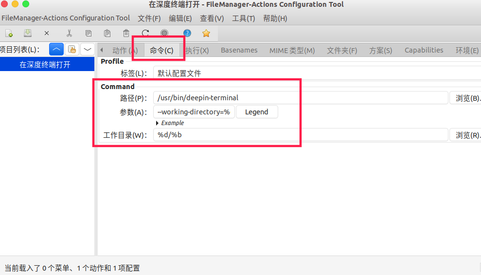

# Ubuntu 20.04 使用深度终端

## Step1. 安装深度终端

直接在Ubuntu 应用商店中搜索就行了。

## Step2. 安装dconf

直接在Ubuntu 应用商店中搜索就行了

## Step3. 修改配置

打开 `dconf` 搜索 `exec` 关键字，找到 `/org/gnome/desktop/applications/termimal/exec` 配置，如下如所示：


**关闭默认配置**，找到自定义值，将 `x-terminal-emulator` 替换为： `deepin-terminal` ，如下如所示：


保存关闭软件，可以愉快的使用 `Ctrl` + `Alt` + `T` 快捷键了！

# 右键菜单使用深度终端

## Step1. 启动filemanger-actions

``` shell
$ fma-config-tool
```

## Step2. 新建动作

**名称为：** 在深度终端打开

**勾选：** 显示选择右键菜单中的项目

**勾选：** Display item in location context menu

**不勾选：** 在工具栏中显示项目(T)


## Step3. 修改命令栏配置

**路径：** `/usr/bin/deepin-terminal`

**参数：** `--working-directory=%d/%b`

**工作目录：** `%d/%b`



## Step4. 打开左上角菜单中 编辑->Perferences

**项目顺序：** 字母升序

* Nautilus菜单布局：

	**不勾选：** Create a root 'FileManager-Actions' menu

	**勾选：** Add an 'About FileManager-Actions' item in the Nautilus context menus


## Step5. 保存，刷新配置

``` shell
$ nautilus -q
```
