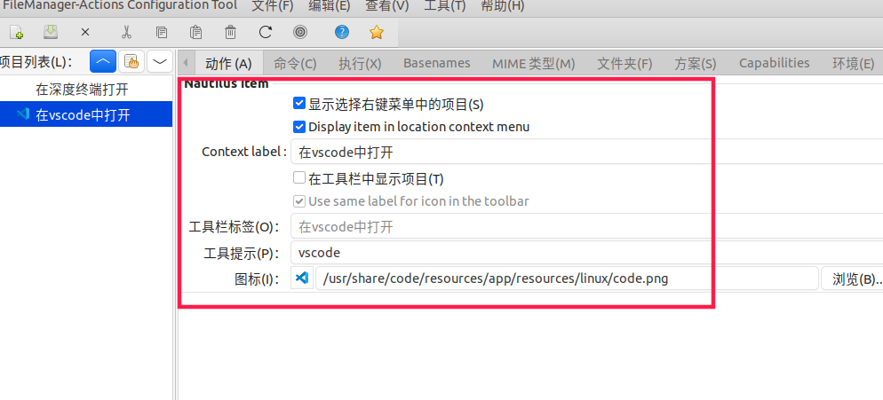
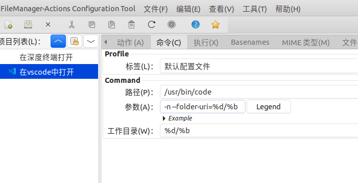

# Ubuntu 20.04 右键扩展在vscode中打开

首先，系统先安装vscode软件，去官网下载即可，[下载地址](https://code.visualstudio.com/download)

## Step1. 启动filemanger-actions

该软件的安装笔记参见：[Ubuntu 20.04 安装fma-config-tool](../软件安装/安装fma-config-tool.md)

``` shell
$ fma-config-tool
```

## Step2. 新建动作

**名称为：** 在vscode中打开

**勾选：** 显示选择右键菜单中的项目

**勾选：** Display item in location context menu

**不勾选：** 在工具栏中显示项目(T)

**工具提示(P):** 输入 `vscode`

**图标(I):** 输入 `/usr/share/code/resources/app/resources/linux/code.png`



## Step3. 修改命令栏配置

**路径：** `/usr/bin/code`

**参数：** `-n --folder-uri=%d/%b`

**工作目录：** `%d/%b`



## Step4. 保存，刷新配置

``` shell
$ nautilus -q
```
