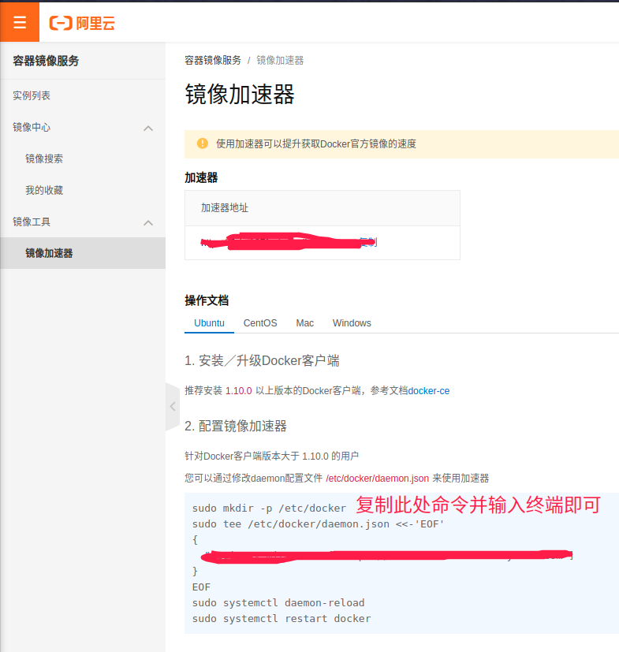

# Ubuntu 20.04 安装 Docker

[Docker简介](../../../../容器/Docker/基础知识/简介.md)

## 官网安装方法（不推荐）

[官方文档](https://docs.docker.com/engine/install/ubuntu/)

不推荐的原因：因为走的docker官网的镜像源，国内嘛，呵呵。

## apt安装法

一行命令即可

``` shell
$ sudo apt install docker.io
```

## 换源

不用说，换源必不可少。

### 公开镜像源

编辑 `/etc/docker/daemon.json` 文件，没有新建即可

``` shell
$ sudo vim /etc/docker/daemon.json
```

写入：

``` json
{
  "registry-mirrors": ["https://pee6w651.mirror.aliyuncs.com"]
}
```

保存，退出。

### 个人镜像源(推荐，方便以后使用阿里云的容器镜像服务！)

登录 `阿里云控制台` ，开通**容器镜像服务**



## 去掉sudo权限

安装好的Docker需要用sudo权限来启动，这不是一个好的习惯，会造成安全风险（题外话，Docker里面的root权限和宿主机中的root权限是一样的，如果处理不好，容器可能控制宿主机，这也是容器安全需要考虑的一方面，如想深入了解，可以看一下[虚拟化技术](../../../../容器/Docker/基础知识/虚拟化技术.md)）

### Step1. 创建docker用户组

``` shell
$ sudo groupadd docker
```

### Step2. 将当前用户增加到docker用户组中

``` shell
$ sudo usermod -aG docker $USER
```

### Step3. 注销并重新登录，以便重新评估组成员关系

``` shell
$ newgrp docker 
```

### Step4. 测试

``` shell
$ docker run hello-world
```

## 增加zsh自动补全命令功能

``` shell
$ gedit ~/.zshrc
```

插件列表增加插件 `docker` 即可

## 重启

换源后需要重启才能生效，重启命令如下：

``` shell
$ sudo service docker restart
```

## 开机自启动

默认Docker没有开机自启动功能的，需要我们手动给他添加到开机启动项中，如果不加，name每次开机后都要手动运行docker才行。

``` shell
$ sudo systemctl enable docker.service
```
