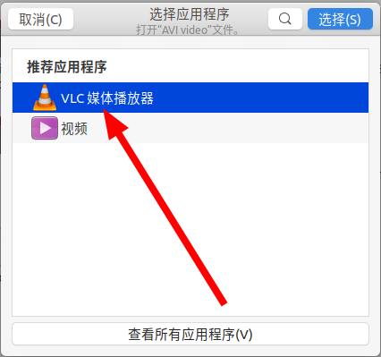

# `Ubuntu 20.04` 安装 `VLC` 视频播放器

## 介绍

`Ubuntu 20.04` 版本自带一个视频播放器，但是这个视频播放器有很多格式的视频是不支持的，例如 `avi` 文件。

`VLC` 视频播放器应运而生，其可以兼容绝大多数视频格式，有点万能播放器那种味道。

## 安装

`VLC` 已经内置到 `apt` 源中了，通过 `apt` 可以直接安装。

```shell
$ sudo apt install vlc
```

## 使用

在不支持格式的视频文件上右键，选择打开方式为：**VLC媒体播放器**

如下所示：



## 附加说明

作为程序员，我们完全可以通过代码的方式来绕过视频格式的问题，可以通过 `ffmpeg` 应用来完成视频格式转换，转换完的视频直接播放就好了。

视频格式转换请参考笔记：[视频格式转换](../../../../Adobe/杂项/视频格式转换/README.md)
