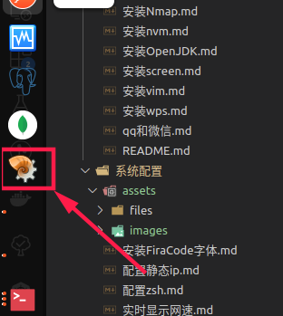

# Ubuntu 20.04 安装 fma-config-tool

`fma-config-tool` 软件是用来**扩展右键菜单**的。

## 安装命令

``` shell
$ sudo apt install nautilus-actions filemanager-actions
```

图标是一个小蜗牛



## 启动命令

``` shell
$ fma-config-tool
```

也可通过应用中心启动

## 修改后生效命令

``` shell
$ nautilus -q
```
