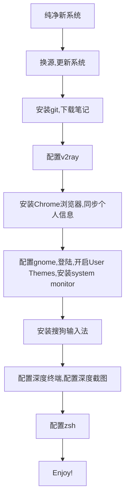

# ubuntu 新系统个性化配置篇

流程如下：

```mermaid
graph TD;
    纯净新系统 --> 换源,更新系统;
    换源,更新系统 --> 安装git,下载笔记;
    安装git,下载笔记 --> 配置v2ray;
    配置v2ray --> 安装Chrome浏览器,同步个人信息;
    安装Chrome浏览器,同步个人信息 --> A[配置gnome,登陆,开启User Themes,安装system monitor]
    A --> 安装搜狗输入法
    安装搜狗输入法 --> 配置深度终端,配置深度截图
    配置深度终端,配置深度截图 --> 配置zsh
    配置zsh --> Enjoy!
```