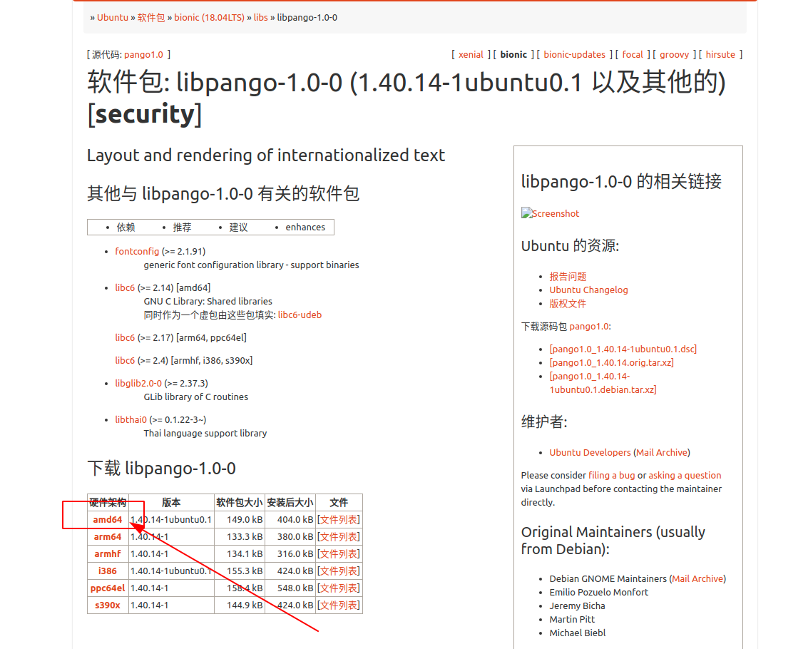

# Ubuntu 依赖库调整

关于依赖库相关知识请先阅读笔记：[Linux系统依赖库](../基础知识/依赖库.md)

本笔记结合案例做说明——[Ubuntu 20.04 EasyConnect修复](../20.04/bug修复/EasyConnect修复.md)

请在开始之前先阅读案例笔记。

## 目的

想要实现的目的就是将 `Easy Connect` 这个软件依赖的 `Pango` 库降级，来达到兼容的目的。

首先看一下 `Easy Connect` 中 `Pango` 的依赖关系

``` shell
$ ldd /usr/share/sangfor/EasyConnect/EasyConnect | grep pango
	libpangocairo-1.0.so.0 => /lib/x86_64-linux-gnu/libpangocairo-1.0.so.0 (0x00007faa0e276000)
	libpango-1.0.so.0 => /lib/x86_64-linux-gnu/libpango-1.0.so.0 (0x00007faa0e0dc000)
	libpangoft2-1.0.so.0 => /lib/x86_64-linux-gnu/libpangoft2-1.0.so.0 (0x00007faa0c432000)
```

可以看到，这三个包的地址都是指向了系统库（因为路径是 `/lib/x86_64-linux-gnu/**` ）我们要将其降级，是绝对不能动系统库的，需要单独为其指定依赖。

## 流程

## `Step1.` 准备软件包

首先，去 `ubuntu` 软件中心将这三个软件包都下载下来

* [libpango-1.0-0](https://packages.ubuntu.com/bionic/libs/libpango-1.0-0)
* [libpangocairo-1.0-0](https://packages.ubuntu.com/bionic/libpangocairo-1.0-0)
* [libpangoft2-1.0-0](https://packages.ubuntu.com/bionic/libpangoft2-1.0-0)

下图是 `libpango-1.0-0` 的下载页面示意：



这三个包下载下来都是 `deb` 文件，注意： `千万不要直接安装！`  `千万不要直接安装！`  `千万不要直接安装！`

将这三个包解压， `不是双击解压！`  `不是双击解压！`  `不是双击解压！` ，是 `右键` --> `提起到此处` 进行解压。

解压后能够看到一个以包名命名的文件夹，这里以 `libpango-1.0-0` 包示意，里面的文件及文件夹应如下所示：

``` shell
libpango-1.0-0_1.40.14-1ubuntu0.1_amd64
    ├── control.tar.xz
    ├── data.tar.xz
    └── debian-binary
```

接下来将 `data.tar.xz` 压缩包解压，会得到一个 `data` 文件夹，里面的文件及文件夹应如下所示：

``` shell
data
└── usr
    ├── lib
    │   └── x86_64-linux-gnu
    │       ├── libpango-1.0.so.0 -> libpango-1.0.so.0.4000.14
    │       └── libpango-1.0.so.0.4000.14
    └── share
        └── doc
            └── libpango-1.0-0
                ├── AUTHORS
                ├── changelog.Debian.gz
                ├── copyright
                ├── NEWS.gz
                ├── README
                └── THANKS

6 directories, 8 files
```

其余两个包做同样的解压缩处理。

### `Step2.` 依赖包替换

我们不想更新全局的依赖库，那么就要针对具体软件来进行单独配置。首先要了解软件是如何寻找依赖的，这个请参考上面提到的笔记：[Linux系统依赖库](../基础知识/依赖库.md)

接下来就容易了，只需要将这三个包的 `so文件` 和 `so指向文件` 移动到 `Easy Connect` 的可执行文件安装路径下即可。其安装路径为： `/usr/share/sangfor/EasyConnect/`

### `Step3.` 查看修改结果

``` shell
$ ldd /usr/share/sangfor/EasyConnect/EasyConnect | grep pango
	libpangocairo-1.0.so.0 => /usr/share/sangfor/EasyConnect/libpangocairo-1.0.so.0 (0x00007f9f4dfe8000)
	libpango-1.0.so.0 => /usr/share/sangfor/EasyConnect/libpango-1.0.so.0 (0x00007f9f4dc50000)
	libpangoft2-1.0.so.0 => /usr/share/sangfor/EasyConnect/libpangoft2-1.0.so.0 (0x00007f9f4bda9000)
```

可以看到，这三个包的指向已经从 `/lib/x86_64-linux-gnu/**` 转到了 `/usr/share/sangfor/EasyConnect/**` ，证明我们调整成功了！
