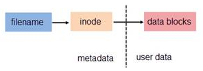

# 软硬连接基本介绍

 在linux系统中有种文件是 `链接文件` ，为了解决文件的共享使用。
 
 链接的方式可以分为两种，一种是 `硬链接（Hard Link）` ，另一种是 `软链接` 或者也称为 `符号链接（Symbolic Link）` 。

# 硬链接

硬链接是指 `通过索引节点来进行链接` 。在Linux的文件系统中，保存在磁盘分区中的文件不管是什么类型都会给它分配一个编号，这个编号被称为 `索引节点编号` (Inode Index)或者Inode，它是文件或者目录在一个文件系统中的 `唯一标识` ，文件的实际数据放置在数据区域（data block），它存储着文件重要参数信息，也就是 `元数据` （metadata），比如创建时间、修改时间、文件大小、属主、归属的用户组、读写权限、数据所在block号等，如下图所示。

在Linux系统中，多个文件名指向同一索引节点(Inode)是正常且允许的。一般这种链接就称为 `硬链接` 。

硬链接的 `作用之一是允许一个文件拥有多个有效路径名` ，这样用户就可以建立硬链接到重要的文件，以防止“误删”源数据(很多硬件，如netapp存储中的快照功能就应用了这个原理，增加一个快照就多了一个硬链接)。

不过硬链接只能在同一文件系统中的文件之间进行链接，不能对目录进行创建。

之所以文件建立了硬链接就会防止数据误删，是因为文件系统的原理是，只要文件的索引节点还有一个以上的链接（仅删除了该文件的指向），只删除其中一个链接并不影响索引节点本身和其他的链接（数据的实体并未删除），只有当最后一个链接被删除后，此时如果有新数据要存储到磁盘上，被删除的文件的数据块及目录的链接才会被释放，空间被新数据暂用覆盖。

# 软链接

 软链接（也叫符号链接）， `类似于windows系统中的快捷方式` ，与硬链接不同，软链接就是一个普通文件，只是数据块内容有点特殊，文件用户数据块中存放的内容是另一文件的路径名的指向，通过这个方式可以快速定位到软连接所指向的源文件实体。
 
`软链接可对文件或目录创建` 。

## 软链接的作用

* 便于文件的管理，比如把一个复杂路径下的文件链接到一个简单路径下方便用户访问。
* 节省空间解决空间不足问题，某个文件文件系统空间已经用完了，但是现在必须在该文件系统下创建一个新的目录并存储大量的文件，那么可以把另一个剩余空间较多的文件系统中的目录链接到该文件系统中。

删除软链接并不影响被指向的文件，但若被指向的原文件被删除，则相关软连接就变成了 `死链接` 。

# 软硬连接对比

<table>
<tbody>
<tr>
<td align="center">软链接</td>
<td align="center">硬链接</td>
</tr>
<tr>
<td>软链接是存放另一个文件的路径的形式存在。</td>
<td>硬链接以文件副本的形式存在。但不占用实际空间。</td>
</tr>
<tr>
<td>软链接可以 跨文件系统 ，硬链接不可以。</td>
<td>不允许给目录创建硬链接。</td>
</tr>
<tr>
<td>软链接可以对一个不存在的文件名进行链接，硬链接必须要有源文件。</td>
<td>硬链接只有在同一个文件系统中才能创建。</td>
</tr>
<tr>
<td>软链接可以对目录进行链接。</td>
<td>删除其中一个硬链接文件并不影响其他有相同 inode 号的文件。</td>
</tr>
</tbody>
</table>

`注意：` **不论是硬链接或软链接都不会将原本的档案复制一份，只会占用非常少量的磁碟空间。**
