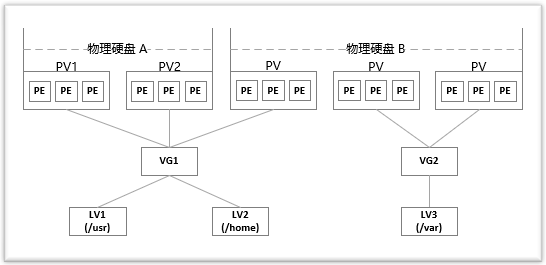

# LVM

## 需求场景

在对磁盘分区的大小进行规划时，往往不能确定这个分区要使用的空间的大小。而使用 `fdisk` 、 `gdisk` 等工具对磁盘分区后，每个分区的大小就固定了。如果分区设置的过大，就白白浪费了磁盘空间；如果分区设置的过小，就会导致空间不够用的情况出现。对于分区过小的问题，可以从新划分磁盘的分区，或者通过**软连接**的方式将此分区的目录链接到另外一个分区。这样虽然能够临时解决问题，但是给管理带来了麻烦。类似的问题可以通过 `LVM` 来解决。

## 简介

`LVM` 是 **Logical Volume Manager** 的缩写，中文一般翻译为 "**逻辑卷管理**"，它是 `Linux` 下**对磁盘分区进行管理**的一种机制。 `LVM` 是建立在磁盘分区和文件系统之间的一个**逻辑层**，系统管理员可以利用 `LVM` 在不重新对磁盘分区的情况下**动态**的调整分区的大小。如果系统新增了一块硬盘，通过 `LVM` 就可以将新增的硬盘空间直接扩展到原来的磁盘分区上。

## 优缺点

* **优点**
  + 文件系统可以**跨多个磁盘**，因此大小不再受物理磁盘的限制。
  + 可以在系统运行状态下**动态**地扩展文件系统大小。
  + 可以以**镜像**的方式冗余重要数据到多个物理磁盘上。
  + 可以很方便地**导出**整个卷组，并导入到另外一台机器上。
* **缺点**
  + 在从卷组中移除一个磁盘的时候必须使用 `reducevg` 命令(这个命令要求`root`权限，并且**不允许在快照卷组中使用**)。
  + 当卷组中的一个磁盘**损坏**时，整个卷组都会受影响。
  + 因为增加了一个逻辑层，存储的**性能**会受影响。

综上所述： `LVM` 的优点对**服务器的管理**非常有用，但对于桌面系统的帮助则没有那么显著，所以需要我们根据使用的场景来决定是否应用 `LVM` 。

## 基本概念

通过 `LVM` 技术，可以屏蔽掉磁盘分区的底层差异，在逻辑上给文件系统提供了一个卷的概念，然后在这些卷上建立相应的文件系统。

下面是 `LVM` 中主要涉及的一些**概念**。

* `物理存储设备`**(Physical Media**)

  指系统的存储设备文件，比如 `/dev/sda` 、 `/dev/sdb` 等

* `PV`(物理卷 **Physical Volume**)

  指硬盘分区或者从逻辑上看起来和硬盘分区类似的设备(比如 `RAID` 设备)。

* `VG`(卷组 **Volume Group**)

  类似于非 `LVM` 系统中的**物理硬盘**，一个 `LVM` 卷组由一个或者多个 `PV` (**物理卷**)组成。

* `LV`(逻辑卷 **Logical Volume**)

  类似于非 `LVM` 系统上的**磁盘分区**， `LV` 建立在 `VG` 上，可以在 `LV` 上建立文件系统。

* `PE`(**Physical Extent**)

  在 `PV` (**物理卷**)中可以分配的**最小存储单元**称为 `PE` ， `PE` 的大小是可以指定的。

* `LE`(**Logical Extent**)

  在 `LV` (**逻辑卷**)中可以分配的**最小存储单元**称为 `LE` ，在同一个卷组中， `LE` 的大小和 `PE` 的大小是**一样**的，并且**一一对应**。

可以这么理解， `LVM` 是把硬盘的分区分成了更小的单位( `PE` )，再用这些单元拼成更大的看上去像分区的东西( `PV` )，进而用 `PV` 拼成看上去像硬盘的东西( `VG` )，最后在这个新的硬盘上创建分区( `LV` )。

文件系统则建立在 `LV` 之上，这样就在物理硬盘和文件系统中间添加了一层抽象( `LVM` )。

下图大致描述了这些概念之间的关系：



> 两块物理硬盘 `A` 和 `B` 组成了 `LVM` 的底层结构，这两块硬盘的大小、型号可以不同。 `PV` 可以看做是硬盘上的分区，因此可以说物理硬盘 `A` 划分了两个分区，物理硬盘 `B` 划分了三个分区。然后将前三个 `PV` 组成一个卷组 `VG1` ，后两个 `PV` 组成一个卷组 `VG2` 。接着在卷组 `VG1` 上划分了两个逻辑卷 `LV1` 和 `LV2` ，在卷组 `VG2` 上划分了一个逻辑卷 `LV3` 。最后，在逻辑卷 `LV1` 、 `LV2` 和 `LV3` 上创建文件系统，分别挂载在 `/usr` 、 `/home` 和 `/var` 目录。

## LVM 工具使用

在安装 `ubuntu server` 时，如果选择使用 `LVM` 创建分区，就会安装 `LVM` 相关的工具。当前这个软件包的名称为 `lvm2` ，如果没有安装，可采用下面命令安装：

``` shell
$ sudo apt install lvm2
```

### 基本查看命令

``` shell
$ sudo pvscan
$ sudo pvs
$ sudo pvdisplay

$ sudo vgscan
$ sudo vgs
$ sudo vgdisplay

$ sudo lvscan
$ sudo lvs
$ sudo lvdisplay
```

### 扩缩容命令

``` shell
$ sudo lvextend -L 10G /dev/mapper/ubuntu--vg-ubuntu--lv      //增大或减小至19G
$ sudo lvextend -L +10G /dev/mapper/ubuntu--vg-ubuntu--lv     //增加10G
$ sudo lvreduce -L -10G /dev/mapper/ubuntu--vg-ubuntu--lv     //减小10G
$ sudo lvresize -l  +100%FREE /dev/mapper/ubuntu--vg-ubuntu--lv   //按百分比扩容
```

### 执行调整（使调整生效）

``` shell
$ sudo resize2fs /dev/mapper/ubuntu--vg-ubuntu--lv
```
