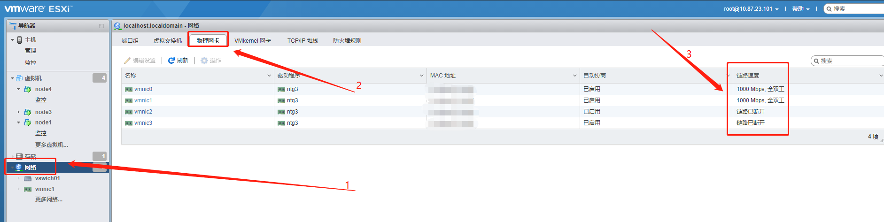
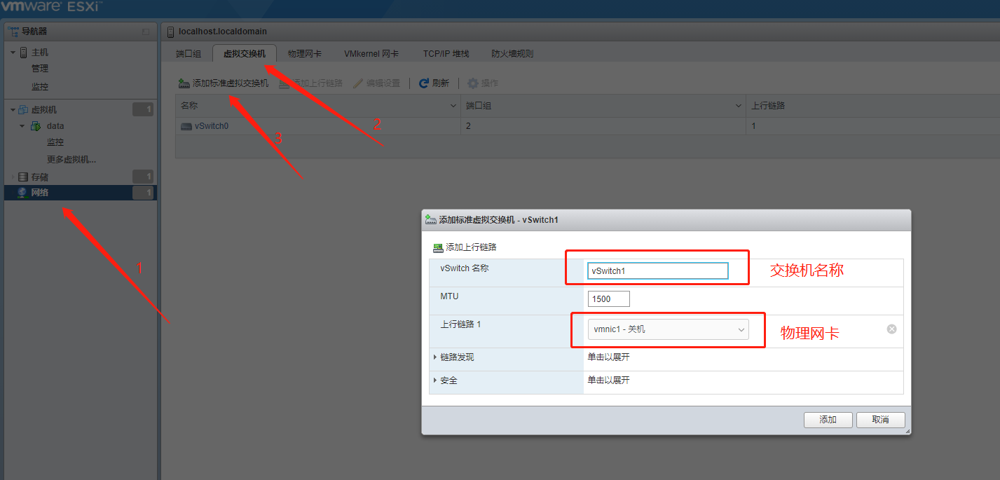
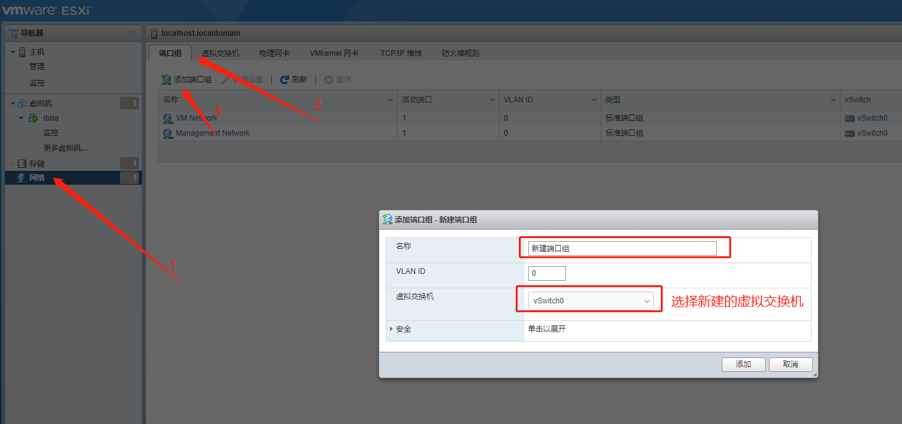
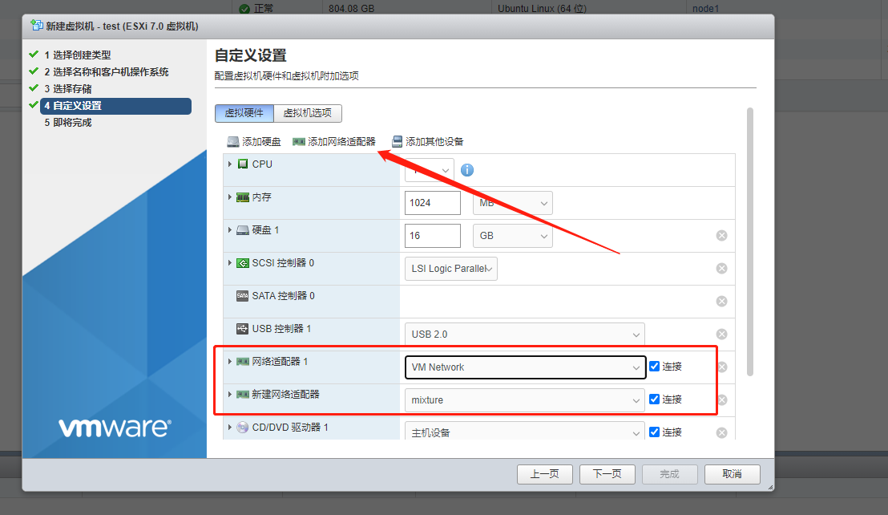

# vmware ESXi 系统 网卡篇

刀片式服务器一般会有**多个网卡**，登录**ESXi管理系统**后可以查看到具体的网卡，如下图所示：



可以看到，一共有四个物理网卡，其中 `vmnic0` 和 `vmnic1` 已经连接上网线了， `vmnic2` 和 `vmnic3` 未连接网线。

## 为虚拟机分配多个网卡

### Step1. 新建虚拟交换机

依次点击： `网络` -> `虚拟交换机` -> `添加标准虚拟交换机` 。输入名称，并选择实际物理网卡即可。

如下图所示：



添加之后即可在虚拟交换机列表中看到新建的虚拟交换机。

**说明：** `vSwich0` 为**默认虚拟交换机**，两个**默认端口组**（ `VM Network` 和 `Management Network` ）均绑定在这个虚拟交换机上。

### Step2. 新建端口组

依次点击： `网络` -> `端口组` -> `添加端口组` 。输入名称，并选择上一步新建的虚拟交换机。

如下图所示：



添加之后即可在端口组列表中看到新建的端口组。

### Step3. 新建或修改多网卡虚拟机

修改和新建差不多，这里拿新建举例。

如下图所示：



### Step4. 验证

虚拟机一切配置就绪就进入系统查看网卡：

``` shell
$ ip link
1: lo: <LOOPBACK,UP,LOWER_UP> mtu 65536 qdisc noqueue state UNKNOWN mode DEFAULT group default qlen 1000
    link/loopback 00:00:00:00:00:00 brd 00:00:00:00:00:00
2: ens160: <BROADCAST,MULTICAST,UP,LOWER_UP> mtu 1500 qdisc mq state UP mode DEFAULT group default qlen 1000
    link/ether ******** brd ff:ff:ff:ff:ff:ff
3: ens192: <BROADCAST,MULTICAST,UP,LOWER_UP> mtu 1500 qdisc mq state UP mode DEFAULT group default qlen 1000
    link/ether ******** brd ff:ff:ff:ff:ff:ff
```

可以看到现在系统中有两个实际网卡，分别是： `ens160` 和 `ens192` ，分辨他们到底属于哪个网卡，可以通过 `link/ether` 中的值（也就是mac地址）来去管理页面查看。
