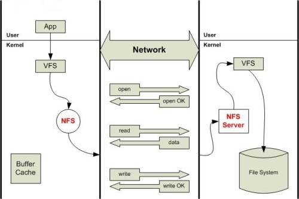

# NFS文件系统简介

`NFS` ，是**Network File System**的简写，即 `网络文件系统` 。网络文件系统是 `FreeBSD` 支持的文件系统中的一种。 `NFS` 允许一个系统在网络上与他人共享目录和文件。通过使用 `NFS` ，**用户和程序可以像访问本地文件一样访问远端系统上的文件** 。

工作原理图如下：

`NFSv3` 使用 `TCP` 、 `UDP` 协议（端口号是 `2049` ），默认是 `UDP` ; `NFSv4` 使用 `TCP` 协议（端口号是 `2049` ）和 `NFS服务器` 建立连接。具体版本之间的差异请转至笔记：[NFS系统版本](版本.md)
