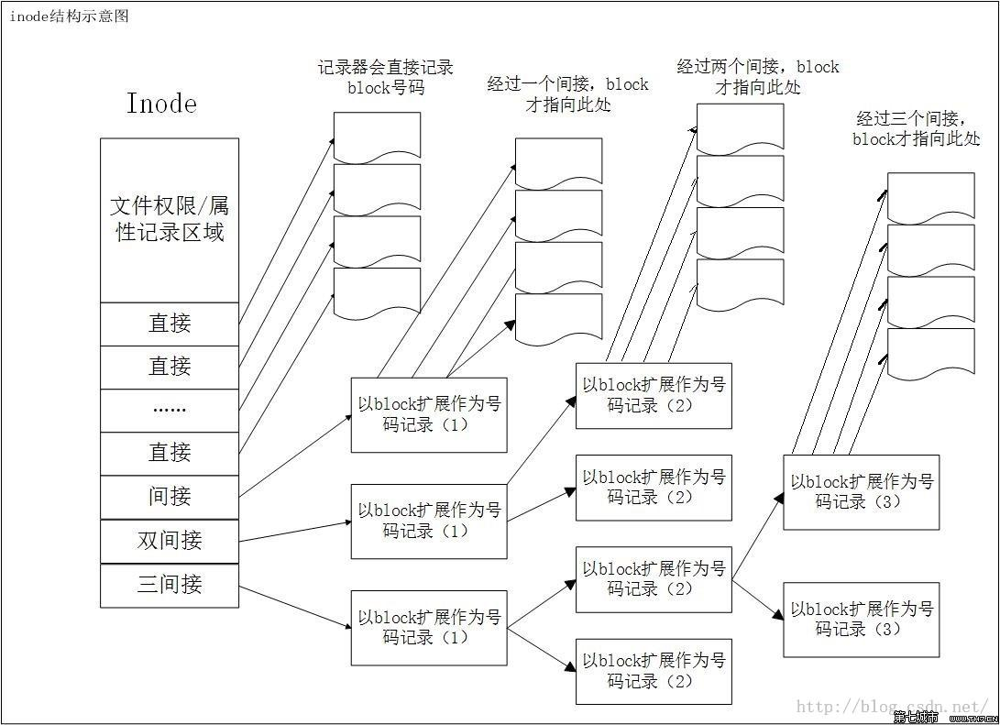

# Ext 文件系统

参考文章：[漫谈Linux标准的文件系统(Ext2/Ext3/Ext4)](https://www.cnblogs.com/justmine/p/9128730.html)

全称**Linux extended file system**, extfs，即 `Linux扩展文件系统` ，Ext2就代表第二代文件扩展系统，Ext3/Ext4以此类推，它们都是Ext2的升级版，只不过为了快速恢复文件系统，减少一致性检查的时间，增加了日志功能，所以Ext2被称为 `索引式文件系统` ，而Ext3/Ext4被称为 `日志式文件系统` 。

`注意：` Linux支持很多文件系统，包括网络文件系统(NFS)、Windows的Fat文件系统。

## 核心设计

### 数据存放区

这些元素相对稳定，磁盘格式化后，就固定下来了。

* inode(索引节点)

记录文件的权限、属性和数据所在块 `block` 的号码，每个文件都 `有且仅有一个的inode` ，每个inode都有自己的 `编号` ，可以把inode简单地理解为 `文档索引` 。

`说明：` 在磁盘格式化后，inode的大小和数量都已经固定了，大小均为128Bytes(新的Ext4和xfs为258Bytes)。读取文件时，先读取inode里面记录的文件属性和权限，匹配正确后，才会读取文件内容(block)。**在Linux系统中，实际使用inode来识别文件，而不是文件名，类似于用户标识和昵称的设计。**

* inode table

存储文件系统的所有inode编号的表格

* block(数据区块)

存储的文件内容，也叫 `数据区块(data block)` ，**每个block都有自己的编号**，Ext2支持的单位block容量**仅为1k、2k、4k。**

`注意：` 为了方便inode的记录，在磁盘格式化后，block的大小都已经固定了。每一个块只能存放一个文件的数据，若文件太大，将占用多个block；若文件太小，block剩余空间就不能被使用了，就会导致磁盘空间浪费，所以在磁盘分区后，文件系统格式化前，请先仔细想想文件系统的预计使用情况。

### 中介数据(metadata)

这些元素是为了维持文件系统状态而设计出来的，当新增、编辑、删除文档时，都需要变更这些状态信息。

* superblock(超级块)

记录文件系统(filesystem)的整体信息，包括**inode/block的总量、使用量、剩余量、大小、以及文件系统的格式和相关信息。**

`说明：` 整个文件系统的基本信息全部记录在superblock，它的**大小一般为1024Bytes**，如果它死掉，将会花费大量的时间去补救哦！！！

* block group(区块群组)

试想一下，假如我们的磁盘容量高达数百G，当我们格式后，inode和block会非常庞大，为了便于管理，Ext文件系统在格式化时，引入了区块群组(block group)的概念，每个区块群组都保持独立inode/block/superblock，拥有固定数量的block，这样就分成了一群一群最基础的子文件系统。

`说明：` superblock对于文件系统太重要了，但是文件系统的superblock又只有一个，所以除了第一个block group含有superblock外，后续block group都可能会含有备份的superblock，目的就是为了避免superblock单点无法救援的问题。

* block bitmap(区块对照表)

一个block只能被一个文件使用，当我们新增文件时，肯定需要使用新的block来记录文件数据。那么如何快速地知道，哪些block是新的？哪些block是已经使用了的？block bitmap就是这样被设计出来，记录所有使用和未使用的block号码。同样的，当我们删除文件时，先从block bitmap中找到对应的block号码，然后更新标志为未使用，最后释放block。

* inode bitmap(inode 对照表)

和block bitmap一样的设计理念，只不过它记录地是已使用和未使用的inode号码，这里就不再敖述了。

* group descriptor

描述每个区段(block group)开始和结束的block号码，以及说明每个区段(inodemap、blockmap、inode table)分别介于哪些block号码之间。

## 系统结构

### 计算单文件最大容量

**每个block号码为数字，需要占据4bytes。**

* **假设block的单位容量为1K，每个block能记录的block号码为1k/4=256。**
  + 12个直接容量 = 12 * 1k =12k
  + 单间接容量 = 256 * 1k = 256k
  + 双间接容量 = 256 * 256 * 1k = 65536k
  + 三间接容量 = 256 * 256 * 256 * 1k = 16777216k
  + 单文件最大总量 = 12个直接容量 + 单间接容量 + 双间接容量 + 三间接容量 = (12 + 256 + 65536 + 16777216) / (1024 * 1024) = 16.06G
* **假设block的单位容量为2K，每个block能记录的block号码为2k/4=512。**
  + 12个直接容量 = 12 * 2k =24k
  + 单间接容量 = 512 * 2k = 1024k
  + 双间接容量 = 512 * 512 * 2k = 524288k
  + 三间接容量 = 512 * 512 * 512 * 2k = 268435456k
  + 单文件最大总量 = 12个直接容量 + 单间接容量 + 双间接容量 + 三间接容量 = (24 + 1024 + 524288 + 268435456) / (1024 * 1024) = 256.50G
* **假设block的单位容量为4K，每个block能记录的block号码为4k/4=1024。**
  + 同理，单文件最大总量 = 12个直接容量 + 单间接容量 + 双间接容量 + 三间接容量 = 4.00T

**Linux标准的文件系统限制表**
|Block大小|1KB|2KB|4KB|
|-----|-----|-----|-----|
|最大单一文件限制|16GB|256GB|2TB|
|最大文件系统总容量|2TB|8TB|16TB|
