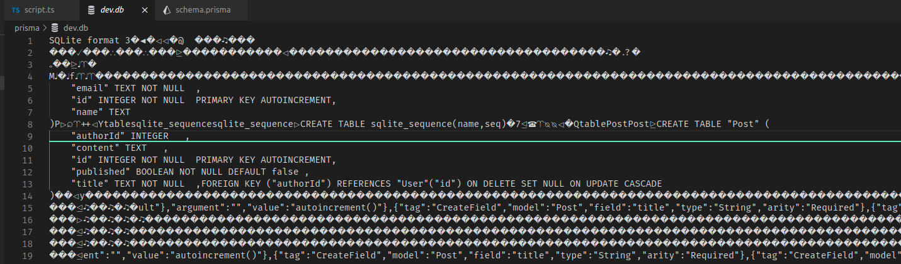
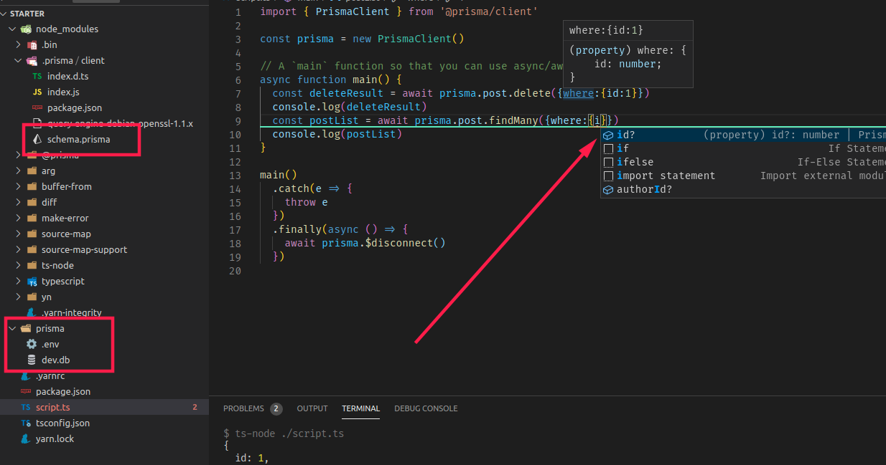

# Prisma 官方案例探究

官方的入门案例地址 https://www.prisma.io/docs/getting-started/quickstart-typescript

## Step1 下载示例项目

通过文档给的命令即可

``` shell
$ curl https://codeload.github.com/prisma/quickstart/tar.gz/master | tar -xz --strip=2 quickstart-master/typescript/starter
```

这时候就会在当前目录下发现一个 `starter` 文件夹。文件结构如下所示：

``` shell
starter
    ├── package.json
    ├── prisma
    │   ├── dev.db
    │   ├── .env
    │   └── schema.prisma
    ├── script.ts
    └── tsconfig.json

1 directory, 5 files
```

文件数量少，项目精炼。重点在于 `starter/prisma` 这个文件夹下的内容，其他文件内容和作用过于常见，不做赘述。

这里面一共有三个文件，分别是 `.env` ， `dev.db` ， `schema.prisma` 。下面来分别说一下这三个文件。

`.env` 文件，里面内容如下：

``` conf
DATABASE_URL="file:./dev.db"
```

这个文件实际上是数据库连接配置文件，写过后台项目的都应该对于 `数据库连接字符串` 有深入的印象，这里面的 `DATABASE_URL` 就是数据库连接字符串，但是和常见的**Postgresql**、**MySQL**、**MSSQL**等形式大相径庭，原因是这个是 `Sqlite` 数据库的连接字符串，这个数据库由于其 `运行时` 的特性，其连接字符串为具体文件的地址，也就是当前目录下的 `dev.db` 文件。

`dev.db` 文件：这个文件不是一个文本文件，通过 `vscode` 等编辑器打开会显示乱码，强行打开内容如下：



尽管大部分内容是无法查看的乱码，但是从小部分解码正确的内容可以看出部分内容，不难看出这是 `sqlite` 数据库的数据存储文件。

`schema.prisma` 文件：（**项目的核心精髓**）这个文件是 `prisma` 的数据格式定义字段，里面内容如下：

``` graphql
datasource db {
  provider = "sqlite"
  url      = env("DATABASE_URL")
}

generator client {
  provider = "prisma-client-js"
}

model Post {
  id        Int     @id @default(autoincrement())
  title     String
  content   String?
  published Boolean @default(false)
  author    User?   @relation(fields: [authorId], references: [id])
  authorId  Int?
}

model User {
  id    Int     @id @default(autoincrement())
  email String  @unique
  name  String?
  posts Post[]
}
```

这个文件**描述了数据库的表结构**。 `强调` 这里的关键字是**描述**，而不是**定义**。因为**修改这个文件并不能更改数据库的表结构，相反这个文件是通过数据库的表结构生成出来的！** 这是 `数据优先` (也叫**Schema First**)的模式。

## Step2. 安装依赖

这个老生常谈，不做赘述。

## Step3. CRUD尝试

接下来看一下代码文件 `script.ts` 文件。(注释已经被我删掉了)

``` typescript
import { PrismaClient } from '@prisma/client'

const prisma = new PrismaClient()

async function main() { }

main()
  .catch(e => {
    throw e
  })
  .finally(async () => {
    await prisma.$disconnect()
  })
```

### 查询

按照官方的流程，我们先来查看一下所有的 `user` 。

``` typescript
async function main() {
  const allUsers = await prisma.user.findMany()
  console.log(allUsers)
}
```

``` shell
$ yarn dev
yarn run v1.22.10
$ ts-node ./script.ts
[
  { id: 1, email: 'sarah@prisma.io', name: 'Sarah' },
  { id: 2, email: 'maria@prisma.io', name: 'Maria' }
]
Done in 0.98s.
```

可以看到里面有两个 `user` ，查询搞定！高级的查询去看官方文档深入学习，联查，删选，排序，分组等等。

### 创建

``` typescript
async function main() {
  const post = await prisma.post.create({
    data: {
      title: "Prisma makes databases easy",
      author: {
        connect: { email: "sarah@prisma.io" },
      },
    },
  })
  console.log(post)
  const allUsers = await prisma.user.findMany({
    include: { posts: true },
  })
  console.dir(allUsers, { depth: null })
}
```

由于篇幅问题，这里就不展示输出结果了，通过运行命令 `yarn dev` 后能够看到新建了一个 `post` ，并且查询所有 `user` 的时候也会联查出 `user` 的 `post`

### 更新

``` typescript
async function main() {
  const post = await prisma.post.update({
    where: { id: 2 },
    data: { published: true },
  })
  console.log(post)
}
```

运行结果：

``` shell
$ yarn dev
yarn run v1.22.10
$ ts-node ./script.ts
{
  id: 2,
  title: 'Prisma makes databases easy',
  content: null,
  published: true,
  authorId: 1
}
Done in 0.99s.
```

### 删除

``` typescript
async function main() {
  const deleteResult = await prisma.post.delete({where:{id:1}})
  console.log(deleteResult)
  const postList = await prisma.post.findMany()
  console.log(postList)
}
```

由于篇幅问题，这里就不展示输出结果了。

## 扩展说明

在上文已经提到了 `schema.prisma` 文件**仅仅是用来阐述数据库表结构的，在代码运行的时候不起作用**，为了验证这个思想，我们可以将其删除，之后运行代码，发现运行正常！

那这个时候就会产生一个疑问？ `prisma` 是拥有**类型推断**的，我们删了这个文件，还是可以正常的编码，运行，丝毫不影响，效果如下：



What？声明都没了，咋推断的类型？我们通过 `F12` 进入 `delete` 方法(方法任意)内部，会发现进入了一个声明文件，路径为： `node_modules/.prisma/client/index.d.ts` 。同时，会在这个目录下发现一个名为 `schema.prisma` 的文件，打开发现和我们删掉的 `schema.prisma` 文件内容完全一致！

那么这个文件是用来干什么的呢？我们删除这个文件，之后再运行试试，会发现无法运行，报错示例如下：

``` shell
$ yarn dev
yarn run v1.22.10
$ ts-node ./script.ts
(node:309005) UnhandledPromiseRejectionWarning: Error: Query engine exited with code 101

thread 'main' panicked at 'Could not open datamodel file "/home/iric/桌面/temp/starter/node_modules/.prisma/client/schema.prisma"', query-engine/query-engine/src/opt.rs:185:53
stack backtrace:
   0: rust_begin_unwind
             at /rustc/18bf6b4f01a6feaf7259ba7cdae58031af1b7b39/library/std/src/panicking.rs:475
   1: std::panicking::begin_panic_fmt
             at /rustc/18bf6b4f01a6feaf7259ba7cdae58031af1b7b39/library/std/src/panicking.rs:429
   2: query_engine::opt::load_datamodel_file::{{closure}}
   3: structopt::StructOpt::from_args
   4: query_engine::main::main::{{closure}}::main::{{closure}}
   5: <core::future::from_generator::GenFuture<T> as core::future::future::Future>::poll
   6: std::thread::local::LocalKey<T>::with
   7: <core::future::from_generator::GenFuture<T> as core::future::future::Future>::poll
   8: async_io::driver::block_on
   9: tokio::runtime::context::enter
```

由此推断，这个文件才是参与运行的文件！有关这个文件更详细的信息会在其他笔记中阐述。
