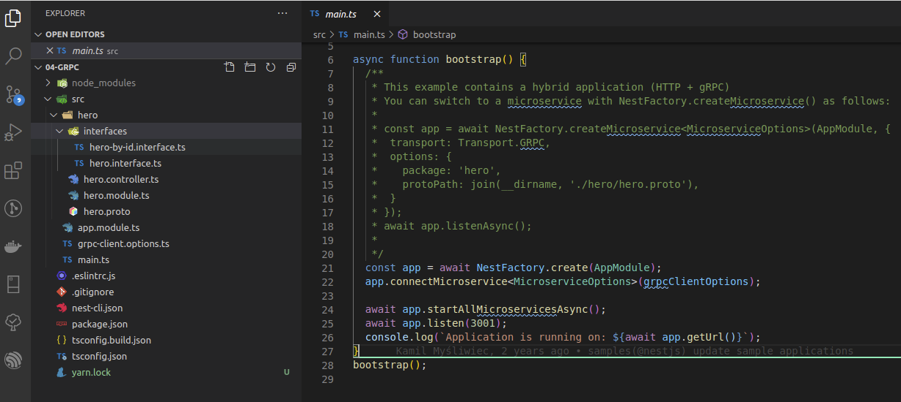

# Nestjs gRPC 官方demo详解

## 前言

官方的这个demo对于初学者是 `非常非常之不友好` 的！！！可能你看过很多的grpc相关介绍，讲了很多客户端，服务端等一系列知识，然后看这个demo，仅仅只有几个文件，可能都无法理清客户端和服务端的界限，这行代码究竟是客户端还是服务端？这是因为官方demo `将客户端和服务端写到了一起` ，没有明确的标出来那块是客户端，那块是服务端！

实际上，GRPC是一个非常非常简单的东西，相对于大家熟知的http来讲，难度小了很多，例如：参数传递就一种方式（http有多种）, 四种服务方式99%的情况下都只会用到 `单向RPC(一元RPC)` 这个最简单的服务方式，而http有GET、POST等多种方法表示资源的变迁，也没有http那么多不同含义的返回状态码。

`问：` 那为什么作者将demo写的如此晦涩难懂？

`答：` 人家是开源，不是讲师！看不懂是水平不到家，当你用过一段时间的grpc之后回过头来再看这个demo，就会发现作者的功底，能够用如此少的代码集成http server，grpc client和grpc server，而且文件划分的如此精致，这才是水平！

## 下载

[官方Demo地址](https://github.com/nestjs/nest/tree/master/sample/04-grpc)

clone下来，并用vscode打开，会得到如下工程



图中文件用意解释：

``` 
src     // 源码目录
├── app.module.ts       // 系统总module文件
├── grpc-client.options.ts      //grpc配置，注意：虽然这里是以client命名的，但是这个是客户端和服务器的配置，也就是说客户端和服务器是一套配置！！！
├── hero        //hero模块代码，此demo是模块化的工程构造。
│   ├── hero.controller.ts      //controller文件，注意：这个文件是http的controller和grpc的controller结合版，里面既有http的路由处理，又有grpc的路由处理
│   ├── hero.module.ts      // 模块注册文件
│   ├── hero.proto      // 用于grpc protobuf协议的proto定义文件，里面是proto3语法
│   └── interfaces      //相关接口文件夹
│       ├── hero-by-id.interface.ts     //相关接口文件
│       └── hero.interface.ts       //相关接口文件
└── main.ts     //程序主入口
```

注意： clone并 `npm i` 之后是不能启动的，因为默认是混合服务，http+grpc，需要安装express适配器才行。 `npm i @nestjs/platform-express` or `yarn add @nestjs/platform-express` , 之后可以通过 `npm start` or `yarn start` 启动。

## 流程说明

先上调用流程，后讲代码实现，因作者在代码实现的时候将http，grpc client，grpc server柔和到一起做了，对初学者很不友好，入门曲线很陡峭。

使用 `yarn start` or `npm start` 开启服务

``` 
» yarn start                                                                                                              
yarn run v1.22.4
$ nest start
[Nest] 415470   - 2020-09-21 2:41:05 ├F10: PM┤   [NestFactory] Starting Nest application...
[Nest] 415470   - 2020-09-21 2:41:05 ├F10: PM┤   [InstanceLoader] AppModule dependencies initialized +8ms
[Nest] 415470   - 2020-09-21 2:41:05 ├F10: PM┤   [InstanceLoader] ClientsModule dependencies initialized +0ms
[Nest] 415470   - 2020-09-21 2:41:05 ├F10: PM┤   [InstanceLoader] HeroModule dependencies initialized +0ms
[Nest] 415470   - 2020-09-21 2:41:05 ├F10: PM┤   [NestMicroservice] Nest microservice successfully started +3ms
[Nest] 415470   - 2020-09-21 2:41:05 ├F10: PM┤   [RoutesResolver] HeroController {/hero}: +4ms
[Nest] 415470   - 2020-09-21 2:41:05 ├F10: PM┤   [RouterExplorer] Mapped {/hero, GET} route +1ms
[Nest] 415470   - 2020-09-21 2:41:05 ├F10: PM┤   [RouterExplorer] Mapped {/hero/:id, GET} route +1ms
[Nest] 415470   - 2020-09-21 2:41:05 ├F10: PM┤   [NestApplication] Nest application successfully started +2ms
Application is running on: http://[::1]:3001
```

之后访问http服务

``` bash
» curl http://127.0.0.1:3001/hero                                                                   
[{"id":1,"name":"John"},{"id":2,"name":"Doe"}]% 
```

调用流程如下：


简要总结：http请求先进http的controller，之后调用grpc方法，进入grpc controller，在grpc controller中进行一系列操作，原路返回，最终返回给请求来源。

## 代码剖析

### main.ts

main.ts中的内容如下：

``` typescript
import { NestFactory } from '@nestjs/core';
import { MicroserviceOptions } from '@nestjs/microservices';
import { AppModule } from './app.module';
import { grpcClientOptions } from './grpc-client.options';

async function bootstrap() {
  /**
   * This example contains a hybrid application (HTTP + gRPC)
   * You can switch to a microservice with NestFactory.createMicroservice() as follows:
   *
   * const app = await NestFactory.createMicroservice<MicroserviceOptions>(AppModule, {
   *  transport: Transport.GRPC,
   *  options: {
   *    package: 'hero',
   *    protoPath: join(__dirname, './hero/hero.proto'),
   *  }
   * });
   * await app.listenAsync();
   *
   */
  const app = await NestFactory.create(AppModule);
  app.connectMicroservice<MicroserviceOptions>(grpcClientOptions);

  await app.startAllMicroservicesAsync();
  await app.listen(3001);
  console.log( `Application is running on: ${await app.getUrl()}` );
}
bootstrap();

```

先忽略注释，该代码的作用是启动混合服务，http+grpc服务，流程如下：


`注意：` http服务和grpc服务都占用3001端口！！！

接下来看看注释讲了什么事情

``` typescript
const app = await NestFactory.createMicroservice<MicroserviceOptions>(AppModule, {
    transport: Transport.GRPC,
    options: {
        package: 'hero',
        protoPath: join(__dirname, './hero/hero.proto'),
    }
});
await app.listenAsync();
```

通过注释可以很容易的知道，这是启动单一grpc服务的示例，就是不要http服务，只有grpc服务。

`注意：` 这里没有写端口，一般options里面需要写监听的端口，否则客户端无法调用，因为不知道端口！示例如下：

``` typescript
const app = await NestFactory.createMicroservice<MicroserviceOptions>(AppModule, {
    transport: Transport.GRPC,
    options: {
        url: `${process.env.COMMON_BIND}:${process.env.COMMON_PORT}` ,
        package: "iot.log",
        protoPath: join(__dirname, './app.proto'),
    },
});

app.useGlobalFilters(new GrpcExceptionsFilter());

await app.listenAsync();
```

其中 `options.url` 就是用来配置程序占用端口的，通常为： `127.0.0.1:3300` or `0.0.0.0:3300` 。 `127.0.0.1` 表示这个服务 `只能本地调用` ，其他ip来源的请求直接过滤， `0.0.0.0` 表示 `任意来源` 的ip都可以调用。题外话：mysql，Postgresql，mongodb等数据库默认都是只能本机连接，其思想和这里的设计思想是一样的，注意多思考。

> `思考题？` 如果想要做仅能内网连接的，请求来源ip为127、192、10、172开头的允许访问，该如何设置？

### grpc-client.options.ts

grpc-client.options.ts文件中的内容如下：

``` typescript
import { ClientOptions, Transport } from '@nestjs/microservices';
import { join } from 'path';

export const grpcClientOptions: ClientOptions = {
  transport: Transport.GRPC,
  options: {
    package: 'hero', // ['hero', 'hero2']
    protoPath: join(__dirname, './hero/hero.proto'), // ['./hero/hero.proto', './hero/hero2.proto']
  },
};
```

该文件主要是定义了grpc服务的proto文件，以及 `包名` ，包名需与proto文件中定义的一致，请查看proto协议那里的笔记详细了解。

这个文件尽管是以client结尾的，但是生成server和client都是用的这个配置！

### app.module.ts

大家都知道，不做赘述。

### hero.proto

GRPC用的protobuf协议定义文件，内容如下：（请查看proto协议那里的笔记详细了解。）

``` protobuf
syntax = "proto3";

package hero;

service HeroService {
  rpc FindOne (HeroById) returns (Hero);
  rpc FindMany (stream HeroById) returns (stream Hero);
}

message HeroById {
  int32 id = 1;
}

message Hero {
  int32 id = 1;
  string name = 2;
}
```

### hero.module.ts

该文件用来组织依赖关系，内容如下：

``` typescript
import { Module } from '@nestjs/common';
import { ClientsModule } from '@nestjs/microservices';
import { grpcClientOptions } from '../grpc-client.options';
import { HeroController } from './hero.controller';

@Module({
  imports: [
    ClientsModule.register([
      {
        name: 'HERO_PACKAGE',
        ...grpcClientOptions,
      },
    ]),
  ],
  controllers: [HeroController],
})
export class HeroModule {}
```

注意： `ClientsModule.register()` 方法是用来 `声明并注入grpc client` 的关键。如不明白，基本功不扎实，去看nestjs依赖注入！

### hero.controller.ts

重点来了，划重点！！！ `这个文件是整个项目的精华所在，也是难点所在！` ，里面的内容如下：

``` typescript
import { Controller, Get, Inject, OnModuleInit, Param } from '@nestjs/common';
import {
  ClientGrpc,
  GrpcMethod,
  GrpcStreamMethod,
} from '@nestjs/microservices';
import { Observable, ReplaySubject, Subject } from 'rxjs';
import { toArray } from 'rxjs/operators';
import { HeroById } from './interfaces/hero-by-id.interface';
import { Hero } from './interfaces/hero.interface';

interface HeroService {
  findOne(data: HeroById): Observable<Hero>;
  findMany(upstream: Observable<HeroById>): Observable<Hero>;
}

@Controller('hero')
export class HeroController implements OnModuleInit {
  private readonly items: Hero[] = [
    { id: 1, name: 'John' },
    { id: 2, name: 'Doe' },
  ];
  private heroService: HeroService;

  constructor(@Inject('HERO_PACKAGE') private readonly client: ClientGrpc) {}

  onModuleInit() {
    this.heroService = this.client.getService<HeroService>('HeroService');
  }

  @Get()
  getMany(): Observable<Hero[]> {
    const ids$ = new ReplaySubject<HeroById>();
    ids$.next({ id: 1 });
    ids$.next({ id: 2 });
    ids$.complete();

    const stream = this.heroService.findMany(ids$.asObservable());
    return stream.pipe(toArray());
  }

  @Get(':id')
  getById(@Param('id') id: string): Observable<Hero> {
    return this.heroService.findOne({ id: +id });
  }

  @GrpcMethod('HeroService')
  findOne(data: HeroById): Hero {
    return this.items.find(({ id }) => id === data.id);
  }

  @GrpcStreamMethod('HeroService')
  findMany(data$: Observable<HeroById>): Observable<Hero> {
    const hero$ = new Subject<Hero>();

    const onNext = (heroById: HeroById) => {
      const item = this.items.find(({ id }) => id === heroById.id);
      hero$.next(item);
    };
    const onComplete = () => hero$.complete();
    data$.subscribe(onNext, null, onComplete);

    return hero$.asObservable();
  }
}
```

首先看一下类装饰器： `@Controller('hero')` , 似乎很熟悉啊，写纯http的时候都这么写，但 `这里不一样！`
这里由于作者开启了混合服务（http+grpc），这是两个服务的controller！对于http服务，里面的 `@Get() getMany()` 和 `@Get(':id') getById(@Param('id') id: string)` 和往常用的没有区别。对于grpc服务， `@GrpcMethod('HeroService') findOne(data: HeroById)` 和 `@GrpcStreamMethod('HeroService') findMany(data$: Observable<HeroById>)` 方法才有作用！

|http服务方法|GRPC服务方法|
|-----|-----|
|@Get() getMany()|@GrpcMethod('HeroService') findOne(data: HeroById)|
|@Get(':id') getById(@Param('id') id: string)|@GrpcStreamMethod('HeroService') findMany(data$: Observable<HeroById>)|

这里讲解 `单向RPC(一元RPC)` 调用，findMany为 `双向流式 RPC` 请自行按照下面的思路研究。

从http请求的 `@Get(':id') getById(@Param('id') id: string)` 方法开始，代码中仅有一行： `return this.heroService.findOne({ id: +id });` ，该代码调用了 `this.heroService.findOne()` 方法，此方法为grpc方法（PS：此处可以看出grpc的特点，单看这行代码，和我们正常调用一个service的方法写法上完全一致，这就是grpc的出发点！）。该方法如何做的呢？为什么仅此一行就实现了rpc调用？接下来在这个文件中看所有与 `heroService` 相关的地方。会发现，在程序的开头定义了这个私有变量 `private heroService: HeroService;` , 之后在 `onModuleInit()` 生命周期函数中为其进行赋值： `this.heroService = this.client.getService<HeroService>('HeroService');` 这行代码就有了一点超出常规，因为正常的写法都是在constructor构造函数中实现依赖注入的，这个却是在生命周期中通过赋值的方式来实现的，而且赋的值是从另一个属性：`this.client` 中通过 `getService` 方法来取出来的！视线转到client上，那这个东西又是什么呢？查看代码，发现了很熟悉的一行： `constructor(@Inject('HERO_PACKAGE') private readonly client: ClientGrpc) {}` ，这是经典的依赖注入写法！瞬间清晰了很多！那这个 `ClientGrpc` 又是那里来的呢？往上翻！看到 `hero.module.ts` 文件讲解的部分。至此，http转到grpc已经走通。

`注意：`  `this.client.getService<HeroService>('HeroService')` 中为什么函数参数中用字符串 `'HeroService'` 来作为参数呢？这个可不是随意写的，这个是grpc通过proto文件来生成的客户端里面的！看一下 `hero.proto` 文件就能看到 `service HeroService` 这个很明显代码，所以这个函数参数是在这里来的！不能乱写哦！

下面看一下grpc server部分，前面已经讲过了，http如何通过grpc client发送消息，现在我们来讲其接收和处理。对于grpc的微服务架构，也是有controller的，前面已经讲过很多次了，作者将http的controller和grpc的controller合并，写到一个文件中了，就是现在我们分析的 `hero.controller.ts` 文件！对于grpc的controller来讲 `@Controller('hero')` 中的 `'hero'` 是不起作用的！我们来看 `@GrpcMethod('HeroService') findOne(data: HeroById)` 方法，咦，为什么是这个方法呢？那就不得不说我们的调用了，看我们的调用代码： `return this.heroService.findOne({ id: +id });` 其中，heroService已经介绍了，那findOne呢？看proto啊， `hero.proto` 文件中在 `Service HeroService` 中有这么一行代码： `rpc FindOne (HeroById) returns (Hero);` , 咦，proto中是 `FindOne` 啊，为什么到代码中是 `heroService.findOne()` 了呢？它不关心大小写吗？答案：不是的，详细看一下nestjs中关于[gPRC](https://docs.nestjs.com/microservices/grpc)相关文档，会发现有以下代码：(自行翻译！)

> Both @GrpcMethod() decorator arguments are optional. If called without the second argument (e.g., 'FindOne'), Nest will automatically associate the .proto file rpc method with the handler based on converting the handler name to upper camel case (e.g., the findOne handler is associated with the FindOne rpc call definition). This is shown below.

回过头来继续看 `@GrpcMethod('HeroService') findOne(data: HeroById)` 这个方法，方法装饰器中的参数 `'HeroService'` 也就很容易理解了吧，对，没错，就是proto中的Service后面跟着的单词！那方法名称叫 `findOne` 也能够理解了吧！到此，分析完成了！

## 总结

这篇笔记写的很长，最好是能够按照我画的流程在demo中打一些断点进行调试一下，打一些log也是可以的，体会一下调用流程。还是开篇那句话，这个demo对于初学者非常不友好，各部分划分的并没有那么零散，需要有grpc经验或者有nest功底看起来才不会那么绕，建议在使用grpc一段时候后回过来再去看这个demo，体会自己和nestjs作者思想上的差距！
