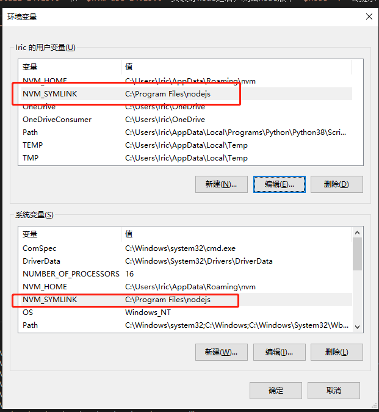
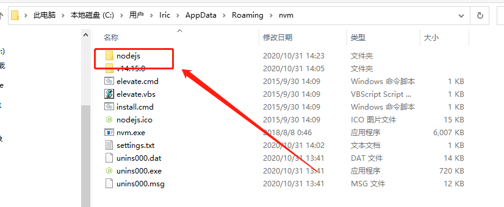
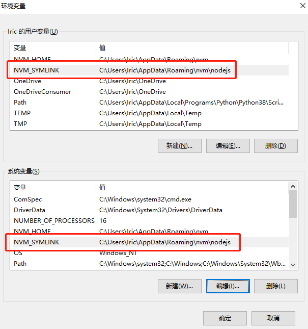

# nvm-windows bug 修复

## 环境变量bug

如果正常安装好nvm，并通过命令 `$nvm install 14.15.0` 和 `$nvm use 14.15.0` 安装好node之后，测试node版本 `$node -v` 会提示 **'node' 不是内部或外部命令，也不是可运行的程序或批处理文件。**

这个问题产生的原因：是环境变量中的 `NVM_SYMLINK` 变量值不正确。

如果**在安装的时候没有更改安装路径**，那么环境变量应该如下所示：

可以看到 `NVM_SYMLINK` 变量值是：**C:\Program Files\nodejs** 这个路径是不对的。

### 解决办法

**在没有更改默认安装位置的前提下：**

在文件夹 `C:\Users\${username}\AppData\Roaming\nvm` 文件下新建 `nodejs` 文件夹，空的，什么都不要往里面放！！！（**提示：** `AppData` 是隐藏文件夹！！！）

如下所示：

之后修改环境变量 `NVM_SYMLINK` ，设置其值为： `C:\Users\${username}\AppData\Roaming\nvm\nodejs` ，如下所示：

保存，退出， `关闭所有终端！重新开启终端` 进行后续操作
