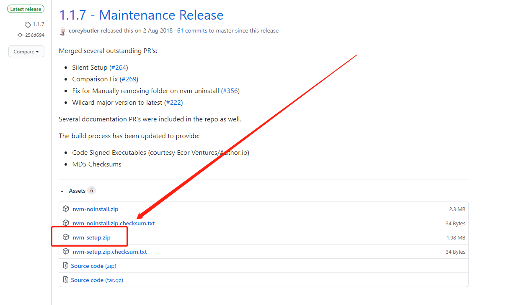

# Windows10 安装nvm

## 前言

`nvm` 是Linux/Max下的一套node版本管理工具（nvm来源于: node version manager），作者在开发时并无跨平台的打算，在Windows下我们使用其衍生版本—— `nvm-windows` , [GitHub地址](https://github.com/coreybutler/nvm-windows)

## 安装方法

很简单，在GitHub Realease页面下载最新版的安装包，解压，双击安装即可。

`注意：` **不要更改安装位置**，这个软件有一个小bug（ps：也不算bug，只是策略选择的问题）。后面会修改一些参数，要用到这个路径。



安装完成测试

``` cmd
$ nvm version
1.1.7
```

## 换源

默认使用 `https://nodejs.org/dist/` 中的node发行包，这个地址在国内下载并不友好，我们将其换成淘宝镜像。

``` cmd
$ nvm node_mirror https://npm.taobao.org/mirrors/node/
$ nvm npm_mirror https://npm.taobao.org/mirrors/npm/
```

测试换源结果：

``` cmd
$ nvm list available
|   CURRENT    |     LTS      |  OLD STABLE  | OLD UNSTABLE |
|--------------|--------------|--------------|--------------|
|    15.0.1    |   14.15.0    |   0.12.18    |   0.11.16    |
|    15.0.0    |   12.19.0    |   0.12.17    |   0.11.15    |
|   14.14.0    |   12.18.4    |   0.12.16    |   0.11.14    |
|   14.13.1    |   12.18.3    |   0.12.15    |   0.11.13    |
|   14.13.0    |   12.18.2    |   0.12.14    |   0.11.12    |
|   14.12.0    |   12.18.1    |   0.12.13    |   0.11.11    |
|   14.11.0    |   12.18.0    |   0.12.12    |   0.11.10    |
|   14.10.1    |   12.17.0    |   0.12.11    |    0.11.9    |
|   14.10.0    |   12.16.3    |   0.12.10    |    0.11.8    |
|    14.9.0    |   12.16.2    |    0.12.9    |    0.11.7    |
|    14.8.0    |   12.16.1    |    0.12.8    |    0.11.6    |
|    14.7.0    |   12.16.0    |    0.12.7    |    0.11.5    |
|    14.6.0    |   12.15.0    |    0.12.6    |    0.11.4    |
|    14.5.0    |   12.14.1    |    0.12.5    |    0.11.3    |
|    14.4.0    |   12.14.0    |    0.12.4    |    0.11.2    |
|    14.3.0    |   12.13.1    |    0.12.3    |    0.11.1    |
|    14.2.0    |   12.13.0    |    0.12.2    |    0.11.0    |
|    14.1.0    |   10.23.0    |    0.12.1    |    0.9.12    |
|    14.0.0    |   10.22.1    |    0.12.0    |    0.9.11    |
|   13.14.0    |   10.22.0    |   0.10.48    |    0.9.10    |
```
