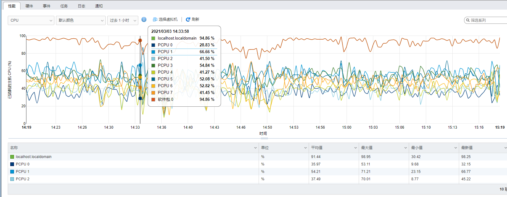
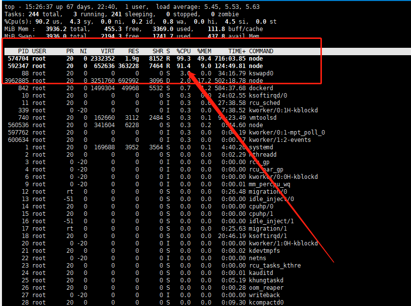
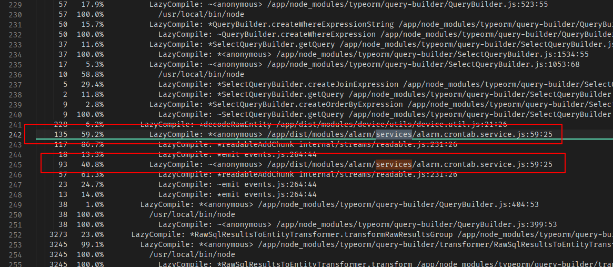
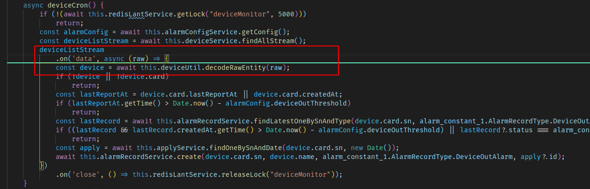

# NodeJS 程序CPU占用过高

## 服务部署场景

采用 `Docker Swarm` 部署，三个应用节点。

## 产生场景

在一个阴沉的天气里，突然客户说系统登录慢，页面数据响应也慢，打开 `VMWareESXi` 系统的管理界面，查看数据服务器和应用服务器的状态，发现数据服务运行正常，但是监控服务器就接近崩溃了，如下所示：



## 问题定位

首先登录任意一个节点服务器，通过 `top` 命令来查看系统状态。得到结果如下图所示：



基本可以发现是 `node` 导致的了。接下来开始分析为什么导致了 `CPU` 占用过高。

## 服务状态记录

在启动 `node` 服务的时候加上 `--prof` 参数，如下所示：

```shell
$ node --prof dist/main.js
```

这样就会在项目**根目录**下生成一个日志文件，格式为： `isolate-0XXXXXXXXXXX-v8-XXXX.log`

运行一段时间后将这个文件拿到，但是这个文件是不能直接看的，看不懂，可以打开看一下里面的内容大致如下：

```log
v8-version,8,4,371,19,-node.17,0
shared-library,/usr/local/bin/node,0x555cadf79000,0x555cafa23000,0
shared-library,/usr/local/bin/node,0x555cadf79000,0x555cafb7a000,0
shared-library,/usr/lib/libgcc_s.so.1,0x7f430f948000,0x7f430f957000,0
shared-library,/usr/lib/libstdc++.so.6.0.28,0x7f430f95c000,0x7f430fa9e000,0
shared-library,/lib/ld-musl-x86_64.so.1,0x7f430faf5000,0x7f430fb51000,0
shared-library,[vdso],0x7ffce57da000,0x7ffce57db000,0
profiler,begin,1000
tick,0x7f430fb48885,2952,0,0x0,6
tick,0x555caee02588,2991,0,0x0,6
tick,0x555caeef89f0,4525,0,0x0,6
tick,0x555caee025f0,5161,0,0x0,6
tick,0x555caec558e6,6314,0,0x0,6
tick,0x7f430fb29c4d,7410,0,0x0,6
code-creation,Builtin,3,7514,0x555caf0ef4c0,1632,RecordWrite
code-creation,Builtin,3,7551,0x555caf0efb40,424,EphemeronKeyBarrier
code-creation,Builtin,3,7566,0x555caf0efd00,44,AdaptorWithBuiltinExitFrame
code-creation,Builtin,3,7582,0x555caf0efd40,291,ArgumentsAdaptorTrampoline
code-creation,Builtin,3,7597,0x555caf0efe80,207,CallFunction_ReceiverIsNullOrUndefined
code-creation,Builtin,3,7622,0x555caf0eff60,260,CallFunction_ReceiverIsNotNullOrUndefined
code-creation,Builtin,3,7632,0x555caf0f0080,289,CallFunction_ReceiverIsAny
code-creation,Builtin,3,7640,0x555caf0f01c0,127,CallBoundFunction
code-creation,Builtin,3,7648,0x555caf0f0240,109,Call_ReceiverIsNullOrUndefined
code-creation,Builtin,3,7656,0x555caf0f02c0,109,Call_ReceiverIsNotNullOrUndefined
code-creation,Builtin,3,7665,0x555caf0f0340,109,Call_ReceiverIsAny
code-creation,Builtin,3,7673,0x555caf0f03c0,866,CallProxy
code-creation,Builtin,3,7680,0x555caf0f0740,75,CallVarargs
code-creation,Builtin,3,7687,0x555caf0f07a0,1056,CallWithSpread
code-creation,Builtin,3,7695,0x555caf0f0be0,926,CallWithArrayLike
```

我们需要将其转换成可以看得懂的，有两种方案，一种是 `火焰图` ，还有一种是 `node` 自带的 `profile` 功能。

### 火焰图

首先介绍火焰图方式，这个由于可视化，所以比较好看。

```shell
$ npm install -g flamebearer    # 全局安装flamebearer包

$ node --prof-process --preprocess -j isolate*.log | flamebearer    # 使用flamebearer包生成火焰图
```

之后就能得到一个 `flamegraph.html` 文件，通过浏览器打开即可看到火焰图信息。

### profile文件

通过node自带的分析诊断功能，得到log日志。

```shell
$ node --prof-process isolate*.log > process.txt
```

以上命令能够生成process.txt日志文件，打开后内容大致如下：

```log
Statistical profiling result from isolate-0x555cb25a7d60-1-v8.log, (61102 ticks, 81 unaccounted, 0 excluded).

 [Shared libraries]:
   ticks  total  nonlib   name
  41793   68.4%          /usr/local/bin/node
  10715   17.5%          /lib/ld-musl-x86_64.so.1
    173    0.3%          /usr/lib/libstdc++.so.6.0.28
     14    0.0%          [vdso]

 [JavaScript]:
   ticks  total  nonlib   name
   2221    3.6%   26.4%  LazyCompile: *RawSqlResultsToEntityTransformer.transformRawResultsGroup /app/node_modules/typeorm/query-builder/transformer/RawSqlResultsToEntityTransformer.js:76:84
   1281    2.1%   15.2%  LazyCompile: *PostgresDriver.prepareHydratedValue /app/node_modules/typeorm/driver/postgres/PostgresDriver.js:494:62
    877    1.4%   10.4%  LazyCompile: *handlePacket /app/node_modules/pg-protocol/dist/parser.js:93:17
    727    1.2%    8.6%  LazyCompile: *string /app/node_modules/pg-protocol/dist/buffer-reader.js:30:11
    611    1.0%    7.3%  LazyCompile: *handleDataRow /app/node_modules/pg/lib/query.js:79:16
    478    0.8%    5.7%  RegExp: (\d{1,})-(\d{2})-(\d{2}) (\d{2}):(\d{2}):(\d{2})(\.\d{1,})?.*?( BC)?$
    364    0.6%    4.3%  LazyCompile: *parseDate /app/node_modules/postgres-date/index.js:8:37
    246    0.4%    2.9%  LazyCompile: *parse /app/node_modules/pg-protocol/dist/parser.js:28:10
    184    0.3%    2.2%  RegExp: ([Z+-])(\d{2})?:?(\d{2})?:?(\d{2})?
    163    0.3%    1.9%  LazyCompile: *slice buffer.js:608:12
……
```

## 问题分析

我更喜欢这两个结合起来看，火焰图直观， `profile` 文件详细。

不管是火焰图还是 `profile` 文件，里面的内容大部分都是包或者底层的信息。现实场景中大概率都是我们手写的代码导致的（当然也可能有包的原因，我还真遇到过，后面讲如何分析包原因导致的问题方法）。那么我们可以很容易的进行筛选。本案例以 `nestjs` 后台服务运行信息为讲解数据源。

文件下载：

[process.txt](assets/files/process.txt)

[flamegraph.html](assets/files/flamegraph.html)

我们的后台服务因为有开发规范，文件命名并不是随意的，都会带有标识，比如： `xxx.controller.ts` 、 `xxx.service.ts` 、 `xxx.util.ts`

架构规范流程如下：


所以大概率出现问题的部分就是 `service` 文件。那么在分析火焰图和 `profile` 文件的时候，就可以通过 `搜索` 来辅助定位，最开始搜索 `services` 关键字，很明显就能找到问题所在。



文件下载：[alarm.crontab.service.js](assets/files/alarm.crontab.service.js)

可以很明显的看到是 `/app/dist/modules/alarm/services/alarm.crontab.service.js` 文件在 `59` 行 `25` 列这个**匿名方法**占用了大量的 `CPU` 资源。打开这段代码如下：



可以很明显的发现是从数据**流式**取出数据并进行逻辑处理这里出现了问题。很大概率就是这里拿到的**数据量过大**，并发处理导致 `node` 频繁 `GC` ，导致 `CPU` 占用过高。接下来搞个**节流+休息**就OK了。问题修复完成！

### 底层包导致

上述场景确实是我们写的代码导致的，但是有的时候会发现基本上 `CPU` 占用都没有和自己编写的代码相关的信息。下面是一个底层包 `bug` 导致的火焰图文件：

[flamegraph.html](assets/files/flamegraph-底层包.html)

经过观察，发现全部是 `mongodb` 连接那里占用的资源，占用了 `94.92%` 的资源。但是以前是没有这个问题的，查看 `npm` 上相应驱动库 `mongoose` 的版本为 `5.11.19` ，以前的版本是 `5.10.x` ，抱着尝试的态度，将版本切换到 `5.10.x` 后居然解决了这个问题。因此得出结论为 `npm` 包的 `bug` 。
