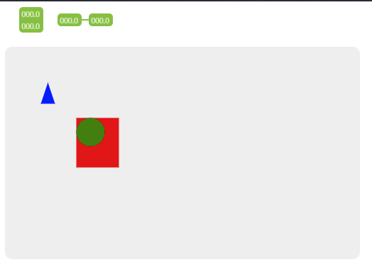

# Fabric.js 拖拽添加元素

## 需求

Fabric.js 在Canvas内部可以很容的对元素进行操作，那么创建元素呢？总得有元素之后才能进行操作吧，俗话说“巧妇难为无米之炊”，没有元素再强的库也是花瓶。

对于不懂技术的人，最符合他们的操作就是点一点，拖一拖，为了炫一点，还是拖拽过来更优雅！

效果如下：



只需要将素材列表中的元素拖动到画布中，就能在对应位置创建一个元素！

## 设计实现原理——基于vue

既然要实现拖拽思想，那么我们需要知道拖拽开始的位置，也就是**选中的元素**，而且要知道**鼠标在这个元素的相对位置**，接下来当拖放停止的时候，我们要知道**鼠标相对于Canvas的位置信息**，之后根据位置信息来绘制元素。这就是基本思路。

接下来说一下技术细节。

先建立两个 `div` 节点，**一个放素材，一个放Canvas。**

素材节点每个素材绑定 `@dragstart` 方法，这个方法用来获取拖拽开始时的事件信息，从这里我们能获取到**选中的元素**和**鼠标在这个元素的相对位置**这两个关键信息。

Canvas 节点绑定 `@drop` 方法，这个方法用来获取拖拽结束时的事件信息，从这里我们能得到**鼠标相对于Canvas节点的位置**。这样，所需就全了。

## 实现代码

html代码：

``` html
<div class="material-list-container">
    
    
</div>
<div @drop="drop">
    <canvas id="canvas" width="500" height="300"></canvas>
</div>
```

JavaScript代码：

``` javascript
import {
    dragHandler
} from "./service";

{
    methods: {
        dragStart(e) {
            this.dragType = e.target.id;
            this.dragOffsetX = e.offsetX;
            this.dragOffsetY = e.offsetY;
        },
        drop(e) {
            dragHandler(
                this,
                this.dragType,
                e.layerX - this.dragOffsetX,
                e.layerY - this.dragOffsetY
            );
        },
    },
}
```

**相应js附件：**

* [service.js](assets/files/拖拽添加元素_service.js)

* [sensor1.js](assets/files/拖拽添加元素_sensor1.js)

* [sensor2.js](assets/files/拖拽添加元素_sensor2.js)

* [common.js](assets/files/拖拽添加元素_common.js)

**相应svg附件：**

* [sensor1.svg](assets/files/拖拽添加元素_sensor1.svg)
* [sensor2.svg](assets/files/拖拽添加元素_sensor2.svg)
