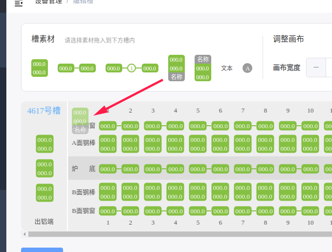

# Fabric.js 拖拽添加元素

## 需求

Fabric.js 在Canvas内部可以很容的对元素进行操作，那么创建元素呢？总得有元素之后才能进行操作吧，俗话说“巧妇难为无米之炊”，没有元素再强的库也是花瓶。

对于不懂技术的人，最符合他们的操作就是点一点，拖一拖，为了炫一点，还是拖拽过来更优雅！

效果如下：

只需要将素材列表中的元素拖动到画布中，就能在对应位置创建一个元素！

## 实现方案
