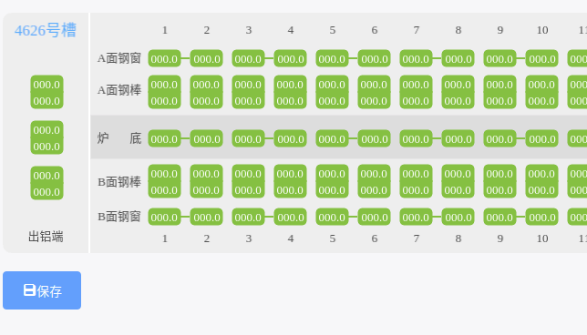

# Fabric.js 扩展辅助定位轴线功能

**效果如下：**



参考网址：[掘金：fabric库 对齐的8种实现 && 辅助线的实现](https://juejin.im/post/6844903865729417229)

写好的代码文件：[辅助定位轴线.js](assets/files/辅助定位轴线.js)

## 用法

``` javascript
import {
    initAligningGuidelines
} from "./util";

this.canvas = new Canvas("canvas");
const rect = new Rect({
    top: 100,
    left: 100,
    width: 60,
    height: 70,
    fill: "red",
});
const circle = new fabric.Circle({
    radius: 20,
    fill: "green",
    left: 100,
    top: 100,
});
const triangle = new fabric.Triangle({
    width: 20,
    height: 30,
    fill: "blue",
    left: 50,
    top: 50,
});
this.canvas.add(rect, circle, triangle);

initAligningGuidelines(this.canvas); //初始化辅助线功能
```
