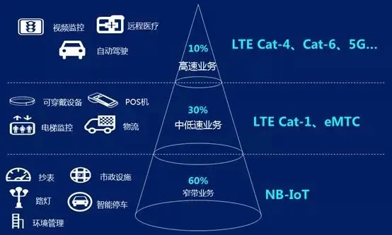

# Cat-M 篇

## 什么是 Cat？

Cat 是**category**的缩写，Cat.M 全称 LTE UE-Category M，M 取值 1~20。

Cat.M 是 4G 通信 LTE 网络下用户终端类别的一个标准。3GPP 组织制定 LTE 标准的时候用 Cat.1 ～ 20 来衡量用户终端设备的无线性能，也就是划分终端速率等级。其中 Cat.1 上行峰值速率 5Mbit/s，下行峰值速率 10Mbit/s，定位于面向物联网应用市场的一个类别。

不同 Category 级别速率对应表：

| UE-Category | 最大上行速度（Mbps） | 最大下行速度（Mbps） | 3GPP release |
| :---------: | :------------------: | :------------------: | :----------: |
|  Category0  |         1.0          |         1.0          |  Release 12  |
|  Category1  |         5.2          |         10.3         |  Release 8   |
|  Category2  |         25.5         |         51.0         |  Release 8   |
|  Category3  |         51.0         |        102.0         |  Release 8   |
|  Category4  |         75.4         |        299.6         |  Release 8   |
|  Category5  |         51.0         |        150.8         |  Release 8   |
|  Category6  |         51.0         |        301.5         |  Release 10  |
|  Category7  |        102.0         |        301.5         |  Release 10  |
|  Category8  |        1497.8        |        2998.6        |  Release 10  |
|  Category9  |         51.0         |        452.2         |  Release 11  |
| Category10  |        102.0         |        452.2         |  Release 11  |
| Category11  |         51.0         |        603.0         |  Release 12  |
| Category12  |        102.0         |        603.0         |  Release 12  |
| Category13  |         51.0         |        391.6         |  Release 12  |
| Category14  |        102.0         |        391.6         |  Release 12  |
| Category15  |        1497.8        |        3916.6        |  Release 12  |

## 应用场景

