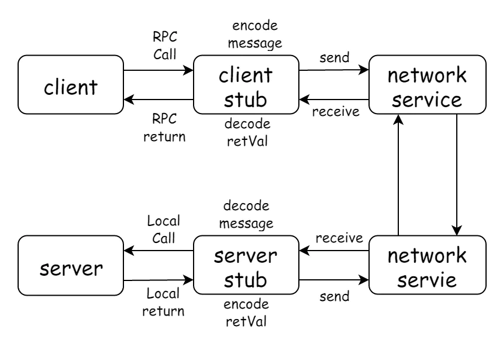
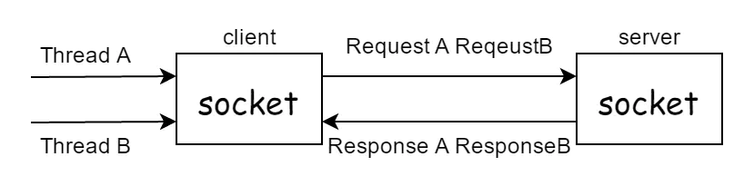

# RPC 篇

## RPC 是什么？

RPC 的全称是 `Remote Procedure Call` 是一种 `进程间通信方式` 。它允许程序调用另一个地址空间（通常是共享网络的另一台机器上）的过程或函数，而不用程序员显式编码这个远程调用的细节。即程序员无论是调用本地的还是远程的，本质上编写的调用代码基本相同。

## 起源

RPC 这个概念术语在上世纪 80 年代由 [Bruce Jay Nelson](https://en.wikipedia.org/wiki/Bruce_Jay_Nelson) 提出。这里我们追溯下当初开发 RPC 的原动机是什么？在 Nelson 的论文 ["Implementing Remote Procedure Calls"](http://birrell.org/andrew/papers/ImplementingRPC.pdf) 中他提到了几点：

* **简单：** RPC 概念的语义十分清晰和简单，这样建立分布式计算就更容易。
* **高效：** 过程调用看起来十分简单而且高效。
* **通用：** 在单机计算中过程往往是不同算法部分间最重要的通信机制。 

通俗一点说，就是一般程序员对于本地的过程调用很熟悉，那么我们把 RPC 作成和本地调用完全类似，那么就更容易被接受，使用起来毫无障碍。Nelson 的论文发表于 40 年前，其观点今天看来确实高瞻远瞩，今天我们使用的 RPC 框架基本就是按这个目标来实现的。

## 实现

RPC 可基于 HTTP 或 TCP 协议，Web Service 就是基于 HTTP 协议的 RPC，它具有良好的跨平台性，但其性能却不如基于 TCP 协议的 RPC。会两方面会直接影响 RPC 的性能，一是 `传输方式` ，二是 `序列化` 。

众所周知，TCP 是传输层协议，HTTP 是应用层协议，而传输层较应用层更加底层，在数据传输方面，越底层越快，因此，在一般情况下，TCP 一定比 HTTP 快。

# 调用流程

参考：[七律断舍离《RPC原理介绍》](https://www.jianshu.com/p/027a6ec9c44e)

RPC采用 `C/S模式` 。请求程序就是一个客户机，而服务提供程序就是一个服务器。首先，客户机调用进程发送一个有进程参数的调用信息到服务进程，然后等待应答信息。在服务器端，进程保持睡眠状态直到调用信息的到达为止。当一个调用信息到达，服务器获得进程参数，计算结果发送答复信息，然后等待下一个调用信息。最后，客户端调用进程接收答复信息，获得进程结果，然后调用执行继续进行。

流程说明：

1. 服务消费方（client）调用以本地调用方式调用服务；
1. client stub接收到调用后负责将方法、参数等组装成能够进行网络传输的消息体；
1. client stub找到服务地址，并将消息发送到服务端；
1. server stub收到消息后进行解码；
1. server stub根据解码结果调用本地的服务；
1. 本地服务执行并将结果返回给server stub；
1. server stub将返回结果打包成消息并发送至消费方；
1. client stub接收到消息，并进行解码；
1. 服务消费方得到最终结果。

RPC的任务就是封装2-8步骤，使调用过程对调用方透明。

## 如何保证返回结果的有序性？

如果有多个线程同时进行远程方法调用，这时建立在client server之间的socket连接上会有很多双方发送的消息传递，前后顺序也可能是随机的，server处理完结果后，将结果消息发送给client，client收到很多消息，怎么知道哪个消息结果是原先哪个线程调用的？

线程A和线程B同时向client socket发送请求requestA和requestB，socket先后将requestB和requestA发送至server，而server可能将responseA先返回，尽管requestA请求到达时间更晚。我们需要一种机制保证responseA返回给ThreadA，responseB返回给ThreadB。

1. client线程每次通过socket调用远程接口前，生成一个唯一的ID，即requestID（requestID必需保证在一个Socket连接里面是唯一的），一般常常使用AtomicLong从0开始累计数字生成唯一ID；
1. 将处理结果的回调对象callback，存放到全局ConcurrentHashMap里面put(requestID, callback)；
1. 当client线程发送消息后，紧接着执行callback的get()方法试图获取远程返回的结果。在get()内部，则使用synchronized获取回调对象callback的锁。先检测是否已经获取到结果，如果没有，则调用callback的wait()方法，释放callback上的锁，让当前线程处于等待状态。
1. 服务端接收到请求并处理后，将response结果（此结果中包含了前面的requestID）发送给客户端，客户端socket连接上专门监听消息的线程收到消息，分析结果取到requestID，再从前面的ConcurrentHashMap里面get(requestID)，从而找到callback对象。再用synchronized获取callback上的锁，将方法调用结果设置到callback对象里，再调用callback.notifyAll()唤醒前面处于等待状态的线程。
