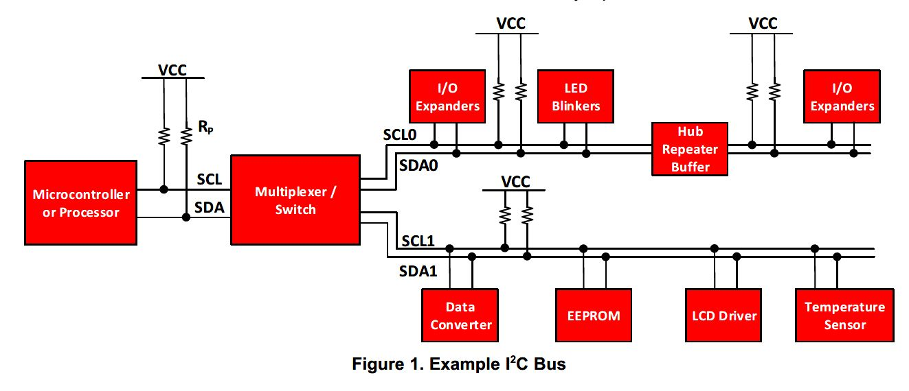

# `I2C` 总线协议

## 简介

`I2C` 总线是由 `Philips` 公司开发的**两线式**串行总线，如今已经成为芯片间**低速**串行通信的事实标准，被广泛使用在消费、控制类电子设备场合。

这里的两个关键词**两线**和**低速**：**两线**意味着**结构简单**，**低速**意味着**好实现**，做电路的都知道速度越慢电路实现起来就越容易，而且协议方式也很优雅。

## 工作原理

下图是一个典型的**嵌入式**系统的 `I2C` 总线应用，系统包含了很多 `slave` **从器件**，最左边的微控制器是 `I2C` 的I2C典型应用图，它控制了**I/O扩赞器**、**LED闪光灯**、**ADCs/DAC**、**EEPROM**、**LCD驱动器**、**温度放大器**等。

所有这些器件都是通过**2根线**： `时钟SCL` 和 `数据SDA` 来控制。

`SDA` （串行数据线）和 `SCL` （串行时钟线）都是 `双向I/O线` ，接口电路为**开漏输出**。需通过**上拉电阻**接电源 `VCC` ．当总线空闲时．两根线都是**高电平**，连接总线的外同器件都是 `CMOS` 器件，输出级也是**开漏电路**．在总线上消耗的**电流很小**，因此，总线上扩展的器件数量主要由**电容负载**来决定，因为每个器件的总线接口都有一定的**等效电容**．而线路中电容会影响总线传输速度．当电容过大时，有可能造成传输错误．所以，其负载能力为 `400pF` ，因此可以估算出总线允许长度和所接器件数量。

**主器件**用于启动总线传送数据，并产生**时钟**以开放传送的器件，此时任何**被寻址**的器件均被认为是**从器件**。

在总线上主和从、发和收的关系**不是恒定**的，而取决于此时**数据传送方向**。

* 如果**主机要发送数据给从器件**，则主机首先寻址从器件，然后主动发送数据至从器件，最后由主机终止数据传送

* 如果**主机要接收从器件的数据**，首先由主器件寻址从器件．然后主机接收从器件发送的数据，最后由主机终止接收过程。在这种情况下，主机负责产生定时时钟和终止数据传送。

## 特征

* 在硬件上，`I2C`总线只需要一根**数据线**和一根**时钟线**两根线，总线接口已经集成在芯片内部，不需要特殊的接口电路，而且芯片上接口电路的**滤波器**可以滤去总线数据上的**毛刺**。因此`I2C`总线简化了硬件电路`PCB`布线，降低了系统成本，提高了系统可靠性。因为`I2C`芯片除了这两根线和少量中断线，与系统再没有连接的线，用户常用`IC`可以很容易形成标准化和模块化，便于重复利用。
* `I2C`总线是一个真正的**多主机**总线，如果两个或多个主机同时初始化数据传输，可以通过**冲突检测**和**仲裁**防止数据破坏，每个连接到总线上的器件都有**唯一**的地址，任何器件既可以作为主机也可以作为从机，但**同一时刻只允许有一个主机**。数据传输和地址设定由软件设定，非常灵活。总线上的器件增加和删除不影响其他器件正常工作。
* `I2C`总线可以通过外部连线进行**在线检测**，便于系统故障诊断和调试，故障可以立即被寻址，软件也利于标准化和模块化，缩短开发时间。
* 连接到相同总线上的`IC`数量只受总线**最大电容**的限制，串行的`8位`双向数据传输位速率在**标准模式**下可达`100Kbit/s`，**快速模式**下可达`400Kbit/s`，**高速模式**下可达`3.4Mbit/s`。
* 总线具有极低的电流消耗，抗高噪声干扰，增加总线驱动器可以使总线电容扩大`10`倍，传输距离达到`15m`；兼容不同电压等级的器件，工作温度范围宽。

## 模式

### 快速模式

**快速模式**器件可以在 `400kbit/s` 下接收和发送。

最小要求是：它们可以和 `400kbit/s` 传输同步，可以延长 `SCL` 信号的低电平周期来减慢传输。

快速模式器件都**向下兼容**，可以和标准模式器件在 `0~100kbit/s` 的 `I2C` 总线系统通讯。但是，由于标准模式器件不向上兼容，所以不能在快速模式 `I2C` 总线系统中工作。

快速模式 `I2C` 总线规范与标准模式相比有以下**特征**：

1. 最大位速率增加到`400kbit/s`
2. 调整了**串行数据**（`SDA`） 和**串行时钟**（`SCL` ）信号的时序
3. 快速模式器件的输入有**抑制毛刺**的功能，`SDA` 和`SCL`输入有[施密特触发器](https://baike.baidu.com/item/%E6%96%BD%E5%AF%86%E7%89%B9%E8%A7%A6%E5%8F%91%E5%99%A8)
4. 快速模式器件的**输出缓冲器**对`SDA` 和`SCL` 信号的**下降沿**有**斜率控制**功能
5. 如果快速模式器件的电源电压被关断，`SDA` 和`SCL` 的`I/O` 管脚**必须悬空**，不能阻塞总线
6. 连接到总线的外部上拉器件必须调整以适应快速模式`I2C` 总线更短的最大允许上升时间。对于负载最大是`200pF` 的总线，每条总线的上拉器件可以是一个电阻，对于负载在`200pF~400pF` 之间的总线，上拉器件可以是一个电流源（最大值`3mA` ）或者是一个开关电阻电路

### 高速模式

**高速模式**（ `Hs` 模式）器件对 `I2C` 总线的传输速度有巨大的突破。 `Hs` 模式器件可以在高达 `3.4Mbit/s` 的位速率下传输信息，而且保持**完全向下兼容**快速模式或标准模式（ `F/S` 模式）器件，它们可以在一个速度混合的总线系统中双向通讯。

`Hs` 模式传输除了不执行仲裁和时钟同步外，与 `F/S` 模式系统有相同的串行总线协议和数据格式。

高速模式下 `I2C` 总线规范如下：

1. `Hs` 模式主机器件有一个`SDAH` 信号的**开漏输出缓冲器**和一个在`SCLH` 输出的开漏极下拉和电流源上拉电路。这个电流源电路缩短了`SCLH` 信号的上升时间，任何时候在`Hs` 模式，只有一个主机的电流源有效
2. 在多主机系统的`Hs` 模式中，不执行仲裁和时钟同步，以加速位处理能力。仲裁过程一般在前面用`F/S` 模式传输主机码后结束
3. `Hs` 模式主机器件以高电平和低电平是`1:2` 的比率产生一个串行时钟信号。解除了建立和保持时间的时序要求
4. 可以选择`Hs` 模式器件有内建的**电桥**。在`Hs` 模式传输中，`Hs` 模式器件的**高速数据**（`SDAH`）和**高速串行时钟**（`SCLH` ）线通过这个**电桥**与`F/S` 模式器件的`SDA` 和`SCL` 线分隔开来。减轻了`SDAH` 和`SCLH` 线的电容负载，使上升和下降时间更快
5. `Hs` 模式从机器件与`F/S` 从机器件的**唯一差别**是它们工作的速度。`Hs` 模式从机在`SCLH` 和`SDAH`输出有开漏输出的缓冲器。`SCLH` 管脚可选的下拉晶体管可以用于拉长`SCLH` 信号的低电平，但只允许在`Hs` 模式传输的响应位后进行
6. `Hs` 模式器件的输出可以**抑制毛刺**，而且`SDAH` 和`SCLH` 输出有一个施密特触发器
7. `Hs` 模式器件的输出缓冲器对`SDAH` 和`SCLH` 信号的下降沿有斜率控制功能
