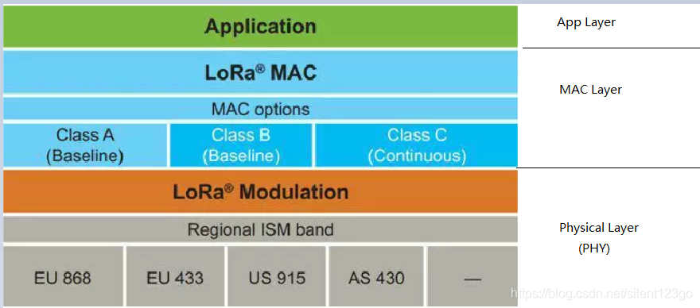

# LoRa vs LoRa WAN
先说一下定义：
- LoRa是低功耗广域网通信技术中的一种，是Semtech公司专有的**一种基于扩频技术的超远距离无线传输技术**。
- LoRaWAN是为LoRa远距离通信网络设计的**一套通讯协议和系统架构**。它是**一种媒体访问控制（MAC）层协议**。

**协议栈原理图**

图中：**LoRa=PHY Layer**，**LoRaWAN=MAC Layer**  
结论：**LoRa是LoRaWan的一个子集，LoRa仅仅包括物理层定义，LoRaWan还包括了链路层。**