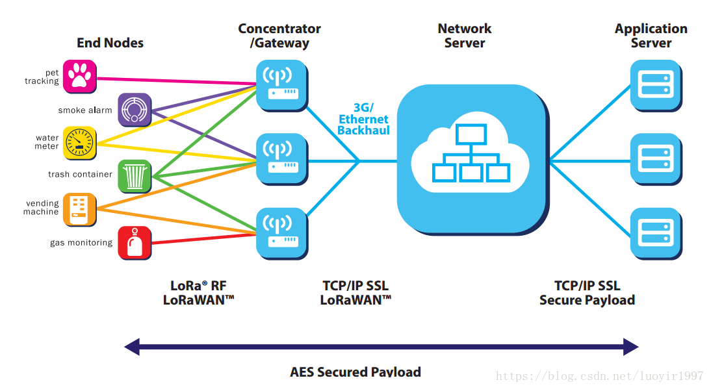

# 什么是LoRa？
LoRa是semtech公司创建的低功耗局域网无线标准，低功耗一般很难覆盖远距离，远距离一般功耗高。 
LoRa的名字就是远距离无线电（Long Range Radio），它最大特点就是**在同样的功耗条件下比其他无线方式传播的距离更远**，实现了低功耗和远距离的统一，它在同样的功耗下比传统的无线射频通信距离扩大**3-5倍**。

# 特性
- 传输距离：城镇可达2-5 Km ， 郊区可达15 Km 。
- 工作频率：ISM 频段 包括433、868、915 MH等。
- 标准：IEEE 802.15.4g。
- 调制方式：基于扩频技术，线性调制扩频（CSS）的一个变种，具有前向纠错（FEC）能力，**semtech公司私有专利技术**。
- 容量：一个LoRa网关可以连接上**千上万**个LoRa节点。
- 电池寿命：长达10年。
- 安全：**AES128**加密。
- 传输速率：**几百到几十Kbps**，速率越低传输距离越长，这很像一个人挑东西，挑的多走不太远，少了可以走远。

# 网络架构
开始之前请先看一下LoRa和LoRaWAN的关系。[LoRa vs LoRaWAN](LoRa_vs_LoRaWAN.md)  

LoRaWAN网络架构图

核心四大部分
- **终端：** LoRa终端节点。
- **基站/网关：** 实现对LoRa终端节点提供接入和汇聚功能。
- **NS服务器：** LoRa的核心网，用于管理LoRa网络中所有的LoRa节点。
- **应用服务器：** 由不同业务领域的服务器组成，并通过Web或手机接入的方式向用户提供业务服务。
