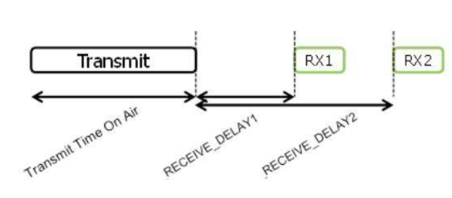
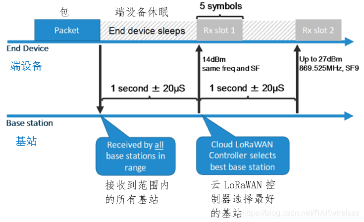
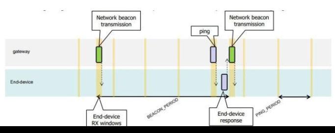
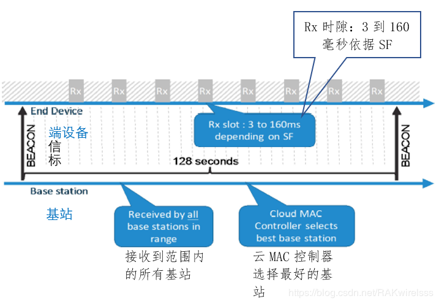
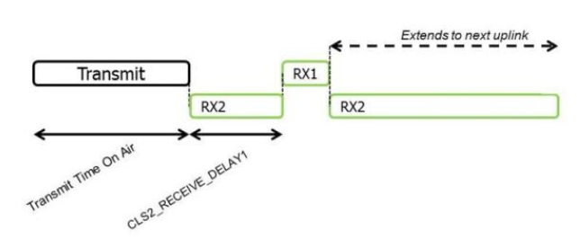
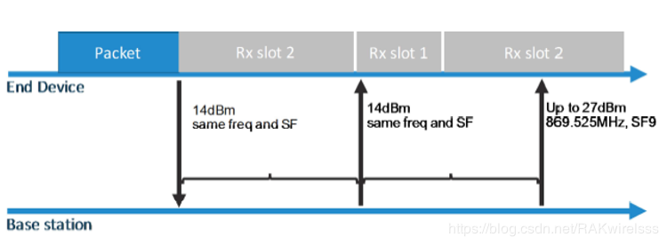
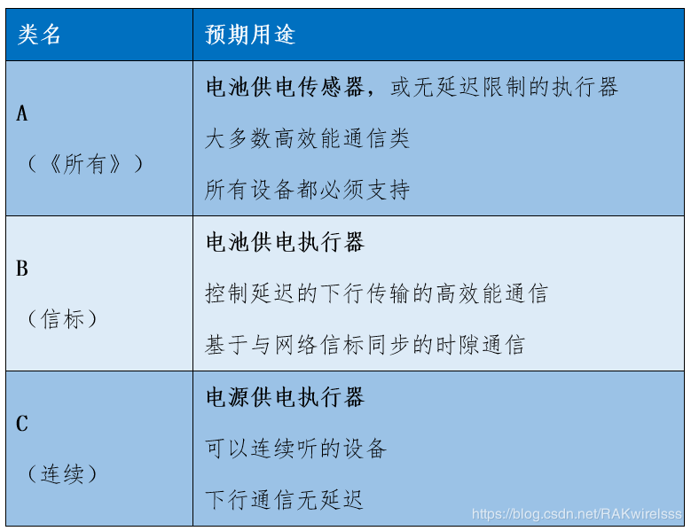

# LoRa 终端节点的三种工作模式：用好 LoRa 终端的关键！

为了更好的适应物联网低功耗的需求，设计了三种 LoRa 终端的工作模式： Class A、Class B、Class C

- **Class A 的终端**，长期处于休眠状态，最省电。只能在唤醒后且发送数据后的 2 个接收时隙，接收服务器的指示和响应，因此不能实时响应服务器的控制。
- **Class B 的终端**，间隙性的休眠，间隙性的唤醒，唤醒后，并不一定发送数据，但打开在特定的时隙打开接收窗口，接收来自于服务器的指令指示。
- **Class C 的终端**，实时在线，在每个接收时隙周期里都能够接收来自服务器的指示。因此这种模式的终端最耗电。

## Class A：功耗最低的模式

上下行时隙图：

终端的接收窗口 RX1，一般是在终端的上行发送 Transmit 后 1 秒开始，终端的接收窗口 RX2, 一般是在终端的上行发送 Transmit 后 2 秒开始。也就是，终端接收服务器的数据窗口，是在终端有数据上报时，才顺便看一下是否有服务器下发来的指令。其他时间，终端都处于休眠状态，无法接收服务器的指令。 

终端与基站的通信过程：

类 A 设备实现一个双向的通信，即每个端设备的**上行**传输后跟着两个**短小下行**接收窗口。

端设备安排好的传输时隙是基于**它自己**的通信需要的，该需要是有一个基于随机时间基的小变化的。

类 A 操作是应用的**最低功耗选择**，在端设备已经发送一个上行传输后该应用立刻只从服务器获取下行通信。在任意其他时间的来自服务器的下行通信必须等待下次安排好的上行通信。类 A 涵盖了绝大多数用例，**是 LoRa 功率最高效的模式**。

## Class B：应用最广泛的模式

上下行时隙图：

Class B 的时隙则复杂一些，它有一个同步时隙 beacon，还有一个固定周期的接收窗口 ping 时隙。如这个示例中，beacon 周期为 128 秒，ping 周期为 32 秒。

看起来复杂，但实际上就跟 NB-IoT 的 eDRX 模式差不多，隔几十秒打开接收窗口收一个数据。其他时候都在休眠。

这种工作模式，终端功耗低、服务器下发数据延时也不大。既不用接电，也能够“还算及时”的控制设备。因此**适合定位器、开关等场景**。

终端与基站的通信过程：

LoRaWAN 类 B 选项的终端，周期性的唤醒：

每 128s 唤醒后与基站同步一次，称为**beacon 周期**。

每 32s 打开接收窗口，在周期性的时隙期间，它允许设备在一个可预知的时隙上，打开一个简短额外的接收窗口（称为“ping slot”），接收来自于网关服务器的消息。

## Class C：响应最及时的模式

上下行时隙图：

Class C 和 A 基本是相同的，

几乎随时都可以接收数据。只干活不睡觉，功耗自然就高了。考虑到 10mA 级别的接收电流，**不是长供电的设备最好别用这个模式**。

终端与基站的通信过程：

该模式的 LoRa 终端，不休眠，除了发送数据时，处于发送状态不能接收数据外，其他时间都处于接收状态，在任何时隙都能够接收来自于服务器的消息和命令指示。**实时性最高，最耗电**。

## 汇总比较

