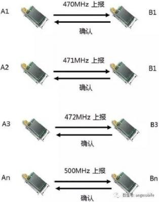
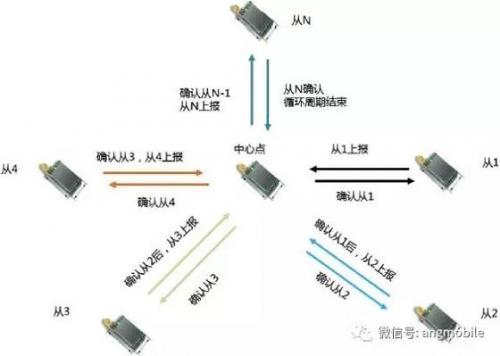
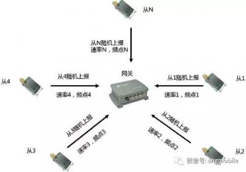

# 点对点通信

一点对一点通信，A 点发起，B 点接收，可以回复也可以不回复确认，多组之间的频点建议分开。如下图所示：

这种连接方式单纯利用 LoRa 射频低功耗、远距离传输的功能，目前主要针对**特定应用**和**试验性质**的项目。

- **优点：** 最简单
- **缺点：** 不存在组网

# 星状网轮询

一点对多点通信，N 个**从节点**轮流与**中心节点**通信，从节点上传，等待中心点收到后返回确认，然后下一个节点再开始上传，直到所有 N 个节点全部完成，一个循环周期结束。如下图所示：

该结构本质上还属于点对点通信，但是加入了**分时处理**，N 个从节点之间的频点可以分开，也可重复使用。

- **优点：** 单项目成本低
- **缺点：** 仅适合从节点数量不大和网络实时性要求不高的应用

# 星状网并发

多个从节点可同时与中心点通信，从节点可随机上报数据，节点可以根据外界环境和信道阻塞自动采取跳频和速率自适应技术，逻辑上，网关/可以接收不同速率和不同频点的信号组合，物理上网关可以同时接收 8 路、16 路、32 路甚至更多路数据，减少了大量节点上行时冲突的概率。如下图所示：

该系统具有极大的延拓性，可单独建网，可交叉组网，`这是LoRa目前最主要、最主流的组网形态！`
