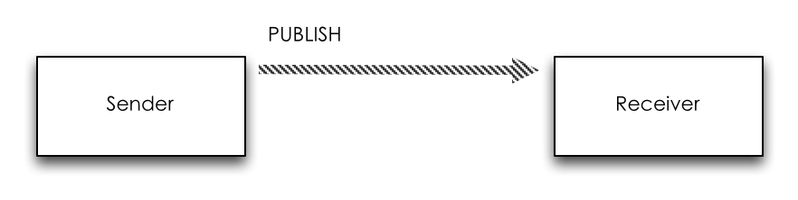
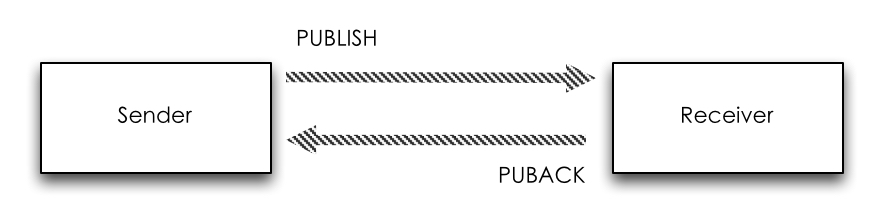

# MQTT QoS 介绍

参考网址：[MQTT系列 | MQTT的QoS介绍](https://zhuanlan.zhihu.com/p/80203905)

## QoS是用来干什么的？

`QoS（Quality of Service）` 是消息的发送方（ `Sender` ）和接受方（ `Receiver` ）之间达成的一个协议。用来**保证消息稳定传输的机制**，包括消息应答、存储和重传。

在这套机制下，提供了三种不同层次 `QoS` ：

|QoS|级别|含义|
| :----------: | :-----------:  | :-----------: |
|QoS0|至多一次|Sender 发送的一条消息，Receiver 最多能收到一次，也就是说 Sender 尽力向 Receiver 发送消息，如果发送失败，也就算了|
|QoS1|至少一次|Sender 发送的一条消息，Receiver 至少能收到一次，也就是说 Sender 向 Receiver 发送消息，如果发送失败，会继续重试，直到 Receiver 收到消息为止，但是因为重传的原因，Receiver 有可能会收到重复的消息|
|QoS2|确保只有一次|Sender 发送的一条消息，Receiver 确保能收到而且只收到一次，也就是说 Sender 尽力向 Receiver 发送消息，如果发送失败，会继续重试，直到 Receiver 收到消息为止，同时保证 Receiver 不会因为消息重传而收到重复的消息|

**注意：** `QoS` 是 `Sender` 和 `Receiver` 之间的协议，而不是 `Publisher` 和 `Subscriber` 之间的协议。换句话说， `Publisher` 发布了一条 `QoS1` 的消息，只能保证 `Broker` 能**至少收到一次这个消息**；而对于 `Subscriber` 能否至少收到一次这个消息，还要取决于 `Subscriber` 在 `Subscribe` 的时候和 `Broker` 协商的 `QoS` 等级。

## QoS0

`QoS0` 等级下， `Sender` 和 `Receiver` 之间一次消息的传递流程如下：

`Sender` 向 `Receiver` 发送一个包含消息数据的 `PUBLISH` 包，然后不管结果如何，丢掉已发送的 `PUBLISH` 包，一条消息的发送完成。

## QoS1

`QoS1` 要保证消息至少到达一次，所以有一个应答的机制。 `Sender` 和 `Receiver` 的一次消息的传递流程如下：

流程：

1. `Sender`向`Receiver`发送一个带有数据的`PUBLISH`包，并在本地保存这个`PUBLISH`包。
2. `Receiver`收到`PUBLISH`包以后，向`Sender`发送一个`PUBACK`数据包，`PUBACK`数据包没有消息体（`Payload`），在**可变头**中有一个包标识（`Packet Identifier`），和它收到的`PUBLISH`包中的`Packet Identifier`一致。
3. `Sender`收到`PUBACK`之后，根据`PUBACK`包中的`Packet Identifier`找到本地保存的`PUBLISH`包，然后丢弃掉，一次消息的发送完成。

但是消息传递流程中**可能会出现问题**：

1. 如果`Sender`在一段时间内没有收到`PUBLISH`包对应的`PUBACK`，它将该`PUBLISH`包的`DUP`标识设为`1`（代表是**重新发送**的`PUBLISH`包），然后重新发送该`PUBLISH`包。
1. `Receiver`可能会重复收到消息，需自行去重。

## QoS2

相比 `QoS0` 和 `QoS1` , `QoS2` 不仅要确保 `Receiver` 能收到 `Sender` 发送的消息，还需要确保**消息不重复**。它的重传和应答机制就要复杂一些，同时**开销也是最大的**。 `QoS2` 下，一次消息的传递流程如下所示：

流程：

1. `Sender`发送`QoS`为`2`的`PUBLISH`数据包，数据包 `Packet Identifier` 为 `P`，并在本地保存该`PUBLISH`包；
1. `Receiver`收到`PUBLISH`数据包后，在本地保存`PUBLISH`包的`Packet Identifier P`，并回复`Sender`一个`PUBREC`数据包，`PUBREC`数据包可变头中的`Packet Identifier`为`P`，没有消息体（`Payload`）；
1. 当`Sender`收到`PUBREC`，它就可以安全的丢弃掉初始`Packet Identifier`为`P`的`PUBLISH`数据包。同时保存该`PUBREC`数据包，并回复`Receiver`一个`PUBREL`数据包，`PUBREL`数据包可变头中的`Packet Identifier`为`P`，没有消息体；
1. 当`Receiver`收到`PUBREL`数据包，它可以丢掉保存的`PUBLISH`包的`Packet Identifier P`，并回复`Sender`一个可变头中 `Packet Identifier` 为 `P`，没有消息体（`Payload`）的`PUBCOMP`数据包；
1. 当`Sender`收到`PUBCOMP`包，那么认为传输已完成，则丢掉对应的`PUBREC`数据包；

上面是一次完整无误的传输过程，然而传输过程中可能会出现以下情况：

* **情况1：** `Sender`发送`PUBLISH`数据包给`Receiver`的时候，发送失败；
* **情况2：** `Sender`已经成功发送`PUBLISH`数据包给`Receiver`了，但是`Receiver`发送`PUBREC`数据包失败；
* **情况3：** `Sender`已经成功收到了`PUBREC`数据包，但是`PUBREL`数据包发送失败；
* **情况4：** `Receiver`已经收到了`PUBREL`数据包，但是发送`PUBCOMP`数据包时发送失败

针对上述的问题，**较为详细的处理方法** 如下：

* 不管是**情况1**还是**情况2**，因为`Sender`在一定时间内没有收到`PUBREC`，那么它会把`PUBLISH`包的`DUP`标识设为`1`，重新发送该`PUBLISH`数据包；
* 不管是**情况3**还是**情况4**，因为`Sender`在一定时间内没有收到`PUBCOMP`包，那么它会重新发送`PUBREL`数据包；
* 针对**情况2**，`Receiver`可能会收到多个重复的`PUBLISH`包，更加完善的处理如下： 

`Receiver` 在收到 `PUBLISH` 数据包之后，马上回复一个 `PUBREC` 数据包。并会在本地保存 `PUBLISH` 包的 `Packet Identifier P` ，不管之后因为重传多少次这个 `Packet Identifier` 为 `P` 的数据包， `Receiver` 都认为是重复的，丢弃。同时 `Receiver` 接收到 `QoS` 为 `2` 的 `PUBLISH` 数据包后，并不马上投递给上层，而是在本地做持久化，将消息保存起来（这里需要是持久化而不是保存在内存）。

* 针对**情况4**，更加完善的处理如下：

`Receiver` 收到 `PUBREL` 数据包后，正式将消息递交给上层应用层，投递之后销毁 `Packet Identifier P` ，并发送 `PUBCOMP` 数据包，销毁之前的持久化消息。之后不管接收到多少个 `PUBREL` 数据包，因为没有 `Packet Identifier P` ，直接回复 `PUBCOMP` 数据包即可。

# QoS降级

在 `MQTT` 协议中，从 `Broker` 到 `Subscriber` 这段消息传递的实际 `QoS` 等于： `Publisher` 发布消息时指定的 `QoS` 等级和 `Subscriber` 在订阅时与 `Broker` 协商的 `QoS` 等级，这两个 `QoS` **等级中的最小那一个**。

> **Actual Subscribe QoS = MIN(Publish QoS, Subscribe QoS)**

# QoS和会话

如果 `Client` 想接收离线消息，必须使用持久化的会话（ `Clean Session = 0` ）连接到 `Broker` ，这样 `Broker` 才会存储 `Client` 在离线期间没有确认接收的 `QoS` 大于 等于 `1` 的消息。

> 在发送 `QoS` 为 `1` 或 `2` 的情况， `Broker` （此时为 `Sender` ）会将发送的 `PUBLISH` 数据包保存到本地，直到收到一系列回复的数据包，然而 `Client` （此时为 `Receiver` ）在离线期间无法回复相应的数据包，所以会一直存储。

# QoS等级使用建议

<table>
    <tbody>
        <tr>
            <td rowspan=3>QoS0</td>
            <td>Client 和 Broker 之间的网络连接非常稳定，例如一个通过有线网络连接到 Broker 的测试用 Client</td>
        </tr>
        <tr>
            <td>可以接受丢失部分消息，比如你有一个传感器以非常短的间隔发布状态数据，所以丢一些也可以接受</td>
        </tr>
        <tr>
            <td>不需要离线消息</td>
        </tr>
        <tr>
            <td rowspan=2>QoS1</td>
            <td>需要接收所有的消息，而且应用可以接受并处理重复的消息</td>
        </tr>
        <tr>
            <td>无法接受 QoS2 带来的额外开销，QoS1 发送消息的速度比 QoS2 快很多</td>
        </tr>
        <tr>
            <td>QoS2</td>
            <td>应用必须接收到所有的消息，而且应用在重复的消息下无法正常工作，同时也能接受 QoS2 带来的额外开销</td>
        </tr>
    </tbody>
</table>
