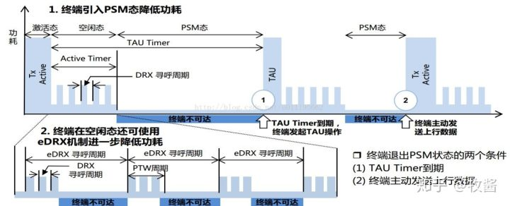

# 概述

NB-IoT 在默认状态下，存在三种工作状态，三种状态会根据不同的配置参数进行切换，在后续对 NB-IoT 的使用和相关程序的设计时，也需要根据开发的需求与产品特性对这三种工作状态进行合适的定制。

# Connected(连接态)

模块注册入网后处于该状态，可以发送和接收数据，无数据交互超过一段时间后会进入 Idle 模式，时间可配置。

# Idle(空闲态)

可收发数据，且接收下行数据会进入 Connected 状态，无数据交互超过一段时会进入 PSM 模式，时间可配置。

# PSM(节能模式)

此模式下终端关闭收发信号机，不监听无线侧的寻呼，因此虽然依旧注册在网络，但信令不可达，无法收到下行数据，功率很小。

持续时间由核心网配置(T3412)，有上行数据需要传输或 TAU 周期结束时会进入 Connected 态。

# 一般情况下的转换过程
① 终端发送数据完毕处于Connected态，启动“不活动计时器”，默认20秒，可配置范围为1s~3600s；

② “不活动计时器”超时，终端进入Idle态，启动及或定时器(Active-Timer【T3324】)，超时时间配置范围为2秒~186分钟；

③ Active-Timer超时，终端进入PSM状态，TAU周期结束时进入Connected态，TAU周期【T3412】配置范围为54分钟~310小时。

【PS：TAU周期指的是从Idle开始到PSM模式结束】

# NB-IoT终端在不同工作状态下的情况剖析

1. NB-IoT发送数据时处于激活态，在超过“不活动计数器”配置的超时时间后，会进入Idle空闲态；

1. 空闲态引入了**eDRX机制**，在一个完整的Idle过程中，包含了若干个eDRX周期，**eDRX周期可以通过定时器配置**，范围为20.48秒~2.92小时，而每个eDRX周期中又包含了若干个**DRX寻呼周期**；

1. 若干个DRX寻呼周期组成一个**寻呼时间窗口(PTW)**，寻呼时间窗口可由定时器设置，范围为2.56s~40.96s，**取值大小决定了窗口的大小和寻呼的次数**；

1. 在Active Timer超时后，NB-IoT终端由空闲态进入**PSM态**，在此状态中，终端不进行寻呼，不接受下行数据，处于休眠状态；

1. TAU Timer从终端进入空闲态时便开始计时，当计时器超时后终端会从PSM状态退出，发起**TAU操作**，回到激活态（对应图中①）；

1. 当终端处于PSM态时，也可以通过主动发送上行数据令终端回到激活态（对应图中②）。
