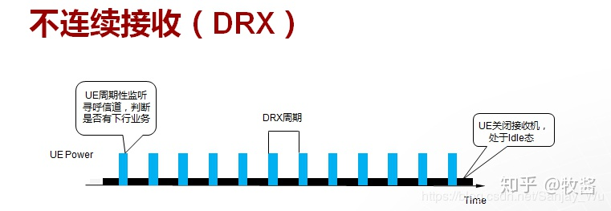
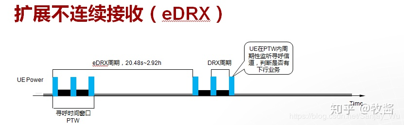
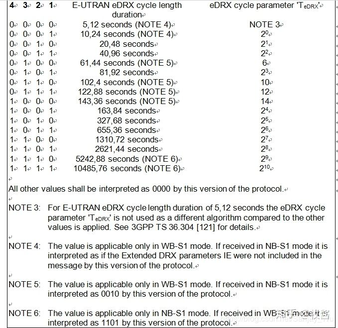
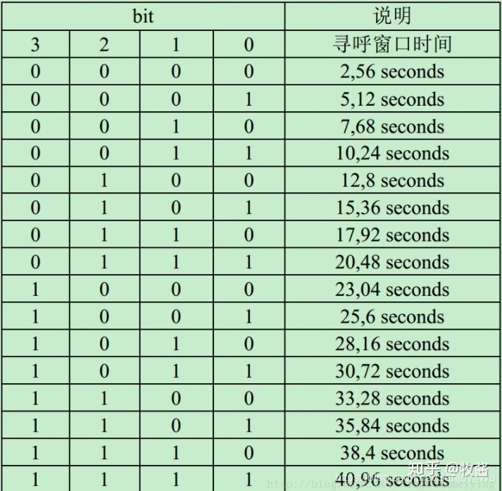

# NB-IoT 的省电技术

## DRX 模式

DRX（Discontinuous Reception）即**非连续接收**，是指终端仅在必要的时间段打开接收机进入激活态，用以接收下行数据，而在剩余时间段关闭接收机进入休眠态，停止接收下行数据的一种节省终端电力消耗的工作模式。

1. 在激活期，UE 将打开接收机，寻呼信道，判断是否有有下行业务。
2. NB-IoT 的 DRX 周期取值范围为：1.28s，2.56s，5.12s 或者 10.24s。
3. DRX 周期时长确定后：
   - 激活期越长，则业务处理越及时，但接收机在同一个周期内工作时间长，UE 耗电量越大。
   - 激活期越短，则 UE 越省电，但接收机在同一个周期内保持关闭的时间越长，业务时延越长。

## eDRX 模式

为了节省终端功耗，同时满足一定下行业务时延的要求，3GPP 引入了扩展 DRX 的概念（extended DRX，eDRX）。 

1. 在每个 eDRX 周期内，有一个寻呼时间窗口（Paging Time Window，PTW），UE 只在 PTW 内按 DRX 周期监听寻呼信道，以便接收下行业务，PTW 外的时间处于睡眠态，不监听寻呼信道，不能接收下行业务。
1. eDRX 周期长度、PTW 窗口长度可配置，UE 和运营商之间进行协商，以运营商下发给 UE 的值为准。
1. eDRX 周期的具体配置可查看 3GPP TS 24.008： 
   
1. 寻呼窗口时间表： 
   

## PSM 模式

PSM(Power Saving Mode) 的技术原理非常简单，在 PSM 该状态下，终端射频关闭，相当于关机状态，终端非业务期间深度休眠，不接收下行数据，只有终端主动发送上行数据（MO Data）时可接收 IoT 平台缓存的下行数据。 

1. 终端何时进入 PSM 状态，以及在 PSM 状态驻留的时长由核心网和终端协商
1. 进入 PSM 模式，虽然 UE 不再进行接收寻呼消息，看起来设备和网络失联，但设备仍然注册在网络中，这样当 UE 从休眠唤醒后就不需重新注册网络就可以进行数据收发。
1. PSM 想唤醒可通过外部唤醒或者周期自身唤醒，外部唤醒常用的是 RTC 中断唤醒（如：MT2625 采用外部 RTC 唤醒），周期唤醒的周期是核心网运行商配置给 NB 物联卡，周期性的唤醒。
1. PSM 自动唤醒与 RTC_ENIT 外部唤醒区别：
   - 在 PSM 状态下，通过 RTC_EINT 唤醒后，如果系统没有其他 task，则会马上重新进行 PSM 状态。如有有其他 task 要执行，则会执行 task，在执行完 task 之后，如果还未到周期自动唤醒，则会继续马上重新进入 PSM 模式。
   - 如果是周期到了自动唤醒，则会维持 Active time 后再重新进入 PSM 状态。而 Active Time 可继续业务的上行和下行。
1. 这里提一下 MT2625，对于 MT2625 进入 PSM 状态时，NB 可能处于 deep sleep 或者 deeper sleep，若 PSM 周期为几十分钟比较短的时间则进入 deep sleep，若 PSM 周期为十几个小时比较长的时间则进入 deeper sleep。其他 NB 芯片笔者还没验证过。
