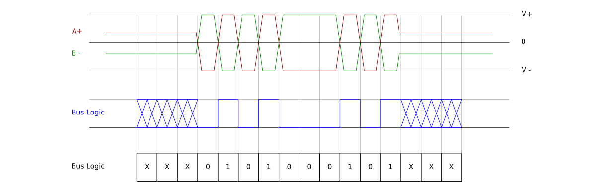

# RS485 扫盲

https://wenku.baidu.com/view/8e8b29257ed5360cba1aa8114431b90d6c85892e.html

RS-485又名**TIA-485-A**, **ANSI/TIA/EIA-485**或**TIA/EIA-485**。

## 信号描述图

RS485 采用对称信号来表示0和1，这样`从先天上就限制了其全双工通信的可能`。但有个优势就是`可以只通过两个线来传输数据`。