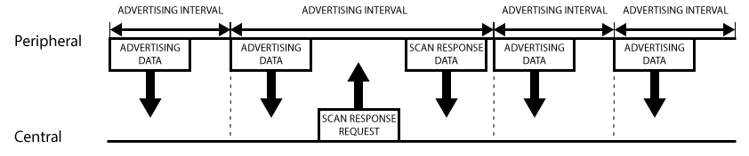

# `GAP` 协议

## 前言

`GAP` （**Generic Access Profile**）协议用来**控制设备连接和广播**。

`GAP` 使你的设备被其他设备可见，并决定了你的设备是否可以或者怎样与合同设备进行交互。例如 `Beacon` 设备就只是向外广播，不支持连接，小米手环就等设备就可以与中心设备连接。

## 设备角色

`GAP` 给设备定义了若干角色，其中主要的两个是： `外围设备` （**Peripheral**）和 `中心设备` （**Central**）。

|外围设备|中心设备|
|-----|-----|
|这一般就是非常小或者简单的低功耗设备，用来提供数据，并连接到一个更加相对强大的中心设备|中心设备相对比较强大，用来连接其他外围设备|

## 广播数据

在 `GAP` 中外围设备通过两种方式向外广播数据： **Advertising Data Payload**（ `广播数据` ）和 **Scan Response Data Payload**（ `扫描回复` ），每种数据最长可以包含 `31byte` 。

这里广播数据是必需的，因为外设必需不停的向外广播，让中心设备知道它的存在。扫描回复是**可选**的，中心设备可以向外设请求扫描回复，这里包含一些设备额外的信息，例如设备的名字。

广播数据这里包含的内容比较多，详细请转至笔记：[广播数据](广播数据.md)

## 广播流程

`GAP` 的广播工作流程如下图所示：

从图中可以清晰看出广播数据和扫描回复数据是怎么工作的。外围设备会设定一个广播间隔，每个广播间隔中，它会重新发送自己的广播数据。**广播间隔越长，越省电，同时也不太容易扫描到**。

## 广播的网络拓扑结构

大部分情况下，外设通过广播自己来让中心设备发现自己，并建立 `GATT` 连接，从而进行更多的数据交换。

也有些情况是不需要连接的，只要外设广播自己的数据即可。用这种方式主要目的是让外围设备，把自己的信息发送给多个中心设备。因为基于 `GATT` 连接的方式的，只能是一个外设连接一个中心设备。 使用广播这种方式最典型的应用就是苹果的 `iBeacon` 。

广播工作模式下的网络拓扑图如下：

