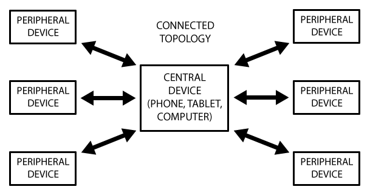
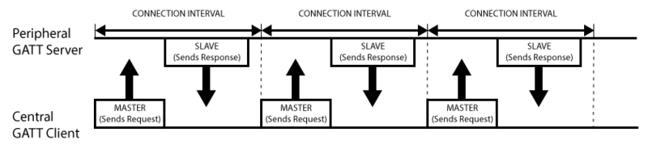
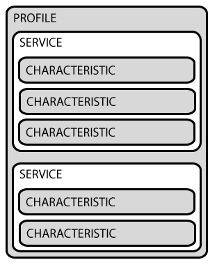

# 低功耗蓝牙 `GATT` 协议

## 前言

现在的**低功耗蓝牙**连接和数据交互都是建立在 `GATT` (**Generic Attribute Profile**) 协议之上的。

`GATT` 是一个在蓝牙连接之上的发送和接收很短的数据段的**通用规范**，这些很短的数据段被称为**属性**（ `Attribute` ）。

在学习 `GATT` 协议之前，需要先学习 `GAP` 协议，请转至笔记：[GAP](GAP.md)

`GATT` 的全名是 `Generic Attribute Profile` ，它定义两个 `BLE` 设备通过叫做 `Service` 和 `Characteristic` 的东西进行通信。

`GATT` 就是使用了 `ATT` （**Attribute Protocol**）协议， `ATT` 协议把 `Service` , `Characteristic` 对应的数据保存在一个查找表中，查找表使用 `16bit ID` 作为每一项的索引。

一旦两个设备建立起了连接， `GATT` 就开始起作用了，这也意味着，你必需完成前面的 `GAP` 协议。

**注意:** `GATT` 连接，必需先经过 `GAP` 协议。实际上，我们在开发中，可以直接使用设备的 `MAC` 地址，发起连接，可以不经过扫描的步骤。这并不意味不需要经过 `GAP` ，原因是因为在芯片级别已经给你做好了，蓝牙芯片发起连接，总是先扫描设备，扫描到了才会发起连接。

`GATT` 连接需要特别注意的是： `GATT` 连接是**独占**的。也就是一个 `BLE` 外设同时只能被一个中心设备连接。一旦外设被连接，它就会马上停止广播，这样它就对其他设备不可见了。当设备断开，它又开始广播。

中心设备和外设需要双向通信的话，**唯一**的方式就是建立 `GATT` 连接。

## 连接网络拓扑图

`GATT` 连接的**网络拓扑图**如下所示：

从图中可以看出，**一个外设只能连接一个中心设备**，而**一个中心设备可以连接多个外设**。一旦建立起了连接，通信就是**双向**的了。

对比前面的 `GAP` 广播的网络拓扑， `GAP` 通信是**单向**的。如果你要让两个设备外设能通信，就只能通过中心设备中转。

## 通信事务

`GATT` 通信的双方是 `C/S` 关系。

**外设**作为 `GATT` 服务端（ `Server` ），它维持了 `ATT` 的查找表以及 `service` 和 `characteristic` 的定义。

**中心设备**是 `GATT` 客户端（ `Client` ），它向 `Server` 发起请求。

`注意` ：所有的通信事件，都是由**客户端**（也叫**主设备**， `Master` ）发起，并且接收**服务端**（也叫**从设备**， `Slave` ）的响应。

一旦连接建立，外设将会给中心设备建议一个**连接间隔**（ `Connection Interval` ）, 这样，中心设备就会在每个连接间隔尝试去重新连接，检查是否有新的数据。但是，这个连接间隔**只是一个建议**，中心设备可能并不会严格按照这个间隔来执行，例如中心设备正在忙于连接其他的外设，或者中心设备资源太忙。

下图展示一个 `外设` （**GATT服务端**）和 `中心设备` （**GATT客户端**）之间的数据交换流程：

## 结构

`GATT事务` 是建立在嵌套的 `Profiles` , `Services` 和 `Characteristics` 之上的的，如下图所示：

* `Profile`

  并不是实际存在于 `BLE` 外设上的，它只是一个被 `Bluetooth SIG` 或者外设设计者预先定义的 `Service` 的集合。

* `Service`

  **Service** 是把数据分成一个个的独立**逻辑项**，它包含一个或者多个 `Characteristic` 。每个 `Service` 有一个 `UUID` 唯一标识。 `UUID` 有 `16bit` 的，或者 `128bit` 的。 `16bit` 的 `UUID` 是官方**通过认证**的，需要**花钱购买**， `128bit` 是自定义的，这个就可以自己随便设置。

* `Characteristic`

  在 `GATT` 事务中的**最低界别**的是 `Characteristic` ， `Characteristic` 是**最小的逻辑数据单元**，当然它可能包含一个组关联的数据，例如加速度计的 `X/Y/Z` 三轴值。

  与 `Service` 类似，每个 `Characteristic` 用 `16bit` 或者 `128bit` 的 `UUID` 唯一标识。你可以免费使用 `Bluetooth SIG` 官方定义的标准 `Characteristic` ，使用官方定义的，可以确保 `BLE` 的软件和硬件能相互理解。当然，你可以自定义 `Characteristic` ，这样的话，就只有你自己的软件和外设能够相互理解。
