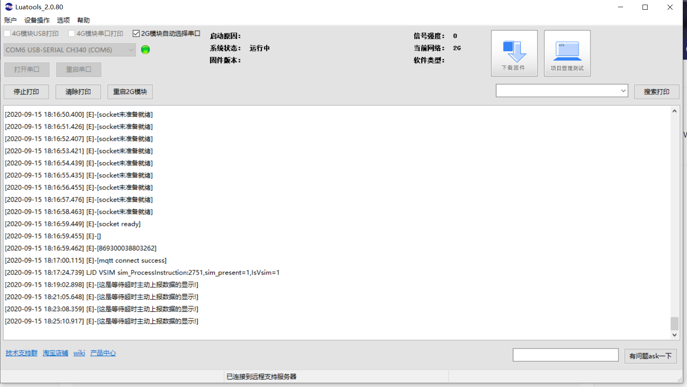
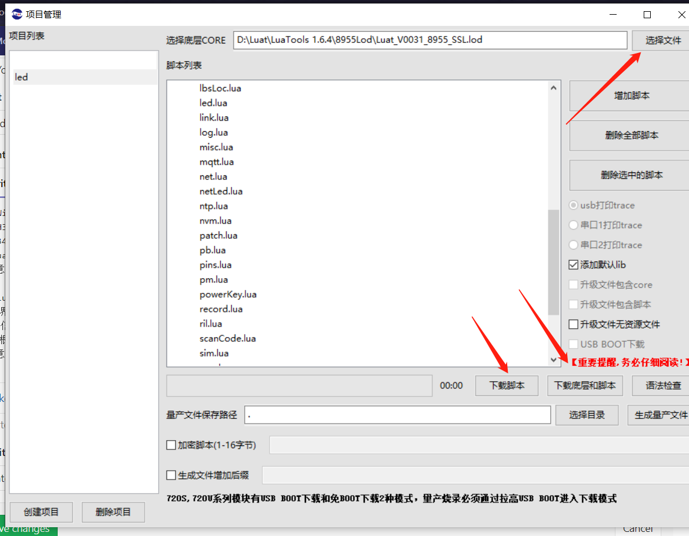

## 需求软件

* CH341SER. EXE  

[CH341SER. EXE](assets/files/CH341SER. EXE)

* LuaTool [下载地址](http://www.openluat.com/Product/software/luatools.html)  

`注意：LuaTool v2为尝鲜版，可能不稳定` （ps：因为个人电脑原因-win10企业版，旧版本的luaTool会卡死，因此选择尝鲜版）

## LuaTool尝鲜版使用

整体界面

固件根据具体环境选择是否下载。
`注意：` 第一次使用其下载的时候要先选择底层core，之后添加脚本，点击 `下载底层和脚本` ，后面就点击 `下载脚本` 即可。

`提示：` 如果不将lib库文件加载到脚本中进行下载，而是选择工具自带的添加库文件，会报错，本人采坑错误为： `log.lua文件不存在`
