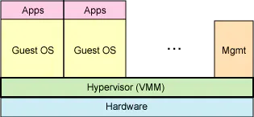
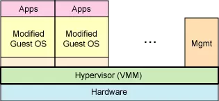

# 虚拟化技术讲解

参考网址：[虚拟化，看这篇文章就够了](https://zhuanlan.51cto.com/art/201703/536043.htm)

## 什么是虚拟化

虚拟化，是指 `通过虚拟化技术将一台计算机虚拟为多台逻辑计算机` 。在一台计算机上同时运行多个逻辑计算机，每个逻辑计算机可运行不同的操作系统，并且应用程序都可以在相互独立的空间内运行而互不影响，从而显著提高计算机的工作效率。

虚拟化使用软件的方法重新定义划分IT资源，可以实现IT资源的动态分配、灵活调度、跨域共享，提高IT资源利用率，使IT资源能够真正成为社会基础设施，服务于各行各业中灵活多变的应用需求。

## Hypervisor是什么?

Hypervisor一种`运行在基础物理服务器和操作系统之间的中间软件层，可允许多个操作系统和应用共享硬件`。也可叫做`VMM( virtual machine monitor )`，即`虚拟机监视器`。

Hypervisor是一种在虚拟环境中的`“元”操作系统`。他们可以访问服务器上包括磁盘和内存在内的所有物理设备。Hypervisor不但协调着这些硬件资源的访问，也同时在各个虚拟机之间施加防护。当服务器启动并执行Hypervisor时，它会加载所有虚拟机客户端的操作系统同时会分配给每一台虚拟机适量的内存，CPU，网络和磁盘。

## 虚拟化分类

### 全虚拟化

全虚拟化(Full virtualization), 也称为`原始虚拟化技术`, 是另一种虚拟化方法。 该模型使用虚拟机协调客户操作系统和原始硬件。 这里"协调"是一个关键词, 因为VMM在客户操作系统和裸硬件之间用于工作协调。 一些受保护的指令必须由Hypervisor(虚拟机管理程序)来捕获和处理。 因为操作系统是通过Hypervisor来分享底层硬件。

全虚拟化的运行速度要`快于硬件模拟`, 但是`性能方面不如裸机`, 因为Hypervisor需要占用一些资源。 全虚拟化`最大的优点`是`操作系统没有经过任何修改`。 它的唯一限制是操作系统必须能够支持底层硬件(比如, PowerPC)

### 半虚拟化

半虚拟化(Paravirtualization)是另一种类似于全虚拟化的热门技术。 它使用Hypervisor(虚拟机管理程序)分享存取底层的硬件,如下图， 但是它的客户操作系统集成了虚拟化方面的代码。 该方法无需重新编译或引起陷阱, 因为操作系统自身能够与虚拟进程进行很好的协作。

上面提到过, 半虚拟化需要客户操作系统做一些修改(配合Hypervisor), 这是一个不足之处。 但是`半虚拟化提供了与原始系统相近的性能`。与全虚拟化一样, `半虚拟化可以同时能支持多个不同的操作系统`。

### 操作系统层虚拟化

实现虚拟化还有一个方法，那就是`在操作系统层面增添虚拟服务器功能`。就操作系统层的虚拟化而言，没有独立的Hypervisor层。相反主机操作系统本身就负责在多个虚拟服务器之间分配硬件资源，并且让这些服务器彼此独立。一个明显的区别是，`如果使用操作系统层虚拟化，所有虚拟服务器必须运行同一操作系统`。

虽然操作系统层虚拟化的灵活性比较差，但`本机速度性能比较高`。此外，由于架构在所有虚拟服务器上使用单一、标准的操作系统，`管理起来比异构环境要容易`。

## 桌面虚拟化

服务器虚拟化主要针对服务器而言，而虚拟化最接近用户的还是要算的上桌面虚拟化了，桌面虚拟化主要功能是`将分散的桌面环境集中保存并管理起来`，包括桌面环境的集中下发，集中更新，集中管理。桌面虚拟化使得桌面管理变得简单，不用每台终端单独进行维护，每台终端进行更新。终端数据可以集中存储在中心机房里，安全性相对传统桌面应用要高很多。桌面虚拟化可以使得一个人拥有多个桌面环境，也可以把一个桌面环境供多人使用，节省了license。

桌面虚拟化依托于服务器虚拟化。没有服务器虚拟化，这个桌面虚拟化的优势将完全没有了。不仅如此，还浪费了许多管理资本。

### 硬件虚拟化

`英特尔虚拟化技术`(IVT，Intel Virtualization Technology)是由英特尔开发的一种虚拟化技术，利用IVT可以对在系统上的客操作系统，通过虚拟机查看器(VMM，Virtual Machine Monitor)来虚拟一套硬件设备，以供客操作系统使用。这些技术以往在VMware与Virtual PC上都通过软件实现，而通过IVT的硬件支持可以加速此类软件的进行。

`AMD虚拟化`(AMD Virtualization)，缩写为“AMD-V”，是AMD为64位的x86架构提供的虚拟化扩展的名称，但有时仍然会用“Pacifica”(AMD开发这项扩展时的内部项目代码)来指代它。
