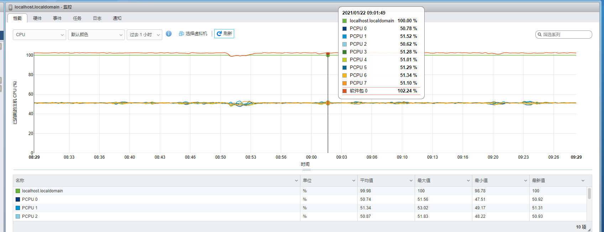
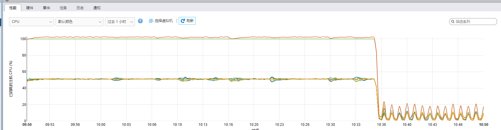

# Postgresql `CPU` 资源占用过高问题

## 产生场景

某一天突然所有请求都超时了，打开 `VMWareESXi` 系统查看资源占用率发现 `CPU` 的占用率达到了 `100%` ，如下图所示：



从图中可以看到， `软件包0` 的 `CPU` 占用率达到了 `100%` 。因为服务器采用 `Docker` 部署，所以 `软件包0` 就是 `Docker` 。

接下来登录服务器，使用 `$ top` 命令查看一下系统状态，如下所示：

``` shell
top - 09:34:54 up 27 days, 16:48,  2 users,  load average: 35.09, 37.06, 38.36
Tasks: 358 total,  53 running, 305 sleeping,   0 stopped,   0 zombie
%Cpu(s): 93.0 us,  5.4 sy,  0.0 ni,  1.2 id,  0.0 wa,  0.0 hi,  0.4 si,  0.0 st
MiB Mem :  15004.9 total,   3234.9 free,   2377.8 used,   9392.2 buff/cache
MiB Swap:   4096.0 total,   4087.2 free,      8.8 used.  12236.5 avail Mem 

    PID USER      PR  NI    VIRT    RES    SHR S  %CPU  %MEM     TIME+   COMMAND                                                                                                                                                                  
3671792 70        20   0  194676 139676 137600 R  16.9   0.9   0:03.98 postgres                                                                                                                                                                 
3671793 70        20   0  194676 140236 138160 R  16.9   0.9   0:03.78 postgres                                                                                                                                                                 
3657139 70        20   0  196064 149896 146492 R  16.6   1.0  38:40.56 postgres                                                                                                                                                                 
3657141 70        20   0  195872 149644 146452 R  16.3   1.0  38:40.96 postgres                                                                                                                                                                 
3664011 70        20   0  195924 146284 143056 R  16.3   1.0  18:50.93 postgres                                                                                                                                                                 
3664020 70        20   0  195928 145780 142444 R  16.3   0.9  18:52.80 postgres                                                                                                                                                                 
3664288 70        20   0  195924 146392 143116 R  16.3   1.0  18:13.50 postgres                                                                                                                                                                 
3671798 70        20   0  194704 140488 138412 R  16.3   0.9   0:03.92 postgres                                                                                                                                                                 
3671799 70        20   0  194668 142924 140832 R  16.3   0.9   0:04.02 postgres                                                                                                                                                                 
3645271 70        20   0  195800 147444 144172 R  15.9   1.0  68:39.55 postgres                                                                                                                                                                 
3645328 70        20   0  195796 146944 143916 R  15.9   1.0  68:33.41 postgres                                                                                                                                                                 
3657058 70        20   0  196168 149992 146484 R  15.9   1.0  38:54.08 postgres                                                                                                                                                                 
3664009 70        20   0  195888 145868 142628 R  15.9   0.9  18:51.97 postgres                                                                                                                                                                 
3664013 70        20   0  195756 146020 142996 R  15.9   1.0  18:52.05 postgres                                                                                                                                                                 
3664282 70        20   0  195944 146772 143188 R  15.9   1.0  18:14.10 postgres                                                                                                                                                                 
3645331 70        20   0  196084 147764 144440 R  15.6   1.0  68:25.93 postgres                                                                                                                                                                 
3645332 70        20   0  195912 147208 144120 R  15.6   1.0  68:31.11 postgres                                                                                                                                                                 
3656987 70        20   0  196020 149900 146304 R  15.6   1.0  38:55.92 postgres                                                                                                                                                                 
3657057 70        20   0  196200 149684 146360 R  15.6   1.0  38:50.22 postgres                                                                                                                                                                 
3664010 70        20   0  195852 146384 143012 R  15.6   1.0  18:52.85 postgres                                                                                                                                                                 
3664279 70        20   0  195732 145988 142868 R  15.6   1.0  18:13.70 postgres                                                                                                                                                                 
3645329 70        20   0  195844 146432 143420 R  15.3   1.0  68:33.48 postgres                                                                                                                                                                 
3645334 70        20   0  195896 146368 143420 R  15.3   1.0  68:33.59 postgres                                                                                                                                                                 
3645335 70        20   0  195892 147228 143924 R  15.3   1.0  68:30.07 postgres                                                                                                                                                                 
3664284 70        20   0  195964 146540 143172 R  15.3   1.0  18:11.67 postgres                                                                                                                                                                 
3671794 70        20   0  194680 139452 137376 R  15.3   0.9   0:03.90 postgres                                                                                                                                                                 
3671795 70        20   0  194704 143012 140884 R  15.3   0.9   0:03.77 postgres                                                                                                                                                                 
3656988 70        20   0  196076 150240 146432 R  15.0   1.0  39:02.62 postgres                                                                                                                                                                 
3664018 70        20   0  195848 146012 142844 R  15.0   1.0  18:51.96 postgres                                                                                                                                                                 
3664287 70        20   0  195928 145688 142632 R  15.0   0.9  18:12.04 postgres                                                                                                                                                                 
3645327 70        20   0  195880 147312 143944 R  14.6   1.0  68:35.28 postgres                                                                                                                                                                 
3645333 70        20   0  195836 146348 143268 R  14.6   1.0  68:34.59 postgres                                                                                                                                                                 
3657140 70        20   0  196016 150028 146428 R  14.6   1.0  38:45.30 postgres                                                                                                                                                                 
3657142 70        20   0  195948 149840 146332 R  14.6   1.0  38:41.07 postgres                                                                                                                                                                 
3657143 70        20   0  196052 149860 146404 R  14.6   1.0  38:43.34 postgres                                                                                                                                                                 
3664014 70        20   0  195716 146248 142836 R  14.6   1.0  18:53.72 postgres                                                                                                                                                                 
3664283 70        20   0  195744 146180 142812 R  14.6   1.0  18:12.23 postgres                                                                                                                                                                 
3664285 70        20   0  195896 146160 142684 R  14.6   1.0  18:15.33 postgres                                                                                                                                                                 
3671789 70        20   0  194764 141868 139820 R  14.6   0.9   0:04.63 postgres                                                                                                                                                                 
3671796 70        20   0  194676 139596 137520 R  14.6   0.9   0:03.83 postgres                                                                                                                                                                 
3671817 70        20   0  194192 140636 138588 R  14.6   0.9   0:00.59 postgres                                                                                                                                                                 
3664012 70        20   0  195912 145992 142668 R  14.3   1.0  18:52.55 postgres                                                                                                                                                                 
3664019 70        20   0  195900 146352 143052 R  14.3   1.0  18:52.75 postgres                                                                                                                                                                 
3664280 70        20   0  195712 145892 142912 R  14.3   0.9  18:15.55 postgres                                                                                                                                                                 
3664286 70        20   0  195904 145920 142956 R  14.3   0.9  18:11.97 postgres                                                                                                                                                                 
3671797 70        20   0  194676 140308 138232 R  14.3   0.9   0:03.86 postgres    
```

由此可见，全部是 `postgres` 占用的，稳定定位到 `Postgressql` 数据库。

## 问题定位

### 查看数据库的连接数

首先检查是不是业务高峰活跃连接陡增，而数据库预留的资源不足。需要查看问题发生时，活跃的连接数是否比平时多很多。

``` sql
# select count( * ) from pg_stat_activity where state not like '%idle';
 count 
-------
    61
(1 row)
```

发现现在有 `61` 个连接，服务的部署方式是 `Docker Swarm` 集群，一共 `6` 个实例，算下来每个实例只有 `10` 个连接，此点待定。

* `Q:` 为什么是待定而不是直接排除？

> 因为连接数据与应用程序的 `orm` 采用的是 `typeorm` ，这个库默认的最大连接数就是 `10` ，超过 `10` 之后程序就无法访问数据库了，当时是使用数据库流的时候发现了它的一个 `bug` ——连接不释放，超过 `10` 个就访问不了数据库了，还给它提了一个[issue](https://github.com/typeorm/typeorm/issues/7109)

### 检查正在运行中的查询

``` sql
-- 通过top命令拿到pid为25400，专门针对这个查看 
# SELECT procpid, START, now() - START AS lap, current_query FROM ( SELECT backendid, pg_stat_get_backend_pid (S.backendid) AS procpid, pg_stat_get_backend_activity_start (S.backendid) AS START,pg_stat_get_backend_activity (S.backendid) AS current_query FROM (SELECT pg_stat_get_backend_idset () AS backendid) AS S) AS S WHERE current_query <> '<IDLE>' and procpid=25400 ORDER BY lap DESC;

-- 针对所有，不知道pid的情况下使用
# SELECT procpid, START, now() - START AS lap, current_query FROM ( SELECT backendid, pg_stat_get_backend_pid (S.backendid) AS procpid, pg_stat_get_backend_activity_start (S.backendid) AS START,pg_stat_get_backend_activity (S.backendid) AS current_query FROM (SELECT pg_stat_get_backend_idset () AS backendid) AS S) AS S WHERE current_query <> '<IDLE>' ORDER BY lap DESC;
```

查询结果示例：

``` sql
  251783 | 2021-01-22 09:48:02.168716+08 | 00:00:07.67981  | SELECT "LocationEntity"."created_at" AS "LocationEntity_created_at", "LocationEntity"."updated_at" AS "LocationEntity_updated_at", "LocationEntity"."deleted" AS "LocationEntity_deleted", "LocationEntity"."id" AS "LocationEntity_id", "LocationEntity"."sn" AS "LocationEntity_sn", "LocationEntity"."antenna_sn" AS "LocationEntity_antenna_sn", "LocationEntity"."position_uuid" AS "LocationEntity_position_uuid", "LocationEntity"."status" AS "LocationEntity_status", "LocationEntity"."change_flag" AS "LocationEntity_change_flag", "LocationEntity"."rf125k" AS "LocationEntity_rf125k", "LocationEntity"."rf24g" AS "LocationEntity_rf24g", "LocationEntity"."center_sn" AS "LocationEntity_center_sn" FROM "locations" "LocationEntity" WHERE "LocationEntity"."sn" = $1 ORDER BY "LocationEntity"."created_at" DESC LIMIT 1
  256041 | 2021-01-22 09:48:03.013859+08 | 00:00:06.834667 | SELECT "LocationEntity"."created_at" AS "LocationEntity_created_at", "LocationEntity"."updated_at" AS "LocationEntity_updated_at", "LocationEntity"."deleted" AS "LocationEntity_deleted", "LocationEntity"."id" AS "LocationEntity_id", "LocationEntity"."sn" AS "LocationEntity_sn", "LocationEntity"."antenna_sn" AS "LocationEntity_antenna_sn", "LocationEntity"."position_uuid" AS "LocationEntity_position_uuid", "LocationEntity"."status" AS "LocationEntity_status", "LocationEntity"."change_flag" AS "LocationEntity_change_flag", "LocationEntity"."rf125k" AS "LocationEntity_rf125k", "LocationEntity"."rf24g" AS "LocationEntity_rf24g", "LocationEntity"."center_sn" AS "LocationEntity_center_sn" FROM "locations" "LocationEntity" WHERE "LocationEntity"."sn" = $1 ORDER BY "LocationEntity"."created_at" DESC LIMIT 1
  256025 | 2021-01-22 09:48:03.354132+08 | 00:00:06.494394 | SELECT "LocationEntity"."created_at" AS "LocationEntity_created_at", "LocationEntity"."updated_at" AS "LocationEntity_updated_at", "LocationEntity"."deleted" AS "LocationEntity_deleted", "LocationEntity"."id" AS "LocationEntity_id", "LocationEntity"."sn" AS "LocationEntity_sn", "LocationEntity"."antenna_sn" AS "LocationEntity_antenna_sn", "LocationEntity"."position_uuid" AS "LocationEntity_position_uuid", "LocationEntity"."status" AS "LocationEntity_status", "LocationEntity"."change_flag" AS "LocationEntity_change_flag", "LocationEntity"."rf125k" AS "LocationEntity_rf125k", "LocationEntity"."rf24g" AS "LocationEntity_rf24g", "LocationEntity"."center_sn" AS "LocationEntity_center_sn" FROM "locations" "LocationEntity" WHERE "LocationEntity"."sn" = $1 AND NOT("LocationEntity"."center_sn" IS NULL) ORDER BY "LocationEntity"."created_at" DESC LIMIT 1
  251787 | 2021-01-22 09:48:04.178499+08 | 00:00:05.670027 | SELECT "LocationEntity"."created_at" AS "LocationEntity_created_at", "LocationEntity"."updated_at" AS "LocationEntity_updated_at", "LocationEntity"."deleted" AS "LocationEntity_deleted", "LocationEntity"."id" AS "LocationEntity_id", "LocationEntity"."sn" AS "LocationEntity_sn", "LocationEntity"."antenna_sn" AS "LocationEntity_antenna_sn", "LocationEntity"."position_uuid" AS "LocationEntity_position_uuid", "LocationEntity"."status" AS "LocationEntity_status", "LocationEntity"."change_flag" AS "LocationEntity_change_flag", "LocationEntity"."rf125k" AS "LocationEntity_rf125k", "LocationEntity"."rf24g" AS "LocationEntity_rf24g", "LocationEntity"."center_sn" AS "LocationEntity_center_sn" FROM "locations" "LocationEntity" WHERE "LocationEntity"."sn" = $1 ORDER BY "LocationEntity"."created_at" DESC LIMIT 1
  256023 | 2021-01-22 09:48:04.511817+08 | 00:00:05.336709 | SELECT "LocationEntity"."created_at" AS "LocationEntity_created_at", "LocationEntity"."updated_at" AS "LocationEntity_updated_at", "LocationEntity"."deleted" AS "LocationEntity_deleted", "LocationEntity"."id" AS "LocationEntity_id", "LocationEntity"."sn" AS "LocationEntity_sn", "LocationEntity"."antenna_sn" AS "LocationEntity_antenna_sn", "LocationEntity"."position_uuid" AS "LocationEntity_position_uuid", "LocationEntity"."status" AS "LocationEntity_status", "LocationEntity"."change_flag" AS "LocationEntity_change_flag", "LocationEntity"."rf125k" AS "LocationEntity_rf125k", "LocationEntity"."rf24g" AS "LocationEntity_rf24g", "LocationEntity"."center_sn" AS "LocationEntity_center_sn" FROM "locations" "LocationEntity" WHERE "LocationEntity"."sn" = $1 AND NOT("LocationEntity"."center_sn" IS NULL) ORDER BY "LocationEntity"."created_at" DESC LIMIT 1
  256028 | 2021-01-22 09:48:04.665629+08 | 00:00:05.182897 | SELECT "LocationEntity"."created_at" AS "LocationEntity_created_at", "LocationEntity"."updated_at" AS "LocationEntity_updated_at", "LocationEntity"."deleted" AS "LocationEntity_deleted", "LocationEntity"."id" AS "LocationEntity_id", "LocationEntity"."sn" AS "LocationEntity_sn", "LocationEntity"."antenna_sn" AS "LocationEntity_antenna_sn", "LocationEntity"."position_uuid" AS "LocationEntity_position_uuid", "LocationEntity"."status" AS "LocationEntity_status", "LocationEntity"."change_flag" AS "LocationEntity_change_flag", "LocationEntity"."rf125k" AS "LocationEntity_rf125k", "LocationEntity"."rf24g" AS "LocationEntity_rf24g", "LocationEntity"."center_sn" AS "LocationEntity_center_sn" FROM "locations" "LocationEntity" WHERE "LocationEntity"."sn" = $1 AND NOT("LocationEntity"."center_sn" IS NULL) ORDER BY "LocationEntity"."created_at" DESC LIMIT 1
  256020 | 2021-01-22 09:48:04.737785+08 | 00:00:05.110741 | SELECT "LocationEntity"."created_at" AS "LocationEntity_created_at", "LocationEntity"."updated_at" AS "LocationEntity_updated_at", "LocationEntity"."deleted" AS "LocationEntity_deleted", "LocationEntity"."id" AS "LocationEntity_id", "LocationEntity"."sn" AS "LocationEntity_sn", "LocationEntity"."antenna_sn" AS "LocationEntity_antenna_sn", "LocationEntity"."position_uuid" AS "LocationEntity_position_uuid", "LocationEntity"."status" AS "LocationEntity_status", "LocationEntity"."change_flag" AS "LocationEntity_change_flag", "LocationEntity"."rf125k" AS "LocationEntity_rf125k", "LocationEntity"."rf24g" AS "LocationEntity_rf24g", "LocationEntity"."center_sn" AS "LocationEntity_center_sn" FROM "locations" "LocationEntity" WHERE "LocationEntity"."sn" = $1 AND NOT("LocationEntity"."center_sn" IS NULL) ORDER BY "LocationEntity"."created_at" DESC LIMIT 1
  256038 | 2021-01-22 09:48:04.904587+08 | 00:00:04.943939 | SELECT "LocationEntity"."created_at" AS "LocationEntity_created_at", "LocationEntity"."updated_at" AS "LocationEntity_updated_at", "LocationEntity"."deleted" AS "LocationEntity_deleted", "LocationEntity"."id" AS "LocationEntity_id", "LocationEntity"."sn" AS "LocationEntity_sn", "LocationEntity"."antenna_sn" AS "LocationEntity_antenna_sn", "LocationEntity"."position_uuid" AS "LocationEntity_position_uuid", "LocationEntity"."status" AS "LocationEntity_status", "LocationEntity"."change_flag" AS "LocationEntity_change_flag", "LocationEntity"."rf125k" AS "LocationEntity_rf125k", "LocationEntity"."rf24g" AS "LocationEntity_rf24g", "LocationEntity"."center_sn" AS "LocationEntity_center_sn" FROM "locations" "LocationEntity" WHERE "LocationEntity"."sn" = $1 ORDER BY "LocationEntity"."created_at" DESC LIMIT 1
  255294 | 2021-01-22 09:48:05.163186+08 | 00:00:04.68534  | SELECT "LocationEntity"."created_at" AS "LocationEntity_created_at", "LocationEntity"."updated_at" AS "LocationEntity_updated_at", "LocationEntity"."deleted" AS "LocationEntity_deleted", "LocationEntity"."id" AS "LocationEntity_id", "LocationEntity"."sn" AS "LocationEntity_sn", "LocationEntity"."antenna_sn" AS "LocationEntity_antenna_sn", "LocationEntity"."position_uuid" AS "LocationEntity_position_uuid", "LocationEntity"."status" AS "LocationEntity_status", "LocationEntity"."change_flag" AS "LocationEntity_change_flag", "LocationEntity"."rf125k" AS "LocationEntity_rf125k", "LocationEntity"."rf24g" AS "LocationEntity_rf24g", "LocationEntity"."center_sn" AS "LocationEntity_center_sn" FROM "locations" "LocationEntity" WHERE "LocationEntity"."sn" = $1 ORDER BY "LocationEntity"."created_at" DESC LIMIT 1
  254115 | 2021-01-22 09:48:05.31885+08  | 00:00:04.529676 | SELECT "LocationEntity"."created_at" AS "LocationEntity_created_at", "LocationEntity"."updated_at" AS "LocationEntity_updated_at", "LocationEntity"."deleted" AS "LocationEntity_deleted", "LocationEntity"."id" AS "LocationEntity_id", "LocationEntity"."sn" AS "LocationEntity_sn", "LocationEntity"."antenna_sn" AS "LocationEntity_antenna_sn", "LocationEntity"."position_uuid" AS "LocationEntity_position_uuid", "LocationEntity"."status" AS "LocationEntity_status", "LocationEntity"."change_flag" AS "LocationEntity_change_flag", "LocationEntity"."rf125k" AS "LocationEntity_rf125k", "LocationEntity"."rf24g" AS "LocationEntity_rf24g", "LocationEntity"."center_sn" AS "LocationEntity_center_sn" FROM "locations" "LocationEntity" WHERE "LocationEntity"."sn" = $1 ORDER BY "LocationEntity"."created_at" DESC LIMIT 1
```

由此可见问题主要发生在 `LocationEntity` 这个表的查询中，分析SQL查询会发现，查询主要有两个约束，一个是 `sn` ，一个是 `center_sn` ， `sn` 采用**相等**判定， `center_sn` 采用**非空**判定，表结构中，这两个都加了**索引**。不难看出原因是：使用了 `NOT` 关键字！这相当于使用了**函数**，导致**索引失效**，而且这个表是一个大表，每天积累上千万的数据。因此，先优化这个查询。

将 `center_sn` 的查询条件： `NOT("LocationEntity"."center_sn" IS NULL)` 修改为： `"LocationEntity"."center_sn" NOTNULL` ，效果显著提升。

`VMWareESXi` 系统监控图如下：



`top` 状态查看结果如下：

``` shell
top - 10:56:33 up 27 days, 18:10,  2 users,  load average: 1.03, 1.62, 10.82
Tasks: 322 total,   1 running, 321 sleeping,   0 stopped,   0 zombie
%Cpu(s):  2.2 us,  0.4 sy,  0.0 ni, 95.8 id,  1.4 wa,  0.0 hi,  0.2 si,  0.0 st
MiB Mem :  15004.9 total,   3192.3 free,   2412.4 used,   9400.2 buff/cache
MiB Swap:   4096.0 total,   4087.2 free,      8.8 used.  12202.1 avail Mem 

    PID USER      PR  NI    VIRT    RES    SHR S  %CPU  %MEM     TIME+ COMMAND                                                                                                                                                                  
3150419 systemd+  20   0 3259388   1.7g  41600 S  15.6  11.3 407:08.24 mongod                                                                                                                                                                   
3676870 70        20   0  195984 145572 142344 S   1.3   0.9   0:03.43 postgres                                                                                                                                                                 
3676997 70        20   0  195972  35100  31924 S   1.0   0.2   0:00.30 postgres                                                                                                                                                                 
    914 root      20   0 2372084  40992  23260 S   0.7   0.3  65:05.25 containerd                                                                                                                                                               
    927 root      20   0 2917948 241304 104376 S   0.7   1.6 338:12.75 dockerd                                                                                                                                                                  
3677052 70        20   0  195560  27972  24696 S   0.7   0.2   0:00.08 postgres                                                                                                                                                                 
     30 root      20   0       0      0      0 S   0.3   0.0   9:36.18 ksoftirqd/3                                                                                                                                                              
3151014 70        20   0  192980   7420   6412 S   0.3   0.0   1:23.54 postgres                                                                                                                                                                 
3151016 70        20   0   47512   3256   2128 S   0.3   0.0   6:15.90 postgres                                                                                                                                                                 
3676792 70        20   0  196016 145980 142768 S   0.3   1.0   0:05.28 postgres                                                                                                                                                                 
3676938 ubuntu    20   0    9780   4436   3552 R   0.3   0.0   0:00.31 top                                                                                                                                                                      
      1 root      20   0  169060  12792   8008 S   0.0   0.1   3:44.16 systemd                                                                                                                                                                  
      2 root      20   0       0      0      0 S   0.0   0.0   0:00.41 kthreadd                                                                                                                                                                 
      3 root       0 -20       0      0      0 I   0.0   0.0   0:00.01 rcu_gp 
```

## 后记

虽然上面的流程解决了当时的问题，但是，这个方式并不是完整的一套方法论，正常应该按照一定的**流程**进行分析。
