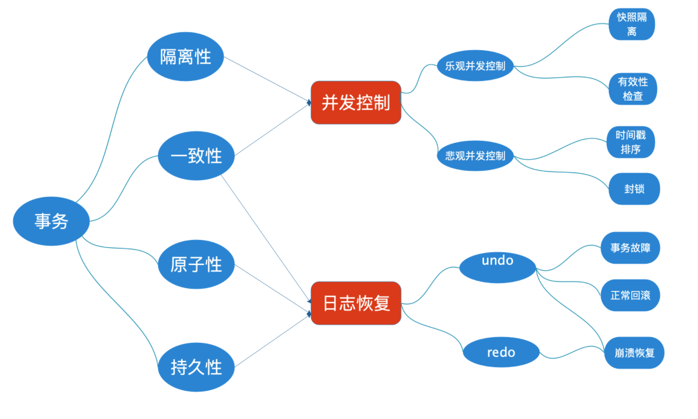
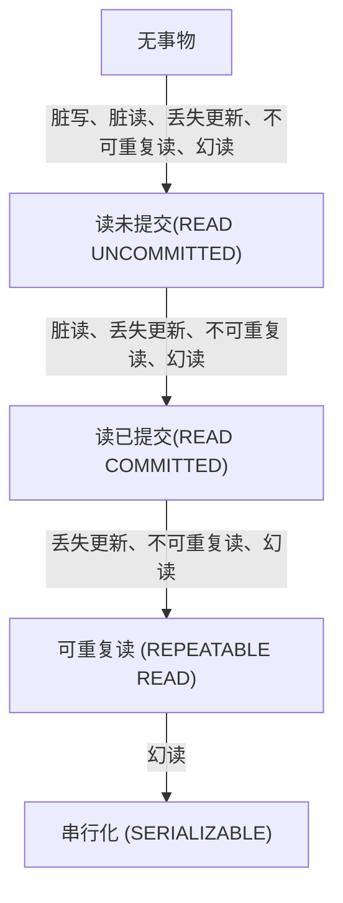

# 数据库事物篇

参考文章：

[博客园： 数据库事务的概念及其实现原理](https://www.cnblogs.com/takumicx/p/9998844.html) 

[博客园：数据库事务的概念及其实现原理](https://www.cnblogs.com/takumicx/p/9998844.html)

先上要记住的结论：
|事务隔离级别|脏写|脏读|丢失更新|不可重复读|幻读|
|:-----:|:-----:|:-----:|:-----:|:-----:|:-----|
|读未提交（read-uncommitted）||可能|可能|可能|可能|
|不可重复读（read-committed）|||可能|可能|可能|
|可重复读（repeatable-read）|||||可能|
|串行化（serializable）|||||||

## 什么是数据库事物

`定义:` **数据库事务是构成单一逻辑工作单元的操作集合**

## 事物的基本要素(ACID)

1. `原子性（Atomicity）：` 事务开始后所有操作，要么全部做完，要么全部不做，不可能停滞在中间环节。事务执行过程中出错，会回滚到事务开始前的状态，所有的操作就像没有发生一样。也就是说事务是一个不可分割的整体，就像化学中学过的原子，是物质构成的基本单位。
2. `一致性（Consistency）：` 事务开始前和结束后，数据库的完整性约束没有被破坏 。比如A向B转账，不可能A扣了钱，B却没收到。
3. `隔离性（Isolation）：` 同一时间，只允许一个事务请求同一数据，不同的事务之间彼此没有任何干扰。比如A正在从一张银行卡中取钱，在A取钱的过程结束前，B不能向这张卡转账。
4. `持久性（Durability）：` 事务完成后，事务对数据库的所有更新将被保存到数据库，不能回滚。

### ACID实现原理

在事务的ACID特性中, C即 `一致性是事务的根本追求` , 而对数据一致性的破坏主要来自两个方面

1. 事务的并发执行
2. 事务故障或系统故障

数据库系统是通过并发控制技术和日志恢复技术来避免这种情况发生的。
并发控制技术保证了事务的隔离性, 使数据库的一致性状态不会因为并发执行的操作被破坏。
日志恢复技术保证了事务的原子性, 使一致性状态不会因事务或系统故障被破坏。同时使已提交的对数据库的修改不会因系统崩溃而丢失, 保证了事务的持久性。

## 事物并发问题

### 脏写

脏写是指事务回滚了其他事务对数据项的已提交修改, 比如下面这种情况：

|事物1|事物2|
|-----|-----|
|read(A)=10|
||read(A)=10|
||write(A)=30|
||Commit|
|write(A)=20||
|Rollback(A=10)||

在事务1对数据A的回滚, 导致事务2对A的已提交修改也被回滚了。

### 丢失更新

丢失更新是指事务覆盖了其他事务对数据的已提交修改, 导致这些修改好像丢失了一样。

|事物1|事物2|
|-----|-----|
||read(A)=10|
|read(A)=10||
||A:=A+10|
||Commit|
|A:=A-10||
|Commit||

事务1和事务2读取A的值都为10, 事务2先将A加上10并提交修改, 之后事务1将A减少10并提交修改, A的值最后为0, 导致事务2对A的修改好像丢失了一样。

### 脏读

脏读是指 `一个事务读取了另一个事务未提交的数据` 。

|事物1|事物2|
|-----|-----|
|read(A)=10||
|A: A*2||
|write(A)||
||read(A)=20|
|rollback(A=10)||

在事务1对A的处理过程中, 事务2读取了A的值, 但之后事务1回滚, 导致事务2读取的A是未提交的脏数据。

### 不可重复读

不可重复读是指一个事务对同一数据的读取结果前后不一致。脏读和不可重复读的区别在于: `前者读取的是事务未提交的脏数据, 后者读取的是事务已经提交的数据` , 只不过因为数据被其他事务修改过导致前后两次读取的结果不一样。

|事物1|事物2|
|-----|-----|
|read(A)=10||
||read(A)=10|
||A: A*2|
||write(A)=20|
||commit|
|read(A)=20||

由于事务2对A的已提交修改, 事务1前后两次读取的结果不一致。

### 幻读

幻读是指事务读取某个范围的数据时，因为其他事务的操作导致前后两次读取的结果不一致。幻读和不可重复读的区别在于, 不可重复读是针对确定的某一行数据而言, 而幻读是针对不确定的多行数据。因而幻读通常出现在带有查询条件的范围查询中。

|事物1|事物2|
|-----|-----|
|read(A<5)=(1, 2, 3)||
||write(A)=4|
||Commit|
|read(A<5)=(1, 2, 3, 4)||

事务1查询A<5的数据, 由于事务2插入了一条A=4的数据, 导致事务1两次查询得到的结果不一样

## 事物的隔离级别

* 事务具有隔离性, 理论上来说事务之间的执行不应该相互产生影响, 其对数据库的影响应该和它们串行执行时一样。
* 然而完全的隔离性会导致系统并发性能很低, 降低对资源的利用率, 因而实际上对隔离性的要求会有所放宽, 这也会一定程度造成对数据库一致性要求降低
* SQL标准为事务定义了不同的隔离级别, 从低到高依次是
  + `读未提交` (READ UNCOMMITTED)
  + `读已提交` (READ COMMITTED)
  + `可重复读` (REPEATABLE READ)
  + `串行化` (SERIALIZABLE)

**事务的隔离级别越低, 可能出现的并发异常越多, 但是通常而言系统能提供的并发能力越强。**

|事务隔离级别|脏写|脏读|丢失更新|不可重复读|幻读|
|:-----:|:-----:|:-----:|:-----:|:-----:|:-----|
|读未提交（read-uncommitted）||可能|可能|可能|可能|
|不可重复读（read-committed）|||可能|可能|可能|
|可重复读（repeatable-read）|||||可能|
|串行化（serializable）|||||||

所有事务隔离级别都不允许出现脏写, 而串行化可以避免所有可能出现的并发异常, 但是会极大的降低系统的并发处理能力。

