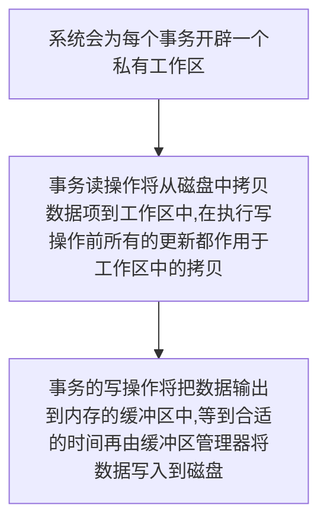
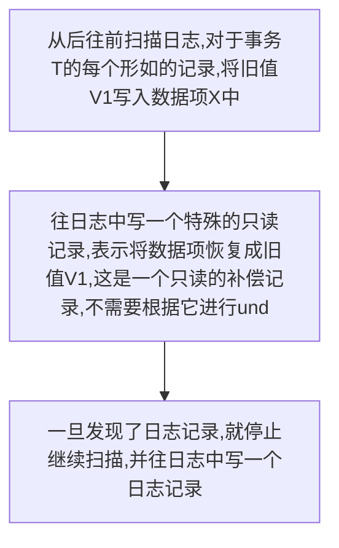
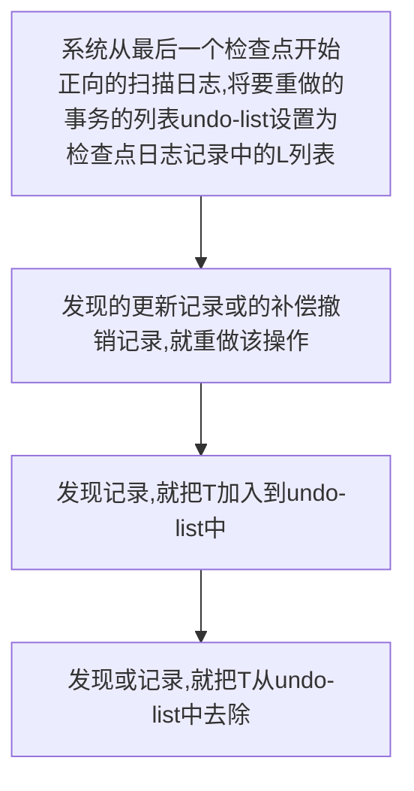
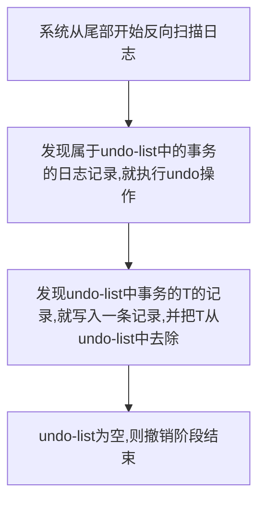
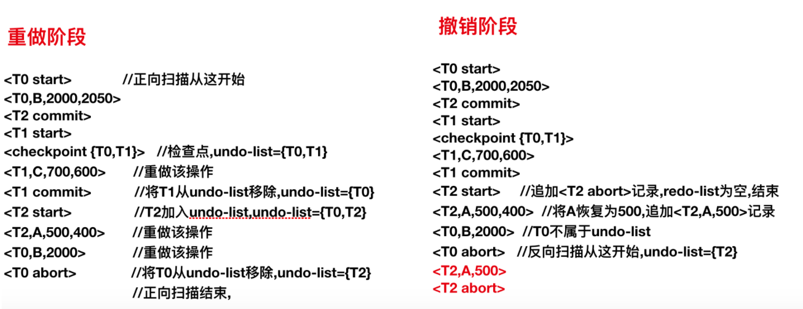

# 事物故障恢复

## 为什么需要故障恢复技术

数据库运行过程中可能会出现故障, 这些故障包括事务故障和系统故障两大类

1. `事务故障:` 比如非法输入, 系统出现死锁, 导致事务无法继续执行。
2. `系统故障:` 比如由于软件漏洞或硬件错误导致系统崩溃或中止。

这些故障可能会对事务和数据库状态造成破坏, 因而必须提供一种技术来对各种故障进行恢复, 保证数据库一致性, 事务的原子性以及持久性。数据库通常以 `日志的方式` 记录数据库的操作从而在故障时进行恢复, 因而可以称之为 `日志恢复技术` 。

## 执行过程中可能产生的问题

事务的执行过程可以简化如下:



由于数据库存在 `立即修改` 和 `延迟修改` , 所以在事务执行过程中可能存在以下情况:

* 在事务提交前出现故障, 但是事务对数据库的部分修改已经写入磁盘数据库中。这导致了事务的 `原子性` 被破坏。
* 在系统崩溃前事务已经提交, 但数据还在内存缓冲区中, 没有写入磁盘。系统恢复时将丢失此次已提交的修改。这是对事务 `持久性` 的破坏。

## 日志的种类和格式

* `<T,X,V1,V2>:` 描述一次数据库写操作, T是执行写操作的事务的唯一标识, X是要写的数据项, V1是数据项的旧值, V2是数据项的新值。
* `<T,X,V1>:` 对数据库写操作的撤销操作, 将事务T的X数据项恢复为旧值V1。在事务恢复阶段插入。
* `<T start>: ` 事务T开始
* `<T commit>:` 事务T提交
* `<T abort>:` 事务T中止

关于日志, 有以下两条 `规则`
1. 系统在对数据库进行修改前会在日志文件末尾追加相应的日志记录。
2. 当一个事务的commit日志记录写入到磁盘成功后, 称这个 `事务已提交, 但事务所做的修改可能并未写入磁盘`

## 日志恢复的核心思想

* `撤销事务undo:` 将事务更新的所有数据项恢复为日志中的旧值, 事务撤销完毕时将插入一条 `<T abort>` 记录。
* `重做事务redo:` 将事务更新的所有数据项恢复为日志中的新值。

事务正常回滚/因事务故障中止将进行redo
系统从崩溃中恢复时将先进行redo再进行undo。

### 事务故障中止/正常回滚的恢复流程




### 系统崩溃时的恢复过程(带检查点)

检查点是形如 `<checkpoint L>` 的特殊的日志记录, L是写入检查点记录时还未提交的事务的集合, 系统保证在检查点之前已经提交的事务对数据库的修改已经写入磁盘, 不需要进行redo。检查点可以加快恢复的过程。

系统奔溃时的恢复过程分为两个阶段: `重做阶段` 和 `撤销阶段` 。

** 重做阶段 **



** 撤销阶段 **



`总结:` 先将日志记录中所有事务的更新按顺序重做一遍, 在针对需要撤销的事务按相反的顺序执行其更新操作的撤销操作。

示例：

``` 
<T0 start>
<T0,B,2000,2050>
<T2 commit>
<T1 start>
<checkpoint {T0,T1}>   //之前T2已经commit,故不用重做
<T1,C,700,600>
<T1 commit>
<T2 start>
<T2,A,500,400>
<T0,B,2000>
<T0 abort>   //T0回滚完成,插入该记录后系统崩溃
```


