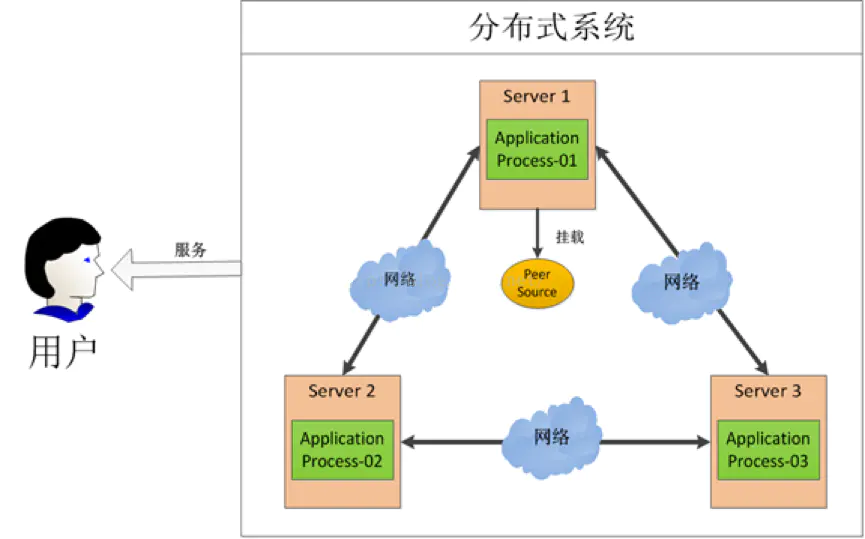

# Zookeeper 简介

参考资料 [ZooKeeper简介（浅入）](https://juejin.im/post/6844903684610981895)

必读：[漫画：什么是Zookeeper](https://juejin.im/post/6844903684610981895) (PS:漫画作者真的很用心，必须点赞)

## 背景

Zookeeper是为了解决分布式问题的，首先看一下分布式系统简化图

上图中有三台机器，每台机器跑同样的一个应用程序。然后我们将这三台机器通过网络将其连接起来，构成一个系统来为用户提供服务，对用户来说这个系统的架构是透明的，他感觉不到这个系统是一个什么样的架构。那么我们就可以把这种系统称作一个`分布式系统`。

问题来了：
1. 程序的运行往往依赖很多配置文件，比如数据库地址、黑名单控制、服务地址列表等，而且有些配置信息需要频繁地进行动态变更，这时候怎么保证所有机器共享的配置信息保持一致？
2. 如果有一台机器挂掉了，其他机器如何感知到这一变化并接管任务？如果用户激增，需要增加机器来缓解压力，如何做到不重启集群而完成机器的添加？
3. 用户数量增加或者减少，会出现有的机器资源使用率繁忙，有的却空闲，如何让每台机器感知到其他机器的负载状态从而实现负载均衡？
4. 在一台机器上要多个进程或者多个线程操作同一资源比较简单，因为可以有大量的状态信息或者日志信息提供保证，比如两个A和B进程同时写一个文件，加锁就可以实现。但是分布式系统怎么办？需要一个三方的分配锁的机制，几百台worker都对同一个网络中的文件写操作，怎么协同？还有怎么保证高效的运行？

## ZooKeeper的前世今生

分布式系统的很多难题，都是由于`缺少协调机制`造成的。

目前，在分布式协调技术方面做得比较好的就是Google的Chubby还有Apache的ZooKeeper。有人会问既然有了Chubby为什么还要弄一个ZooKeeper，难道Chubby做得不够好吗？主要是Chubby是非开源的，Google自家用。后来雅虎模仿Chubby开发出了ZooKeeper，也实现了类似的`分布式锁`的功能，并且将ZooKeeper作为一种开源的程序捐献给了Apache，那么这样就可以使用ZooKeeper所提供锁服务。

## 什么是Zookeeper

Zookeeper是一个`分布式协调服务`(a service for coordinating processes of distributed applications)。此句理解的重点是`协调`二字。协调就是协调资源，避免因资源竞争导致的bug（思维引导：如果感觉此处比较抽象，不好理解，可以顺带看一下[数据库事物](../../../数据库/SQL/事物.md)）。
