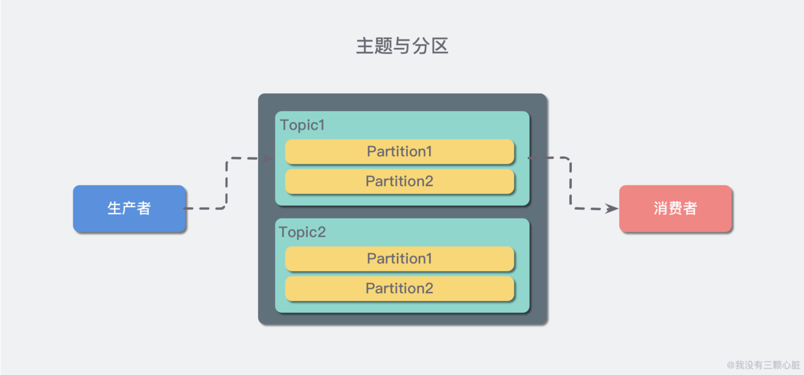

# Kafka基础概念

## 生产者与消费者

对于 Kafka 来说客户端有两种基本类型：

1. **生产者（Producer）**
2. **消费者（Consumer）**。

除此之外，还有用来做数据集成的 Kafka Connect API 和流式处理的 Kafka Streams 等高阶客户端，但这些高阶客户端底层仍然是生产者和消费者API，它们只不过是在上层做了封装。

这很容易理解，生产者（也称为发布者）创建消息，而消费者（也称为订阅者）负责消费or读取消息。

## 主题（Topic）与分区（Partition）

在 Kafka 中，消息以**主题（Topic）**来分类，每一个主题都对应一个 **「消息队列」**，这有点儿类似于数据库中的表。但是如果我们把所有同类的消息都塞入到一个“中心”队列中，势必缺少可伸缩性，无论是生产者/消费者数目的增加，还是消息数量的增加，都可能耗尽系统的性能或存储。

我们使用一个生活中的例子来说明：现在 A 城市生产的某商品需要运输到 B 城市，走的是公路，那么单通道的高速公路不论是在「A 城市商品增多」还是「现在 C 城市也要往 B 城市运输东西」这样的情况下都会出现「吞吐量不足」的问题。所以我们现在引入**分区（Partition）**的概念，类似“允许多修几条道”的方式对我们的主题完成了水平扩展。

## Broker 和集群（Cluster）

一个 Kafka 服务器也称为 Broker，它接受生产者发送的消息并存入磁盘；Broker 同时服务消费者拉取分区消息的请求，返回目前已经提交的消息。使用特定的机器硬件，一个 Broker 每秒可以处理成千上万的分区和百万量级的消息。（现在动不动就百万量级.. 我特地去查了一把，好像确实集群的情况下吞吐量挺高的.. 嗯..）

若干个 Broker 组成一个集群（Cluster），其中集群内某个 Broker 会成为集群控制器（Cluster Controller），它负责管理集群，包括分配分区到 Broker、监控 Broker 故障等。在集群内，一个分区由一个 Broker 负责，这个 Broker 也称为这个分区的 Leader；当然一个分区可以被复制到多个 Broker 上来实现冗余，这样当存在 Broker 故障时可以将其分区重新分配到其他 Broker 来负责。下图是一个样例：

Kafka 的一个关键性质是日志保留（retention），我们可以配置主题的消息保留策略，譬如只保留一段时间的日志或者只保留特定大小的日志。当超过这些限制时，老的消息会被删除。我们也可以针对某个主题单独设置消息过期策略，这样对于不同应用可以实现个性化。

## 多集群

随着业务发展，我们往往需要多集群，通常处于下面几个原因：

* 基于数据的隔离；
* 基于安全的隔离；
* 多数据中心（容灾）

当构建多个数据中心时，往往需要实现消息互通。举个例子，假如用户修改了个人资料，那么后续的请求无论被哪个数据中心处理，这个更新需要反映出来。又或者，多个数据中心的数据需要汇总到一个总控中心来做数据分析。

上面说的分区复制冗余机制只适用于同一个 Kafka 集群内部，对于多个 Kafka 集群消息同步可以使用 Kafka 提供的 MirrorMaker 工具。本质上来说，MirrorMaker 只是一个 Kafka 消费者和生产者，并使用一个队列连接起来而已。它从一个集群中消费消息，然后往另一个集群生产消息。
