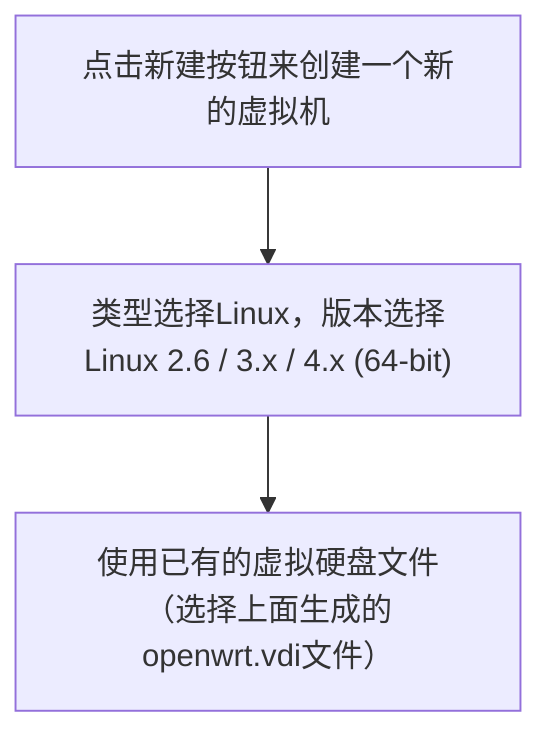
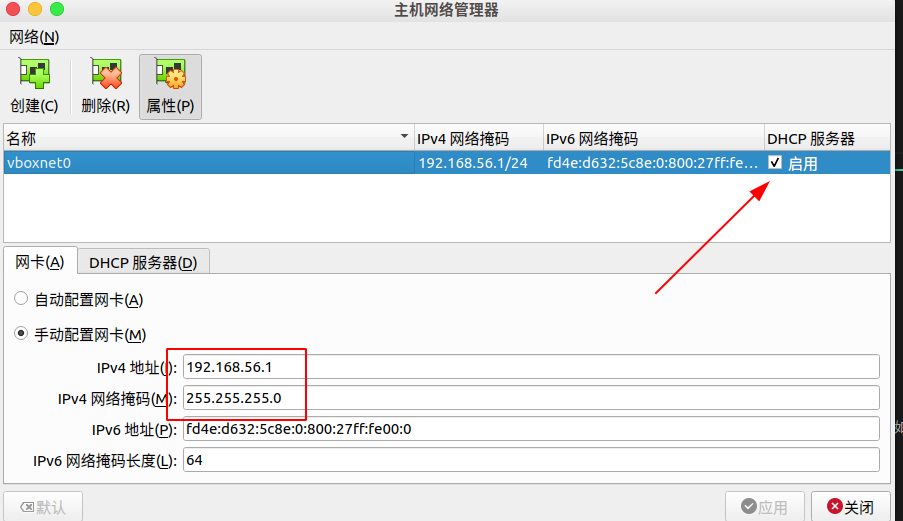
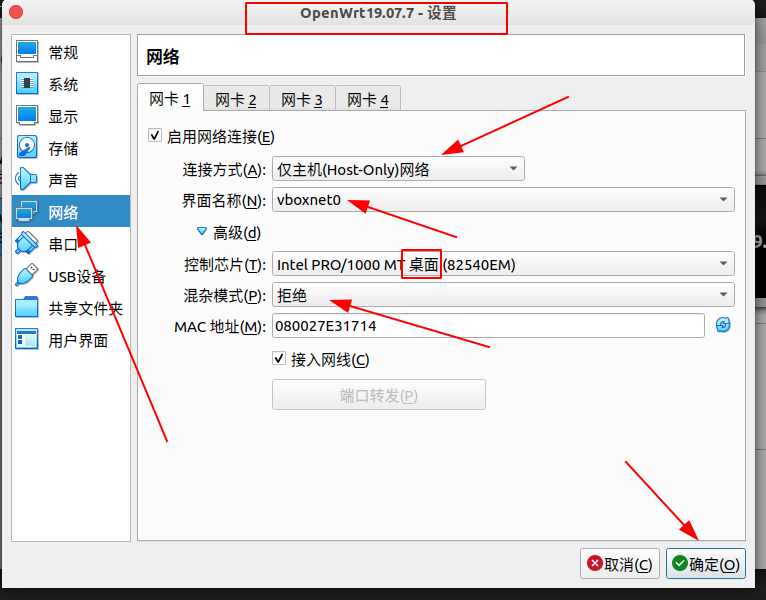
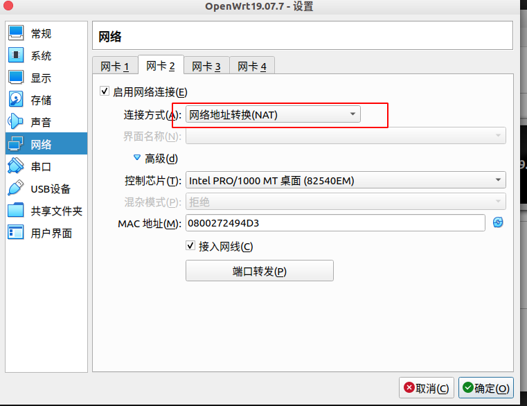
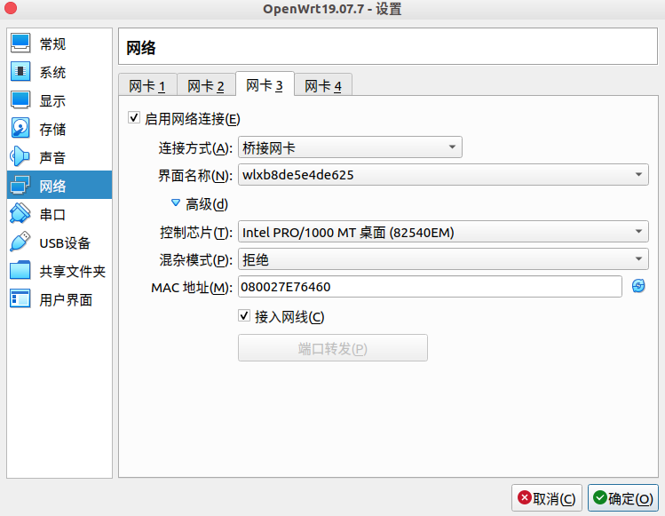
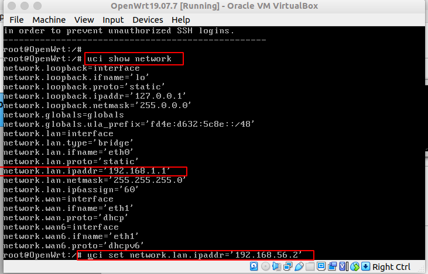
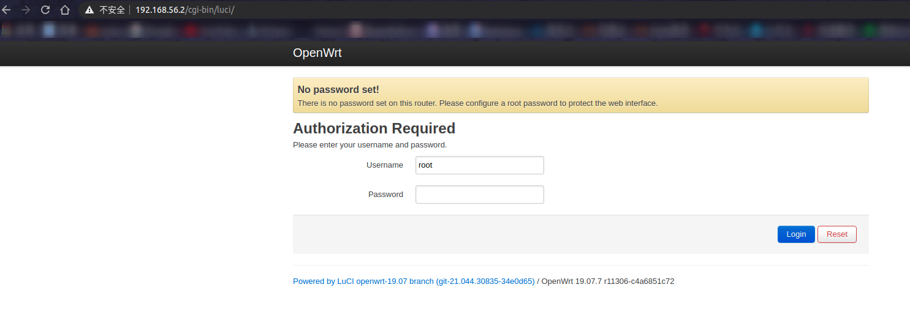

# `VirtualBox` 安装 `OpenWrt`

## 环境

操作系统： `Ubuntu 20.04`

架构： `x64`

`VirtualBox` 版本： `6.1.18 r142142 (Qt5.12.8)`

`OpenWrt` 版本： `19.07.7`

## 官方镜像下载

> 温馨提示：首先去[OpenWrt的清华镜像源](https://mirrors.tuna.tsinghua.edu.cn/openwrt/)查看一下镜像源所支持的 `OpenWrt` 版本，因为 `OpenWrt` 更新过于频繁，清华源可能来不及同步。。。（PS：亲身采坑）

官方下载地址：https://downloads.openwrt.org/releases/

本笔记下载版本：https://downloads.openwrt.org/releases/19.07.7/targets/x86/64/openwrt-19.07.7-x86-64-combined-ext4.img.gz

## `VirtualBox` 镜像制作

将下载好的官方镜像解压，得到img文件，在此目录打开终端，输入如下命令来制作 `VirtualBox` 镜像

``` shell
$ VBoxManage convertfromraw --format VDI openwrt-19.07.7-x86-64-combined-ext4.img openwrt.vdi 
```

之后就能得到 `openwrt.vdi` 文件，这个文件就是 `VirtualBox` 的镜像文件。

## `VirtualBox` 安装 `OpenWrt` 操作系统

新建虚拟机流程比较简单，在此用流程图表示：



## 网络配置（重点）

### `VirtualBox` 网络配置

首先配置主机网络，依次点击左上角的 `管理` --> `主机网络管理器` ，配置 `vboxnet0` 如下所示：



> 提示：**默认应该就是这样**，无需配置，如果不是，请将 `ipv4` 地址配置成 `192.168.56.1`

接下来配置 `OpenWrt` 虚拟机的网络。打开此虚拟机的 `设置` ，选择 `网络` ，一共要配置**三个网卡**。第一个配置 `仅主机(Host Only)网络` ，如下所示：



`网卡2` 配置成 `网络地址转换(NAT)` ，如下所示：



`网卡3` 配置成 `桥接网卡` ，如下所示：



到此配置完成。

### `OpenWrt` 网络配置

进入系统后首先**查看一下网络**，命令如下：

``` shell
$ uci show network
```

正常情况下应如下所示：



可以看到当前地址为 `192.168.1.1` ，这个肯定是不对的，因为我们在上一步配置的网关是 `192.168.56.1` ，所以这里给它分配 `192.168.56.2` 的 `IP` 地址。流程如下：

``` shell
$ uci set network.lan.ipaddr='192.168.56.2'
$ uci commit
$ reboot
```

重启后我们就可以通过 `ssh` 来登录到 `OpenWrt` 系统了。

接下来继续配置：

``` shell
$ uci batch <<EOF
set network.mng=interface
set network.mng.type='bridge'
set network.mng.proto='static'
set network.mng.netmask='255.255.255.0'
set network.mng.ifname='eth0'
set network.mng.ipaddr='192.168.56.2'
delete network.lan
delete network.wan6
set network.wan=interface
set network.wan.ifname='eth1'
set network.wan.proto='dhcp'
EOF

$ uci changes
network.mng='interface'
network.mng.type='bridge'
network.mng.proto='static'
network.mng.netmask='255.255.255.0'
network.mng.ifname='eth0'
network.mng.ipaddr='192.168.56.2'
-network.lan
-network.wan6
network.wan='interface'

$ uci commit
$ reboot
```

> 提示： `network.mng` 的值和必须和上面一样, `network.wan` 可能会稍微不一样

接下来测试一下：

``` shell
$ opkg update   # 类似于 apt update
$ opkg install luci     # 安装luci软件
```

浏览器打开 `192.168.56.2` 即可看到如下页面：


