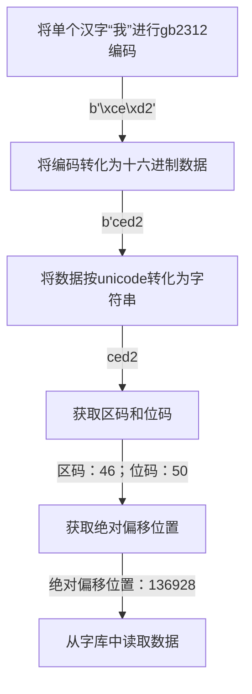
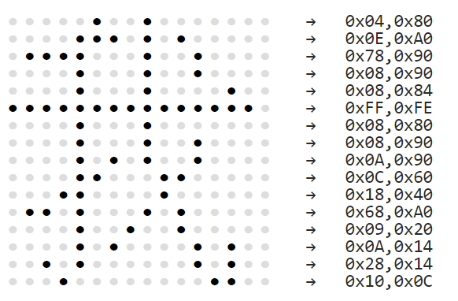

# 字模提取代码讲解—— `Python` 版

<details>
<summary>展开查看源码</summary>

``` python
import binascii
KEYS = [0x80, 0x40, 0x20, 0x10, 0x08, 0x04, 0x02, 0x01]

def printPlay(textStr,line,background):
    # 初始化16*16的点阵位置，每个汉字需要16*16=256个点来表示，需要32个字节才能显示一个汉字
    # 之所以32字节：256个点每个点是0或1，那么总共就是2的256次方，一个字节是2的8次方
    rect_list = [] * 16
    for i in range(16):
        rect_list.append([] * 16)

    for text in textStr:
        #获取中文的gb2312编码，一个汉字是由2个字节编码组成
        gb2312 = text.encode('gb2312')
        #将二进制编码数据转化为十六进制数据
        hex_str = binascii.b2a_hex(gb2312)
        #将数据按unicode转化为字符串
        result = str(hex_str, encoding='utf-8')

        #前两位对应汉字的第一个字节：区码，每一区记录94个字符
        area = eval('0x' + result[:2]) - 0xA0
        #后两位对应汉字的第二个字节：位码，是汉字在其区的位置
        index = eval('0x' + result[2:]) - 0xA0
        #汉字在HZK16中的绝对偏移位置，最后乘32是因为字库中的每个汉字字模都需要32字节
        offset = (94 * (area-1) + (index-1)) * 32

        font_rect = None

        #读取HZK16汉字库文件
        with open("HZK16", "rb") as f:
            #找到目标汉字的偏移位置
            f.seek(offset)
            #从该字模数据中读取32字节数据
            font_rect = f.read(32)

        #font_rect的长度是32，此处相当于for k in range(16)
        for k in range(len(font_rect) // 2):
            #每行数据
            row_list = rect_list[k]
            for j in range(2):
                for i in range(8):
                    asc = font_rect[k * 2 + j]
                    #此处&为Python中的按位与运算符
                    flag = asc & KEYS[i]
                    #数据规则获取字模中数据添加到16行每行中16个位置处每个位置
                    row_list.append(flag)

    #根据获取到的16*16点阵信息，打印到控制台
    for row in rect_list:
        for i in row:
            if i:
                #前景字符（即用来表示汉字笔画的输出字符）
                print(line, end=' ')
            else:
                # 背景字符（即用来表示背景的输出字符）
                print(background, end=' ')
        print()

inpt = input("写你所想：")
lineSign = '■'
#lineSign = "0"

backgroundSign = '○'
#backgroundSign = "."
printPlay(inpt,lineSign,backgroundSign)
```

</details>

## 前言

该笔记承接：[字模](README.md)，关于字模提取的原理已在前篇详细阐述，这里只讲解实现。该代码只实现了汉字取模， `ASCII` 更加容易，不做赘述。

## 代码释义

源码中有很多是为了交互和现实添加的，我们想要的核心就是从字库中获取32个字节信息。因此，只需要搞懂这部分即可。代码如下：

``` python
#获取中文的gb2312编码，一个汉字是由2个字节编码组成
gb2312 = text.encode('gb2312')
#将二进制编码数据转化为十六进制数据
hex_str = binascii.b2a_hex(gb2312)
#将数据按unicode转化为字符串
result = str(hex_str, encoding='utf-8')

#前两位对应汉字的第一个字节：区码，每一区记录94个字符
area = eval('0x' + result[:2]) - 0xA0
#后两位对应汉字的第二个字节：位码，是汉字在其区的位置
index = eval('0x' + result[2:]) - 0xA0
#汉字在HZK16中的绝对偏移位置，最后乘32是因为字库中的每个汉字字模都需要32字节
offset = (94 * (area-1) + (index-1)) * 32

font_rect = None

#读取HZK16汉字库文件
with open("HZK16", "rb") as f:
    #找到目标汉字的偏移位置
    f.seek(offset)
    #从该字模数据中读取32字节数据
    font_rect = f.read(32)
```

得到的 `font_rect` 即是我们想要的信息！

## 流程如下



## 编码图示

`注意：` 这个仅仅是**示例**，提供的代码中所选取的字体不是这个字体（因为这个字体太细了），所以得到的信息并不相同！



``` shell
04 80 0E A0 78 90 08 90 08 84 FF FE 08 80 08 90
0A 90 0C 60 18 40 68 A0 09 20 0A 14 28 14 10 0C
```
