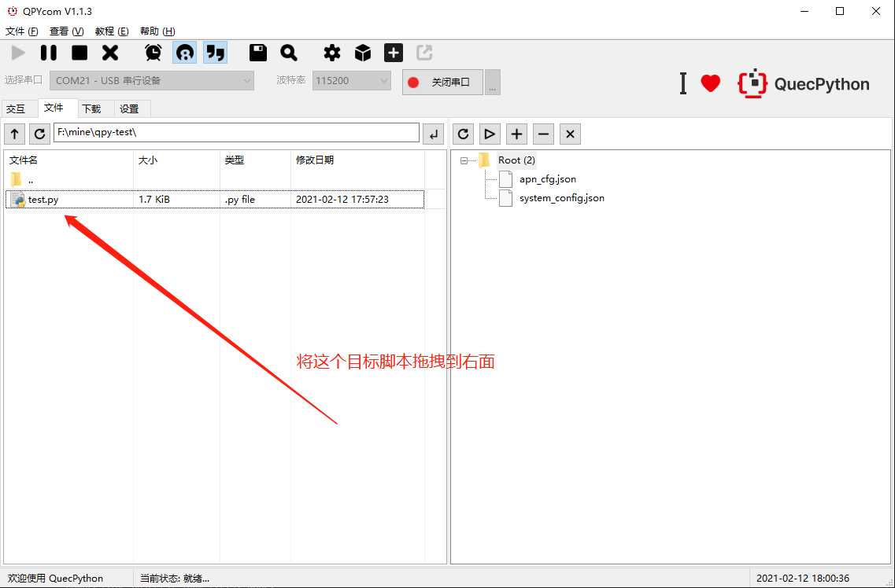
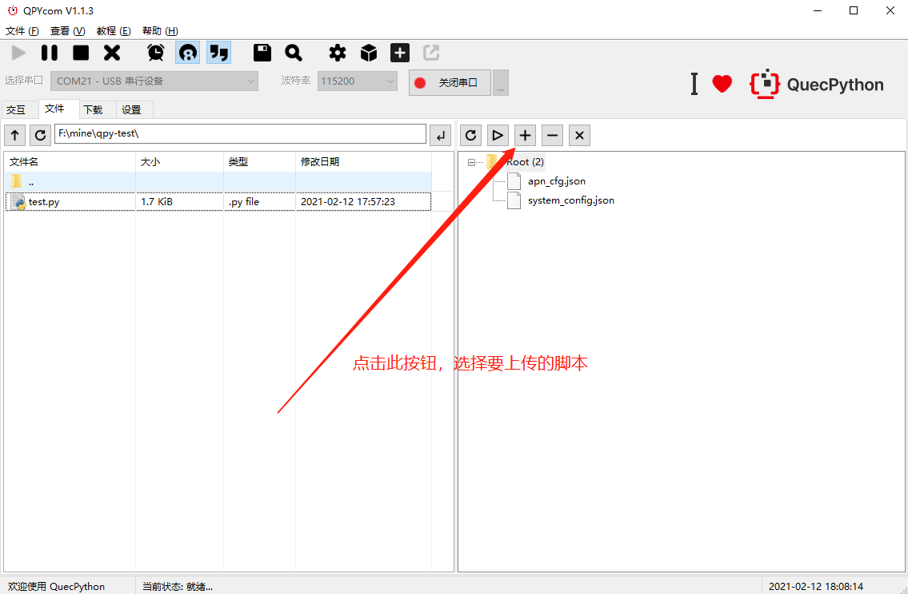
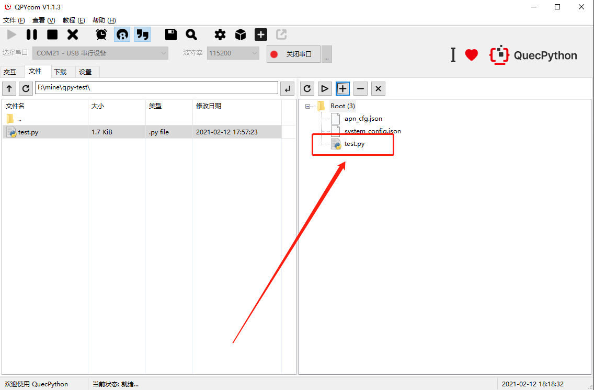

# 下载脚本

## 方法一：拖拽下载

首先打开串口（**USB串行设备**），左侧文件选择到要下载的脚本，长按鼠标左键，拖动到右边即可。如下图所示：



> 温馨提示：必须将文件拖拽到右侧的**文件夹**上，否则会报“**错误的目标**”错误。

## 方法二：点击下载

这种方式比较简单，只需要点击 `“+”` 按钮，之后选择要下载的脚本即可。



## 下载完成效果



``` python
>>> uos.listdir('usr')
['apn_cfg.json', 'system_config.json', 'test.py']
```
